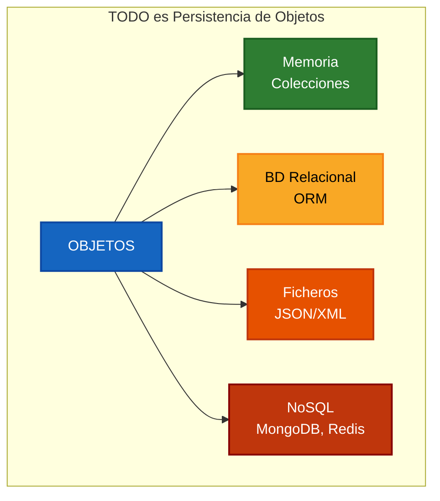
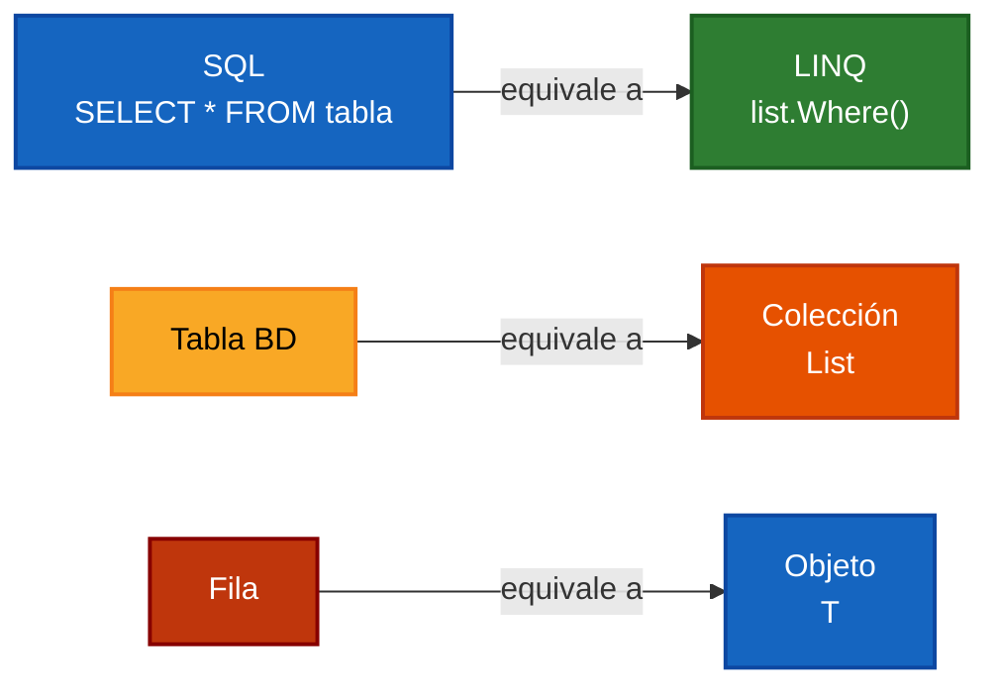
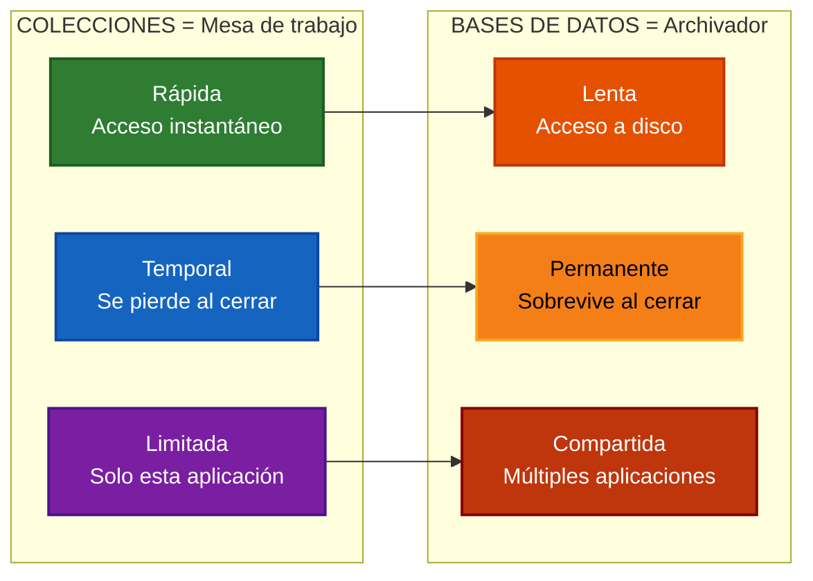

- [1. De las BDOO a la Persistencia de Objetos](#1-de-las-bdoo-a-la-persistencia-de-objetos)
  - [1.1. El Sueño de las BDOO: ¿Por qué no triunfaron?](#11-el-sueño-de-las-bdoo-por-qué-no-triunfaron)
    - [¿Qué es una BDOO?](#qué-es-una-bdoo)
    - [Productos BDOO que existieron](#productos-bdoo-que-existieron)
    - [Pero... el mercado tenía otras ideas](#pero-el-mercado-tenía-otras-ideas)
    - [¿Qué es un ORM?](#qué-es-un-orm)
    - [¿Qué es NoSQL?](#qué-es-nosql)
  - [1.2. Pero... todo es Persistencia de Objetos](#12-pero-todo-es-persistencia-de-objetos)
  - [1.3. SQL vs Colecciones: Mismo concepto, diferente almacenamiento](#13-sql-vs-colecciones-mismo-concepto-diferente-almacenamiento)
    - [Analogía Directa](#analogía-directa)
  - [1.4. La Analogía: La Mesa vs El Archivador](#14-la-analogía-la-mesa-vs-el-archivador)
    - [Comparación detallada](#comparación-detallada)
  - [1.5. LINQ: SQL para Colecciones](#15-linq-sql-para-colecciones)
    - [¿Qué es LINQ?](#qué-es-linq)
    - [Ejemplo comparativo](#ejemplo-comparativo)
    - [LINQ y SQL: Prácticamente idénticos](#linq-y-sql-prácticamente-idénticos)
  - [1.6. ¿Por qué es importante aprender LINQ?](#16-por-qué-es-importante-aprender-linq)
    - [1.6.1. Ventajas profesionales de dominar LINQ](#161-ventajas-profesionales-de-dominar-linq)
    - [1.6.2. LINQ en el mercado laboral](#162-linq-en-el-mercado-laboral)
    - [1.6.3. Preparación para temas futuros](#163-preparación-para-temas-futuros)
    - [1.6.4. Mindset: Piensa en "qué", no en "cómo"](#164-mindset-piensa-en-qué-no-en-cómo)

# 1. De las BDOO a la Persistencia de Objetos

> "En los años 90, los programadores soñaron con guardar objetos directamente en disco. Ese sueño murió, pero de sus cenizas nació algo mejor: entender que **TODO es persistencia de objetos a su manera**."

## 1.1. El Sueño de las BDOO: ¿Por qué no triunfaron?

En los años 80 y 90, cuando la Programación Orientada a Objetos dominaba el desarrollo de software, surgió una pregunta lógica entre los programadores:

> **¿Por qué tenemos que convertir nuestros objetos a tablas y filas para guardarlos? ¿No sería más fácil guardar los objetos directamente?**

Las **BDOO (Bases de Datos Orientadas a Objetos)** prometían resolver este problema permitiendo guardar objetos exactamente como existían en memoria:

```csharp
// El sueño de las BDOO: guardar objetos directamente
Persona persona = new("12345678A", "Ana García", 25);

// Guardar el objeto tal cual existe en memoria
bd.GuardarObjeto(persona);

// Recuperarlo exactamente igual
Persona recuperada = bd.ObtenerObjeto<Persona>("12345678A");
```

Las BDOO parecían la solución perfecta porque:
- **No había conversión**: El objeto en memoria era idéntico al guardado
- **Navegación natural**: Seguir referencias como `persona.Empresa.Departamento`
- **Herencia soportada**: Clases padre e hija funcionaban directamente
- **Sin desfase**: No había traducción entre paradigmas

### ¿Qué es una BDOO?

Una **Base de Datos Orientada a Objetos** es un sistema de almacenamiento que guarda objetos directamente, sin convertirlos a tablas. En lugar de filas y columnas, trabaja con objetos y referencias, igual que la memoria de tu programa.

### Productos BDOO que existieron

- **db4o**: Para Java y .NET, muy popular en su momento
- **ObjectStore**: Uno de los primeros productos comerciales
- **Versant Object Database**: Usado en aplicaciones empresariales
- **Caché** (InterSystems): Todavía existe, pero ha evolucionado

### Pero... el mercado tenía otras ideas

El problema no fue que las BDOO fueran técnicamente inferiores. **El problema fue que SQL ya dominaba completamente el mercado:**

```text
Años 70-80: SQL se impone en la industria
├── Oracle, IBM DB2, PostgreSQL dominan el mercado
├── Estándar ANSI/ISO establecido (todos hablan el mismo idioma)
├── Herramientas maduras: reporting, Business Intelligence, ETL
├── Miles de desarrolladores y administradores ya formados
└── Código legacy enormo que nadie quería tirar

Años 90: Intentan las BDOO
├── db4o, ObjectStore, Versant aparecen en el mercado
├── Cada producto tiene su propia API (no hay estándar)
├── Sin ecosistema de herramientas (sin reporting, sin BI)
└── Curva de aprendizaje: "¿Para qué aprender algo nuevo si SQL ya funciona?"

2000 en adelante: Triunfo del pragmatismo
├── ORM: Traduce objetos a SQL automáticamente
├── NoSQL: Ofrece alternativas flexibles para casos específicos
└── El mercado prefiere soluciones probadas sobre soluciones "puras"
```

### ¿Qué es un ORM?

Un **ORM (Object-Relational Mapper)** es una herramienta que traduce automáticamente entre objetos y tablas de base de datos. Tu escribes código orientado a objetos, y el ORM genera las consultas SQL correspondientes.

**Ejemplo con Entity Framework (ORM de Microsoft):**

```csharp
// Tú escribes código orientado a objetos
public class Producto
{
    public int Id { get; set; }
    public string Nombre { get; set; } = "";
    public decimal Precio { get; set; }
}

// El ORM traduce esto a SQL automáticamente
using var db = new MiDbContext();

// Este código...
var productosCaros = db.Productos
    .Where(p => p.Precio > 100)
    .ToList();

// ...se traduce a este SQL:
SELECT * FROM Productos WHERE Precio > 100
```

### ¿Qué es NoSQL?

**NoSQL** significa "Not Only SQL" (No solo SQL). Son bases de datos que no usan el modelo relacional tradicional de tablas y SQL.

**Tipos de bases de datos NoSQL:**

1. **Bases de datos documentales** (MongoDB, CouchDB): Guardan documentos JSON/BSON
   ```json
   {
     "nombre": "Ana",
     "edad": 25,
     "direcciones": [
       {"tipo": "casa", "ciudad": "Madrid"},
       {"tipo": "trabajo", "ciudad": "Barcelona"}
     ]
   }
   ```

2. **Bases de datos clave-valor** (Redis, DynamoDB): Muy rápidas, como un diccionario gigante
   ```
   "usuario:12345" -> {"nombre": "Ana", "email": "ana@email.com"}
   ```

3. **Bases de datos de grafos** (Neo4j): Ideales para relaciones complejas
   ```
   (Ana)-[ES_AMIGA_DE]->(María)
   (Ana)-[TRABAJA_EN]->(EmpresaX)
   ```

4. **Bases de datos columnares** (Cassandra, HBase): Optimizadas para análisis de grandes volúmenes de datos

**📝 Nota del Profesor:** La realidad del mercado

Las BDOO no fracasaron por ser técnicamente inferiores. **Fracasaron porque:**

1. **SQL ya dominaba todas partes**: Miles de administradores de bases de datos, herramientas empresariales y millones de líneas de código legacy

2. **Los ORM ofrecieron lo mejor de ambos mundos**: Puedes seguir trabajando con objetos en tu código, y el ORM se encarga de la traducción a SQL

3. **NoSQL ofreció flexibilidad sin complejidad**: Para casos específicos como grandes volúmenes de datos o esquemas muy variables, NoSQL era más práctico que las BDOO puras

**⚠️ Advertencia:** Las BDOO puras hoy

Las BDOO puras como db4o o Versant están **prácticamente extintas** en el desarrollo moderno. El mercado habló: ORM + NoSQL + SQL + Ficheros + Colecciones = **todo es persistencia de objetos a su manera**.

---

## 1.2. Pero... todo es Persistencia de Objetos

El sueño de las BDOO murió, pero de sus cenizas nació una verdad más profunda:

> **Al día de hoy, TODO es persistencia de objetos a su manera.**



La diferencia no es el **qué** (siempre son objetos), sino el **cómo** se persisten:

| Tecnología      | ¿Cómo persiste objetos?           | Ejemplo           |
| --------------- | --------------------------------- | ----------------- |
| **Colecciones** | Objetos en memoria RAM (temporal) | `List<Alumno>`    |
| **ORM + SQL**   | Objetos → Tablas relacionales     | Entity Framework  |
| **NoSQL**       | Objetos → Documentos JSON         | MongoDB, Redis    |
| **Ficheros**    | Objetos → Texto/Binario           | JSON, XML, binary |

**📝 Nota del Profesor:** La revolución silenciosa

El verdadero avance no fue crear BDOO puras. **El avance fue aceptar que cada tecnología persiste objetos a su manera.** No existe una solución universal perfecta, sino herramientas especializadas para diferentes casos de uso.

Por ejemplo:
- Usa **SQL** cuando necesites transacciones ACID y consultas complejas
- Usa **NoSQL** cuando tengas datos muy variables o necesites escalar horizontalmente
- Usa **colecciones** cuando trabajes en memoria durante la ejecución
- Usa **ficheros** para configuración y almacenamiento portable

---

## 1.3. SQL vs Colecciones: Mismo concepto, diferente almacenamiento

Aunque parecen muy diferentes, **SQL y colecciones son el mismo concepto aplicado a distintos medios de almacenamiento**:



### Analogía Directa

| Concepto SQL | Equivalente Colecciones | Ejemplo C#                       |
| ------------ | ----------------------- | -------------------------------- |
| **Tabla**    | `List<T>`               | `List<Alumno>`                   |
| **Fila**     | Objeto `T`              | `new Alumno(...)`                |
| **SELECT**   | `.Where()`              | `alumnos.Where(a => a.Nota > 5)` |
| **INSERT**   | `.Add()`                | `alumnos.Add(nuevo)`             |
| **UPDATE**   | Modificar objeto        | `alumno.Nota = 8`                |
| **DELETE**   | `.Remove()`             | `alumnos.Remove(alumno)`         |
| **JOIN**     | `.Join()`               | `alumnos.Join(cursos, ...)`      |
| **GROUP BY** | `.GroupBy()`            | `alumnos.GroupBy(a => a.Curso)`  |
| **ORDER BY** | `.OrderBy()`            | `alumnos.OrderBy(a => a.Nota)`   |
| **COUNT**    | `.Count()`              | `alumnos.Count()`                |
| **SUM**      | `.Sum()`                | `alumnos.Sum(a => a.Nota)`       |
| **AVG**      | `.Average()`            | `alumnos.Average(a => a.Nota)`   |

**💡 Tip del Examinador:** La importancia de esta analogía

Si dominas LINQ para el manejo de objetos en colecciones, **podrás extrapolarlo para su uso en:**
- **Ficheros**: Serialización JSON/XML con las mismas operaciones
- **Bases de datos relacionales**: Entity Framework usa la misma sintaxis
- **Bases de datos NoSQL**: MongoDB, Redis también usan principios similares

**LINQ es tu passport universal** para trabajar con datos en cualquier formato.

---

## 1.4. La Analogía: La Mesa vs El Archivador

Imagina que estás trabajando en un proyecto importante. Tienes dos lugares donde puedes consultar y manipular información:



### Comparación detallada

| Aspecto           | **Colecciones (RAM)**               | **Bases de Datos (Disco)** |
| ----------------- | ----------------------------------- | -------------------------- |
| **Velocidad**     | ⚡ nanosegundos (muy rápido)         | 🐢 milisegundos (más lento) |
| **Persistencia**  | ❌ Se pierde al cerrar la aplicación | ✅ Permanente               |
| **Capacidad**     | Limitada por la memoria RAM         | Prácticamente ilimitada    |
| **Acceso**        | Solo esta aplicación                | Múltiples aplicaciones     |
| **Transacciones** | No hay ACID                         | ✅ ACID completo            |

**📝 Nota del Profesor:** ¿Cuándo usar cada uno?

- **Usa colecciones** cuando:
  - Estés desarrollando o probando código
  - Necesites velocidad máxima
  - Los datos sean temporales
  - No necesites compartir datos entre aplicaciones

- **Usa bases de datos** cuando:
  - Necesites persistencia real
  - Múltiples aplicaciones accedan a los mismos datos
  - Requieras transacciones y consistencia
  - Tengas grandes volúmenes de datos

**Nuestro enfoque en este tema**: Usaremos **colecciones como "base de datos en memoria"** para aprender los fundamentos de LINQ. En los temas 8 y 9 aplicaremos estos mismos conceptos a **ficheros y bases de datos reales**.

---

## 1.5. LINQ: SQL para Colecciones

**LINQ (Language Integrated Query)** es la revolución que hizo posible trabajar con consultas declarativas directamente en C#. Antes de LINQ, consultar colecciones requería bucles complejos. Ahora puedes escribir consultas tan fácilmente como en SQL.

### ¿Qué es LINQ?

**LINQ** significa "Language Integrated Query" (Lenguaje Integrado de Consultas). Es una tecnología de Microsoft que permite escribir consultas directamente en C# para filtrar, ordenar y transformar colecciones de datos.

### Ejemplo comparativo

```csharp
//SIN LINQ: Bucle imperativo (cómo hacerlo)
var numeros = new[] { 1, 2, 3, 4, 5, 6, 7, 8, 9, 10 };
var pares = new List<int>();

for (int i = 0; i < numeros.Length; i++)
{
    if (numeros[i] % 2 == 0)
    {
        pares.Add(numeros[i]);
    }
}

// CON LINQ: Consulta declarativa (qué quieres)
var pares2 = numeros.Where(n => n % 2 == 0).ToList();
```

### LINQ y SQL: Prácticamente idénticos

```csharp
// SQL (base de datos)
SELECT Nombre, Nota FROM Alumnos
WHERE Nota >= 5
ORDER BY Nota DESC;

// LINQ (colecciones)
var aprobados = alumnos
    .Where(a => a.Nota >= 5)           // WHERE
    .Select(a => new { a.Nombre, a.Nota })  // SELECT
    .OrderByDescending(a => a.Nota)     // ORDER BY
    .ToList();
```

**💡 Tip del Examinador:** LINQ ≈ SQL

Las operaciones principales de LINQ tienen una correspondencia directa con SQL:

- `WHERE` → `.Where()`
- `SELECT` → `.Select()`
- `ORDER BY` → `.OrderBy()` / `.OrderByDescending()`
- `GROUP BY` → `.GroupBy()`
- `JOIN` → `.Join()`
- `COUNT` → `.Count()`
- `SUM` → `.Sum()`
- `AVG` → `.Average()`
- `MAX` → `.Max()`
- `MIN` → `.Min()`

**⚠️ Advertencia:** No te confundas con los tipos de LINQ

LINQ no es solo para colecciones en memoria. Existen diferentes "sabores" de LINQ:

| Tipo                 | Propósito                                      |
| -------------------- | ---------------------------------------------- |
| **LINQ to Objects**  | Colecciones en memoria (lo que aprenderemos)   |
| **LINQ to Entities** | Bases de datos relacionales (Entity Framework) |
| **LINQ to XML**      | Ficheros XML                                   |
| **LINQ to JSON**     | Ficheros JSON                                  |
| **PLINQ**            | LINQ paralelo (múltiples núcleos)              |

**En este tema** nos centraremos en **LINQ to Objects** (colecciones) para dominar los fundamentos.

---

## 1.6. ¿Por qué es importante aprender LINQ?

Esta es una pregunta fundamental que todo estudiante debe responder. **LINQ no es solo una herramienta más, es una habilidad que transformarará tu forma de programar.**

### 1.6.1. Ventajas profesionales de dominar LINQ

**1. Código más limpio y mantenible**

```csharp
// ❌ Con bucles: 15 líneas de código
var resultados = new List<Alumno>();
foreach (var alumno in alumnos)
{
    if (alumno.Activo && alumno.Nota >= 5)
    {
        /// Hacer una
    
    }
}
```

2. **Consultas complejas simplificadas**

LINQ permite expresar lógica compleja de forma clara y concisa. En lugar de múltiples bucles anidados y condiciones dispersas, puedes encadenar operaciones que se leen casi como prosa en español.

3. **Portabilidad del conocimiento**

El conocimiento de LINQ se transfiere directamente a:
- Entity Framework (bases de datos)
- Serialización JSON/XML
- APIs modernas
- Desarrollo backend

4. **Mayor productividad**

Estudios muestran que los desarrolladores que usan LINQ pueden escribir código de acceso a datos hasta un 50% más rápido que con bucles tradicionales.

### 1.6.2. LINQ en el mercado laboral

**LINQ es una tecnología fundamental en el ecosistema .NET** y su conocimiento es evaluado en entrevistas técnicas para posiciones de desarrollador backend y full-stack.

### 1.6.3. Preparación para temas futuros

Este tema establece las bases para:

| Tema                       | ¿Cómo se conecta con LINQ?                                      |
| -------------------------- | --------------------------------------------------------------- |
| **Tema 8: Ficheros**       | Usarás LINQ para filtrar y transformar datos JSON/XML           |
| **Tema 9: Bases de Datos** | Entity Framework usa la misma sintaxis LINQ que aprendemos aquí |
| **Proyectos reales**       | Cualquier acceso a datos usará estos principios                 |

### 1.6.4. Mindset: Piensa en "qué", no en "cómo"

Con LINQ aprendes un nuevo paradigma de programación:

```csharp
// ❌ Programación imperativa: CÓMO hacerlo
var suma = 0;
foreach (var numero in numeros)
{
    if (numero > 0)
    {
        suma += numero;
    }
}

// ✅ Programación declarativa: QUÉ quieres
var suma2 = numeros.Where(n => n > 0).Sum();
```

**El cambio de mentalidad es más importante que la sintaxis.** Aprende a pensar en términos de "qué datos quiero" en lugar de "cómo obtenerlos".

**📝 Nota del Profesor:** Tu inversión de tiempo

Dedicar tiempo a dominar LINQ ahora te ahorrará horas de trabajo en el futuro:

- **Esta semana**: Aprendes LINQ con colecciones simples
- **Próximos temas**: Aplicas lo mismo a JSON, XML, bases de datos
- **Tu carrera profesional**: Usarás estos conceptos diariamente

**LINQ no es un tema más. Es una habilidad fundamental que usarás en prácticamente cada proyecto.**

**💡 Tip del Examinador:** Pregunta de entrevista

"¿Por qué usar LINQ en lugar de bucles tradicionales?"

**Respuesta modelo:**
1. **Legibilidad**: El código LINQ se lee casi como inglés
2. **Mantenibilidad**: Cambios en la lógica son más seguros
3. **Consistencia**: Las operaciones siguen el mismo patrón
4. **Portabilidad**: Lo aprendido aplica a colecciones, BD, JSON, XML
5. **Expresividad**: Código más corto para consultas complejas
