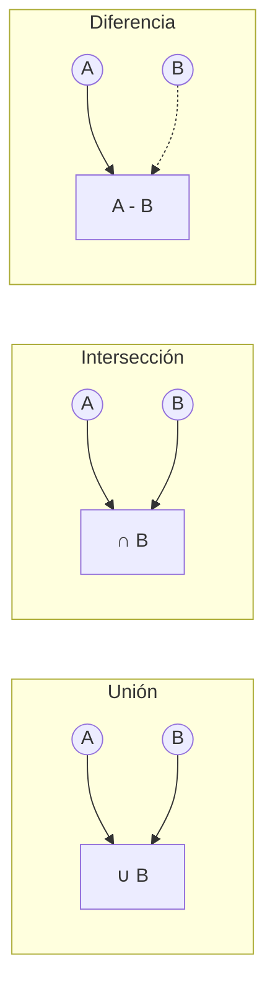
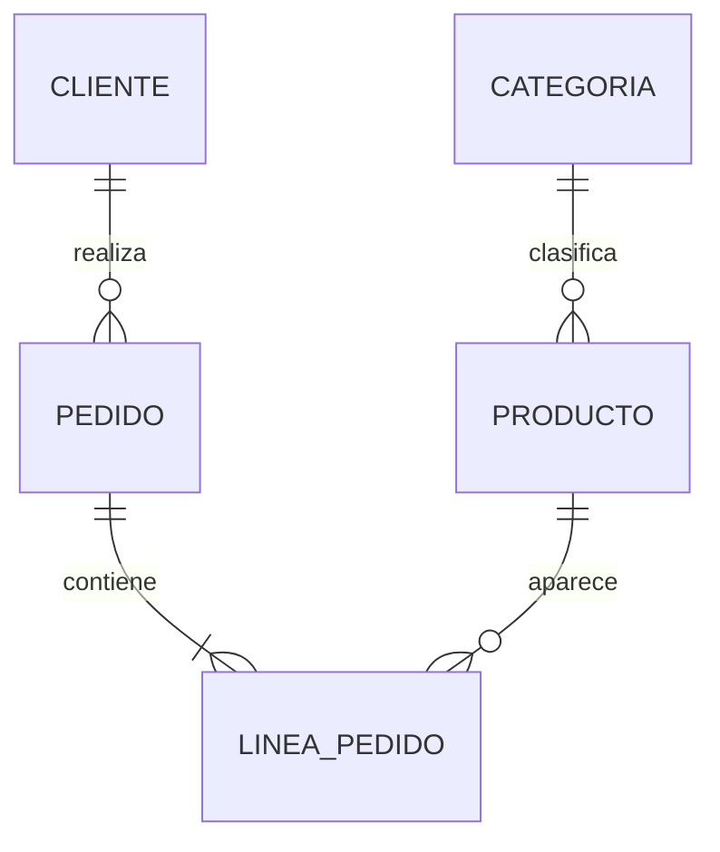
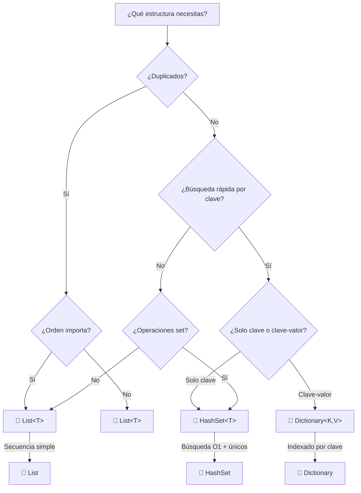

- [2. Estructuras de Almacenamiento en C#](#2-estructuras-de-almacenamiento-en-c)
  - [2.1. Listas (List): Secuencias dinámicas como tablas](#21-listas-list-secuencias-dinámicas-como-tablas)
    - [2.1.1. Concepto: La Lista como Tabla de Base de Datos](#211-concepto-la-lista-como-tabla-de-base-de-datos)
    - [2.1.2. Características de List](#212-características-de-list)
    - [2.1.3. Creación e Inicialización](#213-creación-e-inicialización)
    - [2.1.4. Operaciones CRUD (Create, Read, Update, Delete)](#214-operaciones-crud-create-read-update-delete)
    - [2.1.5. Iteración: foreach vs for vs ForEach](#215-iteración-foreach-vs-for-vs-foreach)
    - [2.1.6. Ordenación](#216-ordenación)
    - [2.1.7. Búsqueda Binaria (cuando está ordenada)](#217-búsqueda-binaria-cuando-está-ordenada)
    - [2.1.8. Conversiones](#218-conversiones)
    - [2.1.9. Capacidad y Rendimiento](#219-capacidad-y-rendimiento)
    - [2.1.10. Casos de Uso: Cuándo Usar List](#2110-casos-de-uso-cuándo-usar-list)
  - [2.2. Diccionarios (Dictionary\<K,V\>): Búsquedas O(1) y concepto de clave primaria](#22-diccionarios-dictionarykv-búsquedas-o1-y-concepto-de-clave-primaria)
    - [2.2.1. Concepto: El Diccionario como Tabla Indexada](#221-concepto-el-diccionario-como-tabla-indexada)
    - [2.2.2. Características de Dictionary\<K,V\>](#222-características-de-dictionarykv)
    - [2.2.3. Creación e Inicialización](#223-creación-e-inicialización)
    - [2.2.4. Operaciones CRUD](#224-operaciones-crud)
    - [2.2.5. Iteración](#225-iteración)
    - [2.2.6. Búsquedas Avanzadas](#226-búsquedas-avanzadas)
    - [2.2.7. Comparadores Personalizados](#227-comparadores-personalizados)
    - [2.2.8. Rendimiento y Complejidad](#228-rendimiento-y-complejidad)
    - [2.2.9. Casos de Uso: Cuándo Usar Dictionary\<K,V\>](#229-casos-de-uso-cuándo-usar-dictionarykv)
  - [2.3. Conjuntos (HashSet): Unicidad y lógica de conjuntos](#23-conjuntos-hashset-unicidad-y-lógica-de-conjuntos)
    - [2.3.1. Concepto: El Conjunto como Tabla con UNIQUE Constraint](#231-concepto-el-conjunto-como-tabla-con-unique-constraint)
    - [2.3.2. Características de HashSet](#232-características-de-hashset)
    - [2.3.3. Creación e Inicialización](#233-creación-e-inicialización)
    - [2.3.4. Operaciones Básicas](#234-operaciones-básicas)
    - [2.3.5. Operaciones de Conjuntos (Teoría de Conjuntos)](#235-operaciones-de-conjuntos-teoría-de-conjuntos)
    - [2.3.6. Caso Práctico: Eliminar Duplicados](#236-caso-práctico-eliminar-duplicados)
    - [2.3.7. Comparadores Personalizados con HashSet](#237-comparadores-personalizados-con-hashset)
    - [2.3.8. Iteración](#238-iteración)
    - [2.3.9. Rendimiento y Complejidad](#239-rendimiento-y-complejidad)
    - [2.3.10. Casos de Uso: Cuándo Usar HashSet](#2310-casos-de-uso-cuándo-usar-hashset)
  - [2.4. Relaciones de Datos: Modelado de objetos compuestos y jerarquías](#24-relaciones-de-datos-modelado-de-objetos-compuestos-y-jerarquías)
    - [2.4.1. Relaciones entre Entidades](#241-relaciones-entre-entidades)
    - [2.4.2. Relación 1:1 (Uno a Uno)](#242-relación-11-uno-a-uno)
    - [2.4.3. Relación 1:N (Uno a Muchos)](#243-relación-1n-uno-a-muchos)
    - [2.4.4. Relación N:M (Muchos a Muchos)](#244-relación-nm-muchos-a-muchos)
    - [2.4.5. Jerarquías (Relaciones Padre-Hijo)](#245-jerarquías-relaciones-padre-hijo)

# 2. Estructuras de Almacenamiento en C#

## 2.1. Listas (List): Secuencias dinámicas como tablas

### 2.1.1. Concepto: La Lista como Tabla de Base de Datos

`List<T>` es la estructura más versátil y utilizada en C#. Representa una colección ordenada de elementos accesibles por índice.

```csharp
// La List<T> es análoga a una tabla en memoria
// - La tabla tiene filas (elementos)
// - Cada fila tiene el mismo tipo (T)
// - El orden importa (como un ORDER BY implícito)
// - Permite duplicados (como una tabla sin PRIMARY KEY única)

List<Producto> productos = new();
productos.Add(new Producto { Id = 1, Nombre = "Laptop" });
productos.Add(new Producto { Id = 2, Nombre = "Mouse" });
```

**📝 Nota del Profesor:** Array vs List

El array tradicional (`Producto[]`) tiene tamaño fijo. `List<T>` es un array dinámico que crece automáticamente cuando se llena. Internamente, `List<T>` usa un array que se redimensiona (típicamente duplicando capacidad) cuando se excede.

---

### 2.1.2. Características de List<T>

| Característica         | Descripción                         |
| ---------------------- | ----------------------------------- |
| **Orden**              | Mantiene el orden de inserción      |
| **Duplicados**         | Permite elementos duplicados        |
| **Acceso por índice**  | O(1) acceso directo por índice      |
| **Búsqueda lineal**    | O(n) para buscar un elemento        |
| **Inserción al final** | Amortizado O(1)                     |
| **Inserción en medio** | O(n) (requiere desplazar elementos) |
| **Capacidad**          | Crece automáticamente               |

**💡 Tip del Examinador:** Complejidad temporal

| Operación          | List<T> | Array |
| ------------------ | ------- | ----- |
| Acceso por índice  | O(1)    | O(1)  |
| Búsqueda           | O(n)    | O(n)  |
| Inserción al final | O(1)*   | N/A   |
| Inserción en medio | O(n)    | O(n)  |
| *Amortizado        |         |       |

---

### 2.1.3. Creación e Inicialización

```csharp
// Método 1: Constructor vacío + Add
List<string> nombres = new();
nombres.Add("Ana");
nombres.Add("Juan");

// Método 2: Inicializador de colección
List<int> numeros = new() { 1, 2, 3, 4, 5 };

// Método 3: Colección expresión (C# 12)
List<Producto> productos = 
[
    new(1, "Laptop", 1200),
    new(2, "Mouse", 25),
    new(3, "Teclado", 75)
];

// Método 4: Desde un IEnumerable
var desdeArray = new List<Producto>(arrayDeProductos);

// Método 5: Con capacidad inicial (optimización)
List<string> palabras = new(capacidad: 1000); // Evita redimensionamientos
```

**🧠 Analogía:** La Lista es como una estantería numerada

Imagina una estantería donde cada producto tiene un número de posición:
- Posición 0: Laptop
- Posición 1: Mouse
- Posición 2: Teclado

Saber qué hay en la posición 1 es instantáneo (O(1)). Pero buscar "Mouse" requiere mirar cada posición hasta encontrarlo (O(n)).

---

### 2.1.4. Operaciones CRUD (Create, Read, Update, Delete)

```csharp
List<Producto> productos = new()
{
    new(1, "Laptop", 1200),
    new(2, "Mouse", 25),
    new(3, "Teclado", 75)
};

// CREATE - Añadir elementos
productos.Add(new Producto(4, "Monitor", 300)); // Añade al final
productos.Insert(1, new Producto(5, "USB", 15)); // Inserta en posición específica

// READ - Leer elementos
var primero = productos[0]; // Acceso directo por índice
var primero2 = productos.First(); // Primer elemento
var ultimo = productos[^1]; // Último (C# 8+)
var count = productos.Count; // Número de elementos

// UPDATE - Modificar elementos
productos[0] = new Producto(1, "Laptop Pro", 1500); // Sobrescribir por índice
productos[2] = productos[2] with { Precio = 99 }; // Con record (inmutable)

// DELETE - Eliminar elementos
productos.RemoveAt(0); // Elimina por índice
productos.Remove(productos.First(p => p.Nombre == "Mouse")); // Elimina por valor
productos.RemoveAll(p => p.Precio < 50); // Elimina todos los que cumplan condición
productos.Clear(); // Vacía la lista
```

**⚠️ Advertencia:** Indices fuera de rango

```csharp
// ❌ ERROR: IndexOutOfRangeException
var item = productos[100]; // Si la lista tiene menos de 101 elementos

// ✅ CORRECTO: Verificar antes de acceder
if (productos.Count > 100)
{
    var item = productos[100];
}

// ✅ O USAR: Métodos seguros
var itemSeguro = productos.ElementAtOrDefault(100); // Devuelve null si no existe
```

---

### 2.1.5. Iteración: foreach vs for vs ForEach

```csharp
List<int> numeros = new() { 1, 2, 3, 4, 5 };

// foreach - La forma estándar y segura
foreach (var num in numeros)
{
    Console.WriteLine(num);
}

// for - Cuando necesitas el índice
for (int i = 0; i < numeros.Count; i++)
{
    Console.WriteLine($"[{i}]: {numeros[i]}");
}

// for - Iteración hacia atrás
for (int i = numeros.Count - 1; i >= 0; i--)
{
    Console.WriteLine(numeros[i]);
}

// for - Con paso (cada 2)
for (int i = 0; i < numeros.Count; i += 2)
{
    Console.WriteLine(numeros[i]);
}

// List.ForEach() - Método de instancia
numeros.ForEach(n => Console.WriteLine(n));

// foreach con índice (C# 6+)
foreach (var (num, index) in numeros.Select((n, i) => (n, i)))
{
    Console.WriteLine($"{index}: {num}");
}
```

**💡 Tip del Examinador:** ¿Cuál usar?

| Situación          | Recomendación      |
| ------------------ | ------------------ |
| Solo iterar        | `foreach`          |
| Necesitas índice   | `for`              |
| Iterar hacia atrás | `for` (reverse)    |
| Acción simple      | `List.ForEach()`   |
| LINQ pipeline      | `foreach` al final |

---

### 2.1.6. Ordenación

```csharp
List<Producto> productos = new()
{
    new(1, "Laptop", 1200),
    new(2, "Mouse", 25),
    new(3, "Teclado", 75)
};

// Método 1: Sort() in-place (modifica la lista)
productos.Sort((a, b) => a.Precio.CompareTo(b.Precio)); // Ascendente
productos.Sort((a, b) => b.Precio.CompareTo(a.Precio)); // Descendente

// Con expresión lambda
productos.Sort(p => p.Nombre);

// Usando IComparable<T>
public class Producto : IComparable<Producto>
{
    public int CompareTo(Producto? other)
    {
        return Precio.CompareTo(other?.Precio);
    }
}

// Método 2: OrderBy() - Devuelve nueva secuencia (inmutable)
var ordenados = productos.OrderBy(p => p.Precio); // Ascendente
var ordenadosDesc = productos.OrderByDescending(p => p.Precio); // Descendente

// Método 3: Ordenación múltiple
var ordenMultiple = productos
    .OrderBy(p => p.Categoria)
    .ThenBy(p => p.Precio)
    .ThenByDescending(p => p.Nombre);

// Método 4: Reverse()
var invertidos = productos.Reverse(); // Invierte el orden actual
```

**📝 Nota del Profesor:** In-place vs Inmutable

- `Sort()` modifica la lista original
- `OrderBy()` devuelve una nueva secuencia (la original permanece igual)

---

### 2.1.7. Búsqueda Binaria (cuando está ordenada)

```csharp
List<int> numerosOrdenados = new() { 1, 3, 5, 7, 9, 11, 13, 15 };

// Búsqueda binaria - O(log n) en lista ORDENADA
int indice = numerosOrdenados.BinarySearch(7); // Devuelve índice: 3
int indiceNoExiste = numerosOrdenados.BinarySearch(8); // Devuelve índice negativo

// Con predicado personalizado
int indiceProducto = productos.BinarySearch(
    new ProductoBuscado(),
    Comparer<Producto>.Create((a, b) => a.Nombre.CompareTo(b.Nombre))
);

// Encontrar índice de elemento específico
int indiceFind = productos.FindIndex(p => p.Nombre == "Laptop");

// Encontrar elemento
var producto = productos.Find(p => p.Nombre.Contains("Mouse"));

// Encontrar todos los que cumplan condición
var todos = productos.FindAll(p => p.Precio > 100);
```

**🧠 Analogía:** Búsqueda en diccionario vs búsqueda en lista

- **Búsqueda en lista**: Como buscar una palabra en un libro leyendo página por página
- **Búsqueda binaria**: Como buscar en un diccionario abriendo por la mitad y descartando mitades
- **Búsqueda en diccionario**: Ir directamente a la página correcta por el índice

---

### 2.1.8. Conversiones

```csharp
List<Producto> productos = new() { /* ... */ };

// ToArray()
Producto[] array = productos.ToArray();

// ToHashSet()
HashSet<Producto> conjunto = productos.ToHashSet(); // Elimina duplicados

// ToDictionary()
Dictionary<int, Producto> porId = productos.ToDictionary(p => p.Id);
Dictionary<string, decimal> nombrePrecio = productos.ToDictionary(p => p.Nombre, p => p.Precio);

// ToList() (copia)
List<Producto> copia = productos.ToList();

// ToLookup()
var porCategoria = productos.ToLookup(p => p.Categoria);

// Conversiones numéricas
List<int> enteros = new() { 1, 2, 3, 4, 5 };
double[] doubles = enteros.Select(x => (double)x).ToArray();
```

---

### 2.1.9. Capacidad y Rendimiento

```csharp
List<string> items = new();

// Capacity inicial
items = new List<string>(1000); // Capacidad para 1000 sin redimensionar

// Capacity actual
int capacidad = items.Capacity;
int count = items.Count;

// TrimExcess() - libera memoria sobrante
items.TrimExcess();

// EnsureCapacity() - garantiza capacidad mínima
items.EnsureCapacity(500); // Garantiza al menos 500 elementos

// Predecir capacidad inicial
var expectedList = new List<int>(expectedSize: 10000); // Optimización
for (int i = 0; i < 10000; i++)
{
    items.Add(i); // Sin redimensionamientos
}
```

**📝 Nota del Profesor:** Redimensionamiento interno

Internamente, `List<T>` usa un array que se redimensiona así:
1. Crea array con capacidad inicial (típicamente 0 o 4)
2. Cuando se llena, crea uno nuevo del doble de tamaño
3. Copia todos los elementos al nuevo array
4. Desecha el array anterior

Esto causa que `Add()` sea O(1) amortizado (promedio), pero O(n) en momentos específicos.

---

### 2.1.10. Casos de Uso: Cuándo Usar List<T>

| ✅ Usar List<T> cuando                     | ❌ No usar List<T> cuando                      |
| ----------------------------------------- | --------------------------------------------- |
| Necesitas mantener orden de inserción     | Necesitas búsquedas por clave rápida          |
| Duplicados son válidos                    | Necesitas garantizar unicidad                 |
| Acceso secuencial (iteración)             | Acceso mayoritario por clave única            |
| Operaciones en extremos (Add/Remove Last) | Inserciones/eliminaciones frecuentes en medio |
| Tamaño conocido o predecible              | Consultas de existencia frecuentes            |

---

## 2.2. Diccionarios (Dictionary<K,V>): Búsquedas O(1) y concepto de clave primaria

### 2.2.1. Concepto: El Diccionario como Tabla Indexada

`Dictionary<K,V>` es análogo a una tabla con clave primaria, pero mucho más rápido para búsquedas.

```csharp
// Equivalente a una tabla con PRIMARY KEY (K) y columnas (V)
// - Búsqueda por clave: O(1) constante
// - No mantiene orden de inserción
// - Claves únicas (como UNIQUE constraint)

Dictionary<int, Producto> productosPorId = new()
{
    { 1, new Producto(1, "Laptop", 1200) },
    { 2, new Producto(2, "Mouse", 25) },
    { 3, new Producto(3, "Teclado", 75) }
};

// Acceso directo O(1)
var laptop = productosPorId[1]; // Instantáneo
```

**🧠 Analogía:** El Directorio Telefónico

El `Dictionary<K,V>` es como un directorio telefónico:
- La **clave** (K) es el nombre de la persona
- El **valor** (V) es el número de teléfono

Para encontrar un número, no lees todas las páginas (como en una lista). Vas directamente a la letra "L" (gracias al hash) y ahí está Laptop. Tiempo constante: O(1).

---

### 2.2.2. Características de Dictionary<K,V>

| Característica         | Descripción               |
| ---------------------- | ------------------------- |
| **Búsqueda por clave** | O(1) promedio             |
| **Inserción**          | O(1) promedio             |
| **Eliminación**        | O(1) promedio             |
| **Claves únicas**      | Sí (como PRIMARY KEY)     |
| **Valores duplicados** | Sí permitidos             |
| **Orden**              | No garantizado            |
| **Capacidad**          | Crece automáticamente     |
| **Nullable**           | Claves no pueden ser null |

**💡 Tip del Examinador:** Hash Table

`Dictionary<K,V>` implementa una tabla hash. Internamente:
1. Calcula hash de la clave
2. Usa el hash como índice en un array
3. Accede directamente al valor

Esto permite acceso O(1), pero depende de una buena función hash.

---

### 2.2.3. Creación e Inicialización

```csharp
// Constructor vacío
Dictionary<int, string> diccionario = new();

// Con inicializador
Dictionary<int, string> capitales = new()
{
    { 1, "Madrid" },
    { 2, "Barcelona" },
    { 3, "Valencia" }
};

// Sintaxis simplificada (C# 6+)
Dictionary<string, decimal> precios = new()
{
    ["Laptop"] = 1200,
    ["Mouse"] = 25,
    ["Teclado"] = 75
};

// Desde IEnumerable
var desdeColeccion = productos.ToDictionary(p => p.Id, p => p.Precio);

// Con comparador personalizado
var caseInsensitive = new Dictionary<string, string>(StringComparer.OrdinalIgnoreCase);

// Colección expresión (C# 12)
Dictionary<string, int>.contador = new()
{
    ["manzana"] = 5,
    ["banana"] = 3,
    ["naranja"] = 7
};
```

---

### 2.2.4. Operaciones CRUD

```csharp
Dictionary<int, Producto> productos = new()
{
    { 1, new Producto(1, "Laptop", 1200) },
    { 2, new Producto(2, "Mouse", 25) }
};

// CREATE - Añadir
productos.Add(3, new Producto(3, "Teclado", 75)); // Si clave existe: excepción
productos[4] = new Producto(4, "Monitor", 300); // Sobrescribe si existe

// READ - Leer
var laptop = productos[1]; // KeyNotFoundException si no existe
var mouse = productos.GetValueOrDefault(2); // null si no existe
var mouse2 = productos.GetValueOrDefault(2, new Producto(0, "Default", 0));
bool existe = productos.ContainsKey(2);
bool existeValor = productos.ContainsValue(laptop);

// UPDATE - Actualizar
productos[1] = new Producto(1, "Laptop Pro", 1500); // Actualiza o añade
productos[1] = productos[1] with { Precio = 1500 }; // Con record

// DELETE - Eliminar
productos.Remove(1); // Elimina y devuelve bool
bool eliminado = productos.Remove(99); // No lanza excepción

// TryAdd (C# 7+)
bool añadido = productos.TryAdd(5, new Producto(5, "USB", 15)); // Solo si no existe

// TryGetValue (evita excepciones)
if (productos.TryGetValue(1, out var producto))
{
    Console.WriteLine(producto.Nombre);
}
```

---

### 2.2.5. Iteración

```csharp
Dictionary<int, Producto> productos = new()
{
    { 1, new(1, "Laptop", 1200) },
    { 2, new(2, "Mouse", 25) },
    { 3, new(3, "Teclado", 75) }
};

// Solo claves
foreach (int id in productos.Keys)
{
    Console.WriteLine(id);
}

// Solo valores
foreach (Producto producto in productos.Values)
{
    Console.WriteLine(producto.Nombre);
}

// Claves y valores
foreach (var kvp in productos)
{
    Console.WriteLine($"{kvp.Key}: {kvp.Value.Nombre}");
}

// Desestructuración (C# 7+)
foreach (var (id, producto) in productos)
{
    Console.WriteLine($"{id}: {producto.Nombre}");
}
```

---

### 2.2.6. Búsquedas Avanzadas

```csharp
// Find por valor (necesita LINQ)
var producto = productos.FirstOrDefault(p => p.Value.Nombre.Contains("Laptop"));
var valor = producto?.Value;

// Filtrar por valor
var productosCaros = productos
    .Where(p => p.Value.Precio > 100)
    .ToDictionary(p => p.Key, p => p.Value);

// Encontrar clave(s) por valor
var idsDeLaptops = productos
    .Where(p => p.Value.Nombre == "Laptop")
    .Select(p => p.Key);

// Max/Min por valor
var maximo = productos.Values.Max(p => p.Precio);
var productoMax = productos.Values
    .OrderByDescending(p => p.Precio)
    .First();
```

---

### 2.2.7. Comparadores Personalizados

```csharp
// Case-insensitive dictionary
var insensitive = new Dictionary<string, string>(StringComparer.OrdinalIgnoreCase);
insensitive["LAPTOP"] = "Portátil";
Console.WriteLine(insensitive["laptop"]); // "Portátil" ✓

// Con comparer personalizado para objetos
public class ProductoComparer : IEqualityComparer<Producto>
{
    public bool Equals(Producto? x, Producto? y)
    {
        return x?.Id == y?.Id;
    }

    public int GetHashCode(Producto obj)
    {
        return obj.Id.GetHashCode();
    }
}

var productosPorReferencia = new Dictionary<Producto, string>(
    new ProductoComparer()
);
```

**⚠️ Advertencia:** Equals y GetHashCode

Cuando usas objetos como claves, debes sobrescribir `Equals()` y `GetHashCode()`. Si dos objetos son "iguales" por valor pero son instancias diferentes, solo uno podrá existir en el diccionario.

---

### 2.2.8. Rendimiento y Complejidad

```csharp
// Complejidades del Dictionary<K,V>

// O(1) - Tiempo constante
productos.Add(key, value);           // Insertar
productos[key] = value;              // Insertar/Actualizar
productos.Remove(key);               // Eliminar
productos.ContainsKey(key);          // Buscar por clave
productos.TryGetValue(key, out var); // Buscar por clave

// O(n) - Tiempo lineal
productos.ContainsValue(value);      // Buscar por valor
productos.Values.Max();               // Agregación sobre valores
productos.Keys.Max();                 // Agregación sobre claves
```

**📝 Nota del Profesor:** Colisiones hash

En una tabla hash, dos claves diferentes pueden generar el mismo hash (colisión). El manejo de colisiones puede degradar el rendimiento a O(n) en el peor caso. Por eso se dice "O(1) promedio" y no "O(1) siempre".

---

### 2.2.9. Casos de Uso: Cuándo Usar Dictionary<K,V>

| ✅ Usar Dictionary cuando             | ❌ No usar Dictionary cuando               |
| ------------------------------------ | ----------------------------------------- |
| Búsquedas frecuentes por clave única | Necesitas mantener orden de inserción     |
| Necesitas O(1) para Add/Remove/Get   | Duplicados son válidos en claves          |
| Necesitas key-value pairs            | Iteras secuencialmente todo el tiempo     |
| Implementas caché en memoria         | Las claves pueden ser null                |
| Simulas clave primaria               | Necesitas buscar por valor frecuentemente |

---

## 2.3. Conjuntos (HashSet): Unicidad y lógica de conjuntos

### 2.3.1. Concepto: El Conjunto como Tabla con UNIQUE Constraint

`HashSet<T>` representa un conjunto matemático donde:
- **No hay duplicados** (como UNIQUE constraint)
- **No hay orden** (a diferencia de List)
- **Operaciones de conjunto** (unión, intersección, diferencia)

```csharp
// Equivalente a una tabla con UNIQUE sobre todas las columnas
// - Unicidad garantizada automáticamente
// - Búsqueda O(1)
// - Operaciones de teoría de conjuntos

HashSet<string> colores = new()
{
    "Rojo", "Verde", "Azul", "Rojo" // "Rojo" se ignora
};

Console.WriteLine(colores.Count); // 3 (no 4)
```

**🧠 Analogía:** El Sombrero de un Evento

Imagina un evento donde cada persona puede registrarse solo una vez en el sombrero con su nombre. Aunque Juan venga 5 veces, solo tendrá una papeleta en el sombrero. El `HashSet<T>` funciona igual: cada elemento único se registra una sola vez.

---

### 2.3.2. Características de HashSet<T>

| Característica | Descripción                    |
| -------------- | ------------------------------ |
| **Unicidad**   | No permite duplicados          |
| **Búsqueda**   | O(1) Contains()                |
| **Inserción**  | O(1) Add()                     |
| **No orden**   | No mantiene orden de inserción |
| **Capacidad**  | Crece automáticamente          |
| **Null**       | Un solo null permitido         |

**💡 Tip del Examinador:** HashSet vs List vs Dictionary

| Estructura        | Búsqueda | Inserción | Duplicados | Orden |
| ----------------- | -------- | --------- | ---------- | ----- |
| `List<T>`         | O(n)     | O(1)*     | Sí         | Sí    |
| `HashSet<T>`      | O(1)     | O(1)      | No         | No    |
| `Dictionary<K,V>` | O(1)     | O(1)      | Claves no  | No    |

*Al final

---

### 2.3.3. Creación e Inicialización

```csharp
// Constructor vacío
HashSet<string> frutas = new();

// Inicializador de colección
HashSet<int> numeros = new() { 1, 2, 3, 4, 5, 3, 2 }; // {1, 2, 3, 4, 5}

// Desde colección existente
List<int> lista = new() { 1, 2, 2, 3, 3, 3 };
HashSet<int> unicos = new(lista); // Elimina duplicados

// Colección expresión (C# 12)
HashSet<string> ciudades =
[
    "Madrid", "Barcelona", "Valencia", "Madrid"
]; // {Madrid, Barcelona, Valencia}
```

---

### 2.3.4. Operaciones Básicas

```csharp
HashSet<int> numeros = new() { 1, 2, 3, 4, 5 };

// Añadir - Devuelve false si ya existe
bool añadido = numeros.Add(6);  // true
bool añadidoDup = numeros.Add(3); // false (ya existe)

// Verificar existencia
bool existe = numeros.Contains(3); // true
bool existe2 = numeros.Contains(99); // false

// Eliminar
bool eliminado = numeros.Remove(3); // true
bool eliminado2 = numeros.Remove(99); // false

// Eliminar que cumpla condición
numeros.RemoveWhere(n => n % 2 == 0); // Elimina pares

// Vaciar
numeros.Clear();

// Tamaño
int cantidad = numeros.Count;
```

---

### 2.3.5. Operaciones de Conjuntos (Teoría de Conjuntos)

```csharp
HashSet<int> setA = new() { 1, 2, 3, 4, 5 };
HashSet<int> setB = new() { 3, 4, 5, 6, 7 };

// UNIÓN - Elementos en A o B (o ambos)
HashSet<int> union = new(setA);
union.UnionWith(setB); // {1, 2, 3, 4, 5, 6, 7}
var union2 = setA.Union(setB); // Versión LINQ

// INTERSECCIÓN - Elementos en A Y B
HashSet<int>.intersect = new(setA);
intersect.IntersectWith(setB); // {3, 4, 5}
var intersect2 = setA.Intersect(setB); // Versión LINQ

// DIFERENCIA - Elementos en A pero no en B
HashSet<int> diferencia = new(setA);
diferencia.ExceptWith(setB); // {1, 2}
var diferencia2 = setA.Except(setB); // Versión LINQ

// DIFERENCIA SIMÉTRICA - Elementos en A o B pero no ambos
HashSet<int> simetrica = new(setA);
simetrica.SymmetricExceptWith(setB); // {1, 2, 6, 7}
```

**📝 Nota del Profesor:** Operaciones matemáticas


```mermaid
---
theme: dark
---
graph LR
    subgraph Unión
    A1((A)) --> U[∪ B]
    B1((B)) --> U
    end

    subgraph Intersección
    A2((A)) --> I[∩ B]
    B2((B)) --> I
    end

    subgraph Diferencia
    A3((A)) --> D[A - B]
    B3((B)) -.-> D
    end
```

---

### 2.3.6. Caso Práctico: Eliminar Duplicados

```csharp
// Problema común: Eliminar duplicados de una lista
List<string> nombresConDupes = new() 
{ 
    "Ana", "Juan", "Ana", "Pedro", "Juan", "Maria" 
};

// Solución 1: HashSet intermedio
HashSet<string> unicos = new(nombresConDupes);
List<string> sinDupes = unicos.ToList();

// Solución 2: Directamente con LINQ
var sinDupes2 = nombresConDupes.Distinct().ToList();

// Solución 3: HashSet como destino mientras procesas
HashSet<string> procesando = new();
foreach (var nombre in nombresConDupes)
{
    if (procesando.Add(nombre))
    {
        Console.WriteLine($"Nuevo: {nombre}");
    }
    else
    {
        Console.WriteLine($"Duplicado ignorado: {nombre}");
    }
}
```

**💡 Tip del Examinador:** Eliminación eficiente

Usar `Distinct()` de LINQ es más limpio, pero crear un `HashSet` intermedio es más eficiente para grandes volúmenes porque usa hashing en lugar de comparaciones lineales.

---

### 2.3.7. Comparadores Personalizados con HashSet

```csharp
// Definir igualdad personalizada
public class Persona
{
    public string Nombre { get; set; }
    public string Apellido { get; set; }
    
    // Para HashSet, necesitamos sobrescribir Equals y GetHashCode
    public override bool Equals(object? obj)
    {
        return obj is Persona otra &&
               Nombre == otra.Nombre &&
               Apellido == otra.Apellido;
    }
    
    public override int GetHashCode()
    {
        return HashCode.Combine(Nombre, Apellido);
    }
}

// O usar IEqualityComparer
public class PersonaComparer : IEqualityComparer<Persona>
{
    public bool Equals(Persona? x, Persona? y)
    {
        return x?.Nombre == y?.Nombre;
    }
    
    public int GetHashCode(Persona obj)
    {
        return obj.Nombre.GetHashCode();
    }
}

// Usar con HashSet
var set = new HashSet<Persona>(new PersonaComparer());
```

**⚠️ Advertencia:** Comparación por referencia vs valor

Por defecto, `HashSet<T>` para clases usa **comparación por referencia** (igual que `==`). Dos objetos con los mismos valores serán treated como diferentes hasta que sobrescribas `Equals()` y `GetHashCode()`.

---

### 2.3.8. Iteración

```csharp
HashSet<string> colores = new() { "Rojo", "Verde", "Azul" };

// Iteración simple
foreach (var color in colores)
{
    Console.WriteLine(color);
}

// Con índice (necesita Select)
foreach (var (color, indice) in colores.Select((c, i) => (c, i)))
{
    Console.WriteLine($"{indice}: {color}");
}
```

---

### 2.3.9. Rendimiento y Complejidad

```csharp
// Complejidades de HashSet<T>

// O(1) - Tiempo constante promedio
set.Add(item);              // Insertar
set.Contains(item);         // Buscar
set.Remove(item);           // Eliminar
set.Clear();                // Vaciar

// O(n) - Tiempo lineal
set.RemoveWhere(predicate); // Eliminar varios
set.Count;                  // Contar (pero es O(1) la propiedad)
```

---

### 2.3.10. Casos de Uso: Cuándo Usar HashSet<T>

| ✅ Usar HashSet cuando                          | ❌ No usar HashSet cuando            |
| ---------------------------------------------- | ----------------------------------- |
| Necesitas eliminar duplicados                  | Necesitas mantener orden            |
| Consultas de existencia frecuentes             | Necesitas acceder por índice        |
| Operaciones de conjuntos (unión, intersección) | Necesitas elementos duplicados      |
| Membership testing (¿existe X?)                | Necesitas acceso secuencial         |
| Garantizar unicidad automática                 | Necesitas buscar por valor no-unico |

---

## 2.4. Relaciones de Datos: Modelado de objetos compuestos y jerarquías

### 2.4.1. Relaciones entre Entidades

En el modelado de datos, las relaciones entre entidades son fundamentales:


```mermaid
---
theme: dark
---
erDiagram
    CLIENTE ||--o{ PEDIDO : "realiza"
    PEDIDO ||--|{ LINEA_PEDIDO : "contiene"
    PRODUCTO ||--o{ LINEA_PEDIDO : "aparece"
    CATEGORIA ||--o{ PRODUCTO : "clasifica"
```

**💡 Tip del Examinador:** Cardinalidades

| Símbolo | Significado     |
| ------- | --------------- |
| \|--o{  | Uno a Muchos    |
|         |                 | -- |  | Uno a Uno |
| o{--o{  | Muchos a Muchos |

---

### 2.4.2. Relación 1:1 (Uno a Uno)

```csharp
// Una Persona tiene exactamente una TarjetaID
// Una TarjetaID pertenece a exactamente una Persona

public class Persona
{
    public int Id { get; set; }
    public string Nombre { get; set; } = "";
    
    // Relación 1:1
    public TarjetaID? TarjetaID { get; set; }
}

public class TarjetaID
{
    public int Numero { get; set; }
    public DateTime FechaExpiracion { get; set; }
    
    // Referencia inversa
    public int PersonaId { get; set; }
    public Persona? Persona { get; set; }
}

// Uso
var persona = new Persona 
{ 
    Nombre = "Ana",
    TarjetaID = new TarjetaID 
    { 
        Numero = 12345, 
        FechaExpiracion = DateTime.Now.AddYears(3) 
    } 
};

Console.WriteLine(persona.TarjetaID.Numero); // Acceso directo
```

**📝 Nota del Profesor:** Cuándo usar 1:1

Las relaciones 1:1 se usan cuando:
- Dividir una tabla muy grande en dos (performance)
- Datos opcionales que no siempre aplican
- Herencia (subclases especializadas)
- Seguridad (separar datos sensibles)

---

### 2.4.3. Relación 1:N (Uno a Muchos)

```csharp
// Un Cliente tiene muchos Pedidos
// Un Pedido pertenece a un Cliente

public class Cliente
{
    public int Id { get; set; }
    public string Nombre { get; set; } = "";
    
    // Relación 1:N - Un cliente tiene muchos pedidos
    public List<Pedido> Pedidos { get; set; } = new();
}

public class Pedido
{
    public int Id { get; set; }
    public DateTime Fecha { get; set; }
    public decimal Total { get; set; }
    
    // Relación N:1 - Cada pedido tiene un cliente
    public int ClienteId { get; set; }
    public Cliente? Cliente { get; set; }
}

// Uso
var cliente = new Cliente { Nombre = "Ana", Pedidos = new() };
var pedido1 = new Pedido { Id = 1, Cliente = cliente, Total = 150 };
var pedido2 = new Pedido { Id = 2, Cliente = cliente, Total = 200 };

cliente.Pedidos.Add(pedido1);
cliente.Pedidos.Add(pedido2);

Console.WriteLine($"Ana tiene {cliente.Pedidos.Count} pedidos");

// LINQ: Todos los pedidos de Ana > 100€
var pedidosCaros = cliente.Pedidos.Where(p => p.Total > 100).ToList();
```

**🧠 Analogía:** El Cliente y sus Pedidos

Imagina un cliente en una tienda:
- **El cliente** es la "parte uno" ( Cliente)
- **Los pedidos** son las "partes muchas" (Pedidos)

El cliente puede tener 0, 1, o muchos pedidos. Cada pedido sabe quién es su cliente (Foreign Key), y el cliente tiene una lista de todos sus pedidos (Colección).

---

### 2.4.4. Relación N:M (Muchos a Muchos)

```csharp
// Un Estudiante puede estar en muchos Cursos
// Un Curso puede tener muchos Estudiantes

// SOLUCIÓN 1: Tabla intermedia explícita
public class Estudiante
{
    public int Id { get; set; }
    public string Nombre { get; set; } = "";
    
    // Colección a través de la tabla intermedia
    public List<EstudianteCurso> Cursos { get; set; } = new();
}

public class Curso
{
    public int Id { get; set; }
    public string Nombre { get; set; } = "";
    
    // Colección a través de la tabla intermedia
    public List<EstudianteCurso> Estudiantes { get; set; } = new();
}

public class EstudianteCurso
{
    public int EstudianteId { get; set; }
    public Estudiante? Estudiante { get; set; }
    
    public int CursoId { get; set; }
    public Curso? Curso { get; set; }
    
    public DateTime FechaMatricula { get; set; }
    public decimal? Nota { get; set; }
}

// SOLUCIÓN 2: Colecciones directas (muchos a muchos simple)
public class Autor
{
    public int Id { get; set; }
    public string Nombre { get; set; } = "";
    public List<Libro> Libros { get; set; } = new();
}

public class Libro
{
    public int Id { get; set; }
    public string Titulo { get; set; } = "";
    public List<Autor> Autores { get; set; } = new();
}

// Uso
var autor1 = new Autor { Nombre = "George Orwell" };
var autor2 = new Autor { Nombre = "Aldous Huxley" };
var libro = new Libro { Titulo = "1984" };

libro.Autores.Add(autor1);
autor1.Libros.Add(libro);
```

**💡 Tip del Examinador:** Tabla intermedia

Para relaciones N:M con atributos adicionales (como fecha de matrícula, nota), **necesitas** una tabla intermedia explícita (`EstudianteCurso`). Para relaciones N:M simples, puedes usar colecciones cruzadas.

---

### 2.4.5. Jerarquías (Relaciones Padre-Hijo)

```csharp
// Estructura jerárquica: Categorías con subcategorías
public class Categoria
{
    public int Id { get; set; }
    public string Nombre { get; set; } = "";
    public int? PadreId { get; set; }
    public Categoria? Padre { get; set; }
    
    // Hijos directos
    public List<Categoria> Hijos { get; set; } = new();
    
    // Todos los descendientes (requiere recursión o estructura plana)
    public IEnumerable<Categoria> TodosLosHijos => 
        Hijos.SelectMany(h => h.TodosLosHijos).Concat(Hijos);
}

// Construcción jerárquica
var electronica = new Categoria { Id = 1, Nombre = "Electrónica" };
var Informatica = new Categoria { Id = 2, Nombre = "Informática", Padre = electronica };
var software = new Categoria { Id = 3, Nombre = "Software", Padre = Informatica };

electronica.Hijos.Add(Informatica);
Informatica.Hijos.Add(software);

// LINQ para navegar jerarquías
var categoriasHijasDeElectronica = electronica.Hijos;
var todoSoftwareYHardware = software.TodosLosHijos;

// Encuentra todos los ancestros
public IEnumerable<Categoria> ObtenerAncestros(Categoria categoria)
{
    var ancestros = new List<Categoria>();
    var actual = categoria.Padre;
    while (actual != null)
    {
        ancestros.Add(actual);
        actual = actual.Padre;
    }
    return ancestros;
}
```

**📝 Nota del Profesor:** Árboles vs Grafos

- **Árbol**: Cada nodo tiene un solo padre (como la jerarquía de carpetas)
- **Grafo**: Los nodos pueden tener múltiples padres (como una red social)

Las jerarquías de categorías son árboles. Las relaciones entre personas pueden ser grafos.

---

**📊 Resumen Visual:** Cuándo Usar Cada Estructura


```mermaid
---
theme: dark
---
graph TD
    A[¿Qué estructura necesitas?] --> B{¿Duplicados?}
    B -->|Sí| C{¿Orden importa?}
    B -->|No| D{¿Búsqueda rápida por clave?}

    C -->|Sí| E[📂 List&lt;T&gt;]
    C -->|No| F[📂 List&lt;T&gt;]
    D -->|Sí| G{¿Solo clave o clave-valor?}

    D -->|No| H{¿Operaciones set?}
    G -->|Solo clave| I[🔗 HashSet&lt;T&gt;]
    G -->|Clave-valor| J[📄 Dictionary&lt;K,V&gt;]

    H -->|Sí| I
    H -->|No| E

    I -->|Búsqueda O1 + únicos| K[🔗 HashSet]
    J -->|Indexado por clave| L[📄 Dictionary]
    E -->|Secuencia simple| M[📂 List]
```
