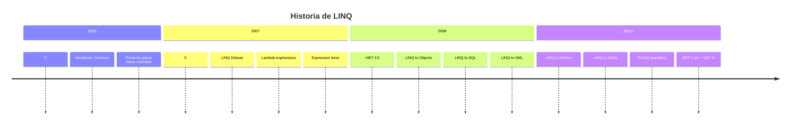
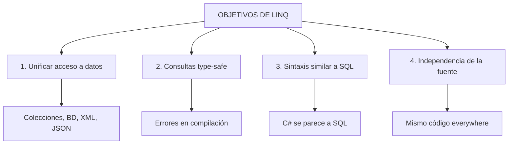
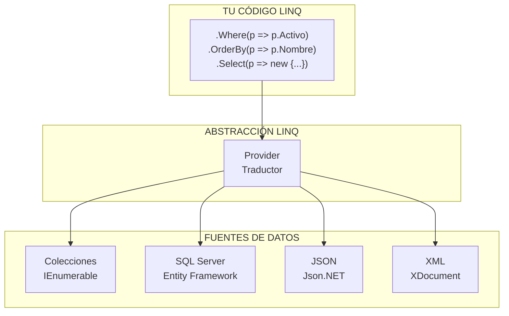
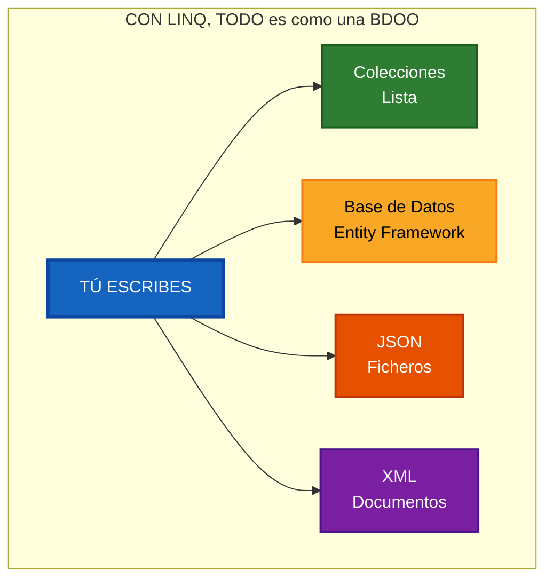
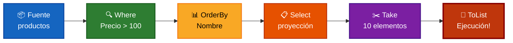

- [3. LINQ (Language Integrated Query): Abstracción Universal](#3-linq-language-integrated-query-abstracción-universal)
  - [3.1. ¿Qué es LINQ?](#31-qué-es-linq)
    - [3.1.1. Definición y Origen](#311-definición-y-origen)
    - [¿Cuándo nació LINQ?](#cuándo-nació-linq)
    - [3.1.2. Objetivos de LINQ](#312-objetivos-de-linq)
    - [3.1.3. ¿Por qué surge LINQ?](#313-por-qué-surge-linq)
  - [3.2. La Filosofía de LINQ: Consultas Unificadas](#32-la-filosofía-de-linq-consultas-unificadas)
    - [3.2.1. El Problema que LINQ Resuelve](#321-el-problema-que-linq-resuelve)
    - [3.2.2. La Solución: Una Sintaxis para Todo](#322-la-solución-una-sintaxis-para-todo)
  - [3.3. LINQ: SQL para Objetos, Independientemente del Storage](#33-linq-sql-para-objetos-independientemente-del-storage)
    - [3.3.1. El Concepto Central: Abstracción de la Fuente](#331-el-concepto-central-abstracción-de-la-fuente)
    - [¿Qué significa esto en la práctica?](#qué-significa-esto-en-la-práctica)
    - [3.3.2. IEnumerable vs IQueryable](#332-ienumerable-vs-iqueryable)
  - [3.4. Programación Declarativa vs Imperativa con LINQ](#34-programación-declarativa-vs-imperativa-con-linq)
    - [El cambio de paradigma](#el-cambio-de-paradigma)
  - [3.5. Sintaxis de LINQ: Method Syntax vs Query Syntax](#35-sintaxis-de-linq-method-syntax-vs-query-syntax)
    - [3.5.1. Method Syntax (Sintaxis de Métodos)](#351-method-syntax-sintaxis-de-métodos)
    - [3.5.2. Query Syntax (Sintaxis de Consulta)](#352-query-syntax-sintaxis-de-consulta)
    - [3.5.3. Comparación directa](#353-comparación-directa)
    - [3.5.4. Combinación de ambas sintaxis](#354-combinación-de-ambas-sintaxis)
  - [3.5.5. ¿Cómo funcionan los métodos LINQ? Métodos de Extensión](#355-cómo-funcionan-los-métodos-linq-métodos-de-extensión)
    - [¿Qué es un método de extensión?](#qué-es-un-método-de-extensión)
    - [Los métodos LINQ son métodos de extensión](#los-métodos-linq-son-métodos-de-extensión)
    - [Ejemplo completo: Nuestra propia implementación de LINQ](#ejemplo-completo-nuestra-propia-implementación-de-linq)
    - [¿Por qué importa esto?](#por-qué-importa-esto)
  - [3.6. LINQ: Bases de Datos Orientadas a Objetos, Declarativamente](#36-linq-bases-de-datos-orientadas-a-objetos-declarativamente)
    - [El concepto clave](#el-concepto-clave)
    - [Lo que LINQ te permite hacer](#lo-que-linq-te-permite-hacer)
    - [En resumen: La promesa cumplida de las BDOO](#en-resumen-la-promesa-cumplida-de-las-bdoo)
  - [3.7. El Pipeline de Consultas en LINQ](#37-el-pipeline-de-consultas-en-linq)
    - [¿Qué es un pipeline?](#qué-es-un-pipeline)
    - [El pipeline en acción](#el-pipeline-en-acción)
    - [Ejemplo práctico: Paso a paso](#ejemplo-práctico-paso-a-paso)
    - [✅ Solución: Materializar primero](#-solución-materializar-primero)
    - [Pipeline con múltiples operaciones](#pipeline-con-múltiples-operaciones)
  - [📝 Resumen: Fundamentos de LINQ](#-resumen-fundamentos-de-linq)

# 3. LINQ (Language Integrated Query): Abstracción Universal

> "LINQ revolucionó C# permitiendo escribir consultas directamente en el lenguaje, sin importar si los datos vienen de una base de datos, un XML, JSON o una colección en memoria. **El objetivo: una sintaxis única para cualquier fuente de datos.**"

---

## 3.1. ¿Qué es LINQ?

### 3.1.1. Definición y Origen

**LINQ (Language Integrated Query)** significa "Lenguaje Integrado de Consultas" en español. Es una tecnología desarrollada por Microsoft e introducida en **2007** con C# 3.0 y .NET Framework 3.5.

**📝 Nota del Profesor:** ¿Qué significa "Lenguaje Integrado de Consultas"?

La palabra "Integrado" es clave. Antes de LINQ, las consultas estaban "separadas" del código C#:
- **SQL**: Lenguaje separado, fuera de C#
- **XPath/XQuery**: Lenguajes separados para XML
- **Bucles imperativos**: Código complejo para operaciones simples

**LINQ integra el poder de las consultas directamente en C#**, permitiendo escribir código que se parece a SQL pero funciona con colecciones, objetos, XML, JSON y bases de datos.

### ¿Cuándo nació LINQ?



### 3.1.2. Objetivos de LINQ

Microsoft diseñó LINQ con **cuatro objetivos principales**:



**Objetivo 1: Unificar el acceso a datos**

Antes de LINQ, cada fuente de datos requería una API diferente:
- **Colecciones**: Bucles `for`, `foreach`
- **SQL**: Cadenas de texto con SQL
- **XML**: XPath, XQuery
- **Objetos en memoria**: Bucles manuales

**Con LINQ**: Una sola API para todo.

**Objetivo 2: Type-safety (seguridad de tipos)**

```csharp
// SIN LINQ: SQL como string (error en tiempo de ejecución)
string sql = "SELECT * FROM Usuarios WHERE Id = " + usuarioId;
// Si usuarioId es null, error en tiempo de ejecución

// CON LINQ: Type-safe (error en tiempo de compilación)
var usuarios = db.Usuarios.Where(u => u.Id == usuarioId);
// Si el tipo no coincide, el compilador avisa
```

**Objetivo 3: Sintaxis similar a SQL**

Si sabes SQL, ya sabes parte de LINQ:
```csharp
// SQL
SELECT * FROM Products WHERE Price > 100 ORDER BY Name

// LINQ
products.Where(p => p.Price > 100).OrderBy(p => p.Name)
```

**Objetivo 4: Independencia de la fuente**

El mismo código LINQ puede funcionar con:
- Colecciones en memoria
- Bases de datos SQL
- Ficheros JSON/XML
- Servicios web

**💡 Tip del Examinador:** Pregunta de examen

"¿Cuáles son los 4 objetivos principales de LINQ?"

**Respuesta:**
1. Unificar el acceso a datos
2. Consultas type-safe (seguras en tipos)
3. Sintaxis similar a SQL
4. Independencia de la fuente de datos

---

### 3.1.3. ¿Por qué surge LINQ?

Antes de LINQ, la programación de acceso a datos era un caos:

```csharp
// ANTES DE LINQ: Múltiples APIs, ninguna integrada

// 1. Base de datos (SQL como string)
string sql = "SELECT * FROM Products WHERE Price > 100";
var reader = connection.ExecuteQuery(sql);
while (reader.Read())
{
    // Procesar fila por fila
}

// 2. XML (XPath)
var productosCaros = doc.XPathSelectElements("//producto[precio > 100]");

// 3. Colecciones (Bucles)
var productosCaros = new List<Producto>();
foreach (var p in productos)
{
    if (p.Price > 100)
        productosCaros.Add(p);
}
```

**📝 Nota del Profesor:** El problema de la fragmentación

El problema no era solo escribir más código. El problema era que cada tecnología requería:
- **Conocimientos diferentes**: SQL, XPath, bucles imperativos
- **APIs diferentes**: No había transferencia de conocimiento
- **Errores diferentes**: Strings vs objetos vs nodos XML
- **Debugging diferente**: Cada herramienta su propio depurador

**LINQ resolvió esto integrando todo en C# con una sola sintaxis.**

---

## 3.2. La Filosofía de LINQ: Consultas Unificadas

### 3.2.1. El Problema que LINQ Resuelve

```csharp
// DESPUÉS DE LINQ: La misma sintaxis para todas las fuentes

// Colecciones en memoria
var productos1 = productos
    .Where(p => p.Precio > 100)
    .OrderBy(p => p.Nombre)
    .ToList();

// Base de datos (Entity Framework)
var productos2 = db.Productos
    .Where(p => p.Precio > 100)
    .OrderBy(p => p.Nombre)
    .ToList();

// XML
var productos3 = doc.Descendants("producto")
    .Where(p => (decimal)p.Attribute("precio") > 100)
    .OrderBy(p => (string)p.Attribute("nombre"))
    .ToList();

// JSON
var productos4 = JArray.Parse(json)
    .Where(p => (decimal)p["precio"] > 100)
    .OrderBy(p => (string)p["nombre"])
    .ToList();
```

**🧠 Analogía:** El Enchufe Universal

Imagina que vives en un mundo donde cada electrodoméstico tiene un enchufe diferente:
- Nevera: enchufe triangular
- Televisión: enchufe rectangular
- Microondas: enchufe redondo

Ahora imaginas que alguien inventa un **enchufe universal** que funciona con todos.

**LINQ es ese enchufe universal** para acceder a datos, sin importar la fuente.

---

### 3.2.2. La Solución: Una Sintaxis para Todo

LINQ funciona porque todo lo que consulta implementa una de estas interfaces:

```csharp
// IEnumerable<T>: Para colecciones en memoria
public interface IEnumerable<out T> : IEnumerable
{
    IEnumerator<T> GetEnumerator();
}

// IQueryable<T>: Para consultas remotas (BD, servicios)
public interface IQueryable<out T> : IEnumerable<T>
{
    Type ElementType { get; }
    Expression Expression { get; }
    IQueryProvider Provider { get; }
}
```

**📝 Nota del Profesor:** La magia detrás de LINQ

El "truco" de LINQ es que tanto `IEnumerable<T>` como `IQueryable<T>` comparten operadores comunes:
- `Where()`
- `Select()`
- `OrderBy()`
- `GroupBy()`
- `Join()`
- etc.

Cuando escribes `lista.Where(p => p.Precio > 100)`, el compilador traduce esto a llamadas a métodos de extensión que funcionan con cualquier fuente de datos.

---

## 3.3. LINQ: SQL para Objetos, Independientemente del Storage

### 3.3.1. El Concepto Central: Abstracción de la Fuente

El poder de LINQ radica en su **abstracción de la fuente de datos**:



### ¿Qué significa esto en la práctica?

**Con LINQ, tú solo escribes "qué datos quieres". LINQ y el provider se encargan de "cómo obtenerlos".**

| Fuente de datos | Provider LINQ    | ¿Cómo traduce LINQ?             |
| --------------- | ---------------- | ------------------------------- |
| Colecciones     | LINQ to Objects  | Ejecuta directamente en memoria |
| SQL Server      | LINQ to SQL / EF | Genera consultas SQL            |
| XML             | LINQ to XML      | Genera XPath/XQuery             |
| JSON            | LINQ to JSON     | Lee y filtra objetos JSON       |
| Azure Search    | LINQ to Search   | Genera queries de búsqueda      |

**💡 Tip del Examinador:** El provider importa

El resultado de tu consulta DEPENDE del provider LINQ que estés usando:

```csharp
// LINQ to Objects (colecciones): Ejecución inmediata
var resultado1 = productos.Where(p => p.Precio > 100);
// Se ejecuta AHORA, en memoria

// LINQ to SQL (base de datos): Ejecución diferida + SQL
var resultado2 = db.Productos.Where(p => p.Precio > 100);
// NO se ejecuta aún, genera SQL

resultado2.ToList(); // AHORA ejecuta el SQL generado
```

---

### 3.3.2. IEnumerable vs IQueryable

Esta es una distinción **CRUCIAL** que debes entender:

```csharp
// IEnumerable<T>: Para datos en memoria
// - El filtrado OCURRE en el CLIENTE
// - Adecuado para: List, Array, colecciones ya cargadas

IEnumerable<Producto> productosEnMemoria = new List<Producto>();
var filtrados = productosEnMemoria.Where(p => p.Precio > 100);
// Where se ejecuta AQUÍ, en memoria local

// IQueryable<T>: Para datos remotos (BD, servicios)
// - El filtrado se DIFIERE hasta ToList() o foreach
// - Genera EXPRESIONES que el provider optimiza
// - Adecuado para: EF Core, servicios OData

IQueryable<Producto> productosEnBD = db.Productos;
var filtradosBD = productosEnBD.Where(p => p.Precio > 100);
// Where NO se ejecuta, genera SQL
// Se ejecuta cuando llames a ToList(), First(), foreach
```

**📝 Nota del Profesor:** IEnumerable vs IQueryable en la práctica

**Regla de oro:**
- Usa **IEnumerable** cuando trabajes con datos YA en memoria
- Usa **IQueryable** cuando trabajes con fuentes remotas (BD)

```csharp
// ERROR COMÚN: Convertir prematuramente
public IEnumerable<Producto> GetProductos()
{
    // ❌ Esto trae TODOS los productos de la BD
    return db.Productos.ToList().Where(p => p.Activo);
}

// CORRECTO: Mantener IQueryable
public IQueryable<Producto> GetProductos()
{
    // ✅ LINQ se traduce a SQL óptimo
    return db.Productos.Where(p => p.Activo);
}
```

**🧠 Analogía:** El Menú vs La Cocina

- **IEnumerable**: Como pedir toda la carta y luego filtrar en tu mesa (menos eficiente)
- **IQueryable**: Como pedirle al cocinero que prepare solo lo que quieres (más eficiente)

---

## 3.4. Programación Declarativa vs Imperativa con LINQ

### El cambio de paradigma

Antes de LINQ, accedías a datos de forma **imperativa** (cómo hacerlo):

```csharp
// IMPERATIVO: CÓMO hacerlo paso a paso
var resultados = new List<Alumno>();

foreach (var alumno in todosLosAlumnos)
{
    if (alumno.Activo && alumno.Nota >= 5)
    {
        if (!resultados.Any(r => r.Curso == alumno.Curso))
        {
            resultados.Add(alumno);
        }
    }
}

resultados.Sort((a, b) => a.Nombre.CompareTo(b.Nombre));
```

Con LINQ, usas programación **declarativa** (qué quieres):

```csharp
// DECLARATIVO: QUÉ quieres, no CÓMO
var resultados = todosLosAlumnos
    .Where(a => a.Activo && a.Nota >= 5)
    .DistinctBy(a => a.Curso)
    .OrderBy(a => a.Nombre)
    .ToList();
```

**📝 Nota del Profesor:** ¿Por qué declarativo es mejor?

| Aspecto            | Imperativo                       | Declarativo (LINQ)            |
| ------------------ | -------------------------------- | ----------------------------- |
| **Legibilidad**    | Requiere leer todo el código     | Se lee casi como prosa        |
| **Mantenibilidad** | Cambios = reescribir lógica      | Cambios = cambiar filtros     |
| **Errores**        | Más fáciles en código complejo   | Menos errores por simplicidad |
| **Expresividad**   | Mucho código para poco resultado | Código conciso y claro        |

**💡 Tip del Examinador:** Pregunta frecuente

"¿Cuándo usar programación imperativa con LINQ?"

**Respuesta:**
- Usa LINQ (declarativo) para **consultas y transformaciones de datos**
- Usa código imperativo para **lógica de negocio compleja** que no sea consulta de datos

---

## 3.5. Sintaxis de LINQ: Method Syntax vs Query Syntax

LINQ ofrece **dos formas** de escribir las mismas consultas:

### 3.5.1. Method Syntax (Sintaxis de Métodos)

```csharp
// Method Syntax: Llamadas a métodos encadenadas
var resultado = productos
    .Where(p => p.Precio > 100)              // Filtrar
    .OrderByDescending(p => p.Precio)        // Ordenar descendente
    .ThenBy(p => p.Nombre)                   //thenBy)
    .Select(p => new                          // Proyectar
    { 
        p.Nombre, 
        p.Precio,
        p.Categoria 
    })
    .Take(10)                                // Limitar
    .ToList();
```

### 3.5.2. Query Syntax (Sintaxis de Consulta)

```csharp
// Query Syntax: Similar a SQL
var resultado = from p in productos
                where p.Precio > 100
                orderby p.Precio descending, p.Nombre
                select new 
                { 
                    p.Nombre, 
                    p.Precio,
                    p.Categoria 
                };
```

### 3.5.3. Comparación directa

| Operación     | Method Syntax             | Query Syntax                 |
| ------------- | ------------------------- | ---------------------------- |
| **Filtrar**   | `.Where(x => condición)`  | `where condición`            |
| **Ordenar**   | `.OrderBy(x => expr)`     | `orderby expr`               |
| **Proyectar** | `.Select(x => new {...})` | `select new {...}`           |
| **Agrupar**   | `.GroupBy(x => key)`      | `group x by key into g`      |
| **Join**      | `.Join(...)`              | `join ... on ... equals ...` |

**📝 Nota del Profesor:** ¿Cuál usar?

**Method Syntax es más común** en proyectos profesionales porque:
- ✅ Más flexible (se adapta mejor a chaining)
- ✅ Mejor soporte de IntelliSense
- ✅ Se integra mejor con el resto de C#
- ✅ Más consistente con otras APIs de .NET

**Query Syntax puede ser útil** para:
- JOINs simples que se lean mejor como SQL
- Demostraciones educativas
- Queries muy básicas

### 3.5.4. Combinación de ambas sintaxis

Puedes combinar ambas sintaxis en la misma consulta:

```csharp
// Mezcla de Method y Query Syntax
var resultado = (from p in productos       // Query Syntax
                where p.Activo
                select p)
               .Where(p => p.Precio > 100)  // Method Syntax
                .OrderBy(p => p.Nombre)     // Method Syntax
                .ToList();
```

---

## 3.5.5. ¿Cómo funcionan los métodos LINQ? Métodos de Extensión

Una pregunta fundamental: **¿de dónde salen estos métodos Where(), Select(), OrderBy()?**

**Respuesta**: LINQ son **métodos de extensión** sobre las colecciones.

### ¿Qué es un método de extensión?

Un **método de extensión** permite "agregar" métodos a un tipo existente sin modificarlo ni crear una subclase:

```csharp
// Método de extensión para string
public static class StringExtensions
{
    public static int ContarPalabras(this string texto)
    {
        return texto.Split(' ', StringSplitOptions.RemoveEmptyEntries).Length;
    }
}

// Uso - Parece que string tiene un método nativo
string frase = "Hola mundo esto es LINQ";
int palabras = frase.ContarPalabras(); // 5
```

### Los métodos LINQ son métodos de extensión

```csharp
// Definición simplificada de LINQ (Where)
public static class EnumerableExtensions
{
    // Este método "extiende" a IEnumerable<T>
    public static IEnumerable<TSource> Where<TSource>(
        this IEnumerable<TSource> source,      // <-- "this" lo hace extensión
        Func<TSource, bool> predicado)
    {
        foreach (var elemento in source)
        {
            if (predicado(elemento))
            {
                yield return elemento;
            }
        }
    }
}
```

**📝 Nota del Profesor:** La magia de los métodos de extensión

Fíjate en la palabra clave `this` en el primer parámetro:

```csharp
public static IEnumerable<TSource> Where<TSource>(
    this IEnumerable<TSource> source,  // <-- Esto hace la magia
    Func<TSource, bool> predicado)
```

Gracias a `this IEnumerable<TSource> source`, el método `Where()` parece que pertenece a `List<T>`, `Array<T>`, etc., aunque en realidad está definido en otra clase.

### Ejemplo completo: Nuestra propia implementación de LINQ

```csharp
// PODRÍAS escribir tu propio LINQ:
public static class MiLinq
{
    // Where personalizado
    public static IEnumerable<T> Donde<T>(
        this IEnumerable<T> fuente,
        Func<T, bool> condicion)
    {
        foreach (var item in fuente)
        {
            if (condicion(item))
                yield return item;
        }
    }

    // Select personalizado
    public static IEnumerable<TResult> Seleccionar<TSource, TResult>(
        this IEnumerable<TSource> fuente,
        Func<TSource, TResult> transformacion)
    {
        foreach (var item in fuente)
        {
            yield return transformacion(item);
        }
    }

    // OrderBy personalizado
    public static IEnumerable<T> OrdenarPor<T, TKey>(
        this IEnumerable<T> fuente,
        Func<T, TKey> clave)
    {
        // Implementación simplificada (burbuja)
        var lista = fuente.ToList();
        for (int i = 0; i < lista.Count - 1; i++)
        {
            for (int j = 0; j < lista.Count - i - 1; j++)
            {
                if (clave(lista[j]).CompareTo(clave(lista[j + 1])) > 0)
                {
                    var temp = lista[j];
                    lista[j] = lista[j + 1];
                    lista[j + 1] = temp;
                }
            }
        }
        return lista;
    }
}

// Uso - ¡Igual que LINQ real!
var resultado = numeros
    .Donde(n => n % 2 == 0)           // Where
    .OrdenarPor(n => n)                // OrderBy
    .Seleccionar(n => n * 2);          // Select
```

**💡 Tip del Examinador:** Pregunta frecuente

"¿Los métodos LINQ están 'magicamente' en las colecciones?"

**Respuesta:** No, son **métodos de extensión** declarados en las clases `System.Linq.Enumerable` (para `IEnumerable<T>`) y `System.Linq.Queryable` (para `IQueryable<T>`). El compilador traduce `lista.Where(...)` en `Enumerable.Where(lista, ...)`.

### ¿Por qué importa esto?

Entender que son métodos de extensión te ayuda a:
1. **Depurar**: Puedes ver el código fuente de LINQ en GitHub
2. **Aprender**: Puedes implementar los tuyos propios
3. **Customizar**: Puedes crear LINQ personalizado para tus necesidades

---

## 3.6. LINQ: Bases de Datos Orientadas a Objetos, Declarativamente

Esta es la **idea más importante** de todo el tema: **Gracias a LINQ, puedes trabajar con cualquier fuente de datos como si fuera una base de datos orientada a objetos, de forma declarativa.**

### El concepto clave

Antes de LINQ, cada fuente de datos tenía su propia forma de trabajar:
- **BDOO puras**: Guardabas objetos directamente, pero sin estándares
- **SQL**: Tenías que convertir objetos a filas manualmente
- **Colecciones**: Tenías que usar bucles imperativos

**Con LINQ**, tienes lo mejor de ambos mundos:
- ✅ Trabajas con **objetos** (no filas)
- ✅ De forma **declarativa** (qué quieres, no cómo)
- ✅ **Independientemente** de la fuente de datos

```csharp
// GRACIAS A LINQ: Todo es una "BDOO" declarativa

// Colecciones en memoria
var alumnos1 = listaAlumnos
    .Where(a => a.Nota >= 5)
    .OrderBy(a => a.Nombre)
    .ToList();

// Base de datos SQL (Entity Framework)
var alumnos2 = db.Alumnos
    .Where(a => a.Nota >= 5)
    .OrderBy(a => a.Nombre)
    .ToList();

// Ficheros JSON
var alumnos3 = JArray.Parse(json)
    .Where(a => (decimal)a["nota"] >= 5)
    .OrderBy(a => (string)a["nombre"])
    .ToList();

// XML
var alumnos4 = XDocument.Parse(xml)
    .Descendants("alumno")
    .Where(a => (decimal)a.Attribute("nota") >= 5)
    .OrderBy(a => (string)a.Attribute("nombre"))
    .ToList();
```

**📝 Nota del Profesor:** El objetivo de LINQ

El objetivo de LINQ siempre fue permitirnos **trabajar con datos como si fueran objetos en memoria**, sin importar dónde estén almacenados físicamente. Esto es exactamente lo que las BDOO prometieron, pero LINQ lo logró de forma pragmática usando los estándares existentes (SQL, JSON, XML).

### Lo que LINQ te permite hacer



**Lo que escribes es igual para todas las fuentes:**
- `Where()` para filtrar
- `OrderBy()` para ordenar
- `Select()` para proyectar
- `GroupBy()` para agrupar
- `Join()` para combinar

**LINQ se encarga de la traducción** a la fuente correspondiente.

**💡 Tip del Examinador:** La pregunta clave

"¿Qué permite LINQ que antes no existía?"

**Respuesta:**
> LINQ permite trabajar con **cualquier fuente de datos** (colecciones, BD, JSON, XML) **como si fuera una base de datos orientada a objetos**, usando una **sintaxis declarativa** única. Antes de LINQ, esto no era posible sin usar tecnologías propietarias que no triunfaron.

### En resumen: La promesa cumplida de las BDOO

| Aspecto                    | BDOO Puras | LINQ                  |
| -------------------------- | ---------- | --------------------- |
| **Objetos directamente**   | ✅ Sí       | ✅ Sí                  |
| **Consultas declarativas** | ✅ Sí       | ✅ Sí                  |
| **Estándares**             | ❌ No       | ✅ Sí (SQL, JSON, XML) |
| **Ecosistema**             | ❌ Limitado | ✅ Enorme              |
| **Type-safe**              | Dependía   | ✅ Total               |
| **Múltiples fuentes**      | ❌ No       | ✅ Sí                  |

**Las BDOO prometieron las bases de datos orientadas a objetos. LINQ las hizo realidad de forma pragmática.**

---

## 3.7. El Pipeline de Consultas en LINQ

Cuando encadenas operaciones LINQ, no se ejecutan inmediatamente. Se construye un **pipeline** de operaciones que se ejecuta solo cuando necesitas los resultados.

### ¿Qué es un pipeline?

Un **pipeline** (tubería) es una secuencia de operaciones donde cada paso transforma los datos antes de pasarlos al siguiente:

```csharp
// Este código NO ejecuta NADA aún
var resultado = productos                        // Paso 1: Fuente
    .Where(p => p.Precio > 100)              // Paso 2: Filtrar
    .OrderBy(p => p.Nombre)                 // Paso 3: Ordenar
    .Select(p => new { p.Nombre, p.Precio }) // Paso 4: Proyectar
    .Take(10);                              // Paso 5: Limitar

// Solo cuando iteras, el pipeline se ejecuta:
foreach (var p in resultado)  // <-- AQUÍ se ejecuta TODO
{
    Console.WriteLine(p.Nombre);
}
```

**📝 Nota del Profesor:** Ejecución diferida vs inmediata

| Tipo                      | Descripción                                       | Ejemplos                                               |
| ------------------------- | ------------------------------------------------- | ------------------------------------------------------ |
| **Diferida (Deferred)**   | Se construye el query, no se ejecuta hasta iterar | `Where`, `Select`, `OrderBy`, `GroupBy`                |
| **Inmediata (Immediate)** | Se ejecuta inmediatamente                         | `ToList()`, `ToArray()`, `Count()`, `First()`, `Max()` |

### El pipeline en acción



### Ejemplo práctico: Paso a paso

```csharp
// Paso 1: Fuente - tenemos 1000 productos
var productos = ObtenerProductos(); // 1000 productos

// Paso 2: Solo se construye el pipeline (NADA se ejecuta)
var query = productos
    .Where(p => p.Categoria == "Electrónica")   // No ejecuta
    .OrderBy(p => p.Precio)                      // No ejecuta
    .Take(10);                                  // No ejecuta

// Paso 3: Contar - SÍ ejecuta (operación inmediata)
int total = query.Count(); // Se ejecuta hasta aquí
// Resultado: 45 productos electrónicos

// Paso 4: Iterar - VUELVE a ejecutar el pipeline
foreach (var p in query) // Se ejecuta de nuevo
{
    Console.WriteLine(p.Nombre);
}
```

**⚠️ Advertencia:** El pipeline se ejecuta en cada iteración

```csharp
// ❌ PROBLEMA: El pipeline se ejecuta DOS VECES
var productosCaros = productos.Where(p => p.Precio > 100);

// Primera ejecución
foreach (var p in productosCaros) // Ejecuta el pipeline
{
    Console.WriteLine(p.Nombre);
}

// Segunda ejecución - VUELVE a ejecutar
var count = productosCaros.Count(); // Ejecuta de nuevo
```

**✅ Solución:** Materializar primero

```csharp
// ✅ CORRECTO: Materializar una vez
var productosCaros = productos
    .Where(p => p.Precio > 100)
    .ToList(); // <-- Materializa el pipeline AHORA

// Ahora usa la lista en memoria
var count = productosCaros.Count; // Rápido, ya está en memoria
foreach (var p in productosCaros) // Rápido, ya está en memoria
{
    Console.WriteLine(p.Nombre);
}
```

**💡 Tip del Examinador:** Optimización del pipeline

El pipeline es **muy eficiente** porque:
1. **No crea copias intermedias** de los datos
2. **Se ejecuta una sola vez** cuando iteras
3. **Con LINQ to SQL**, el provider optimiza todo el pipeline en una sola query SQL

```csharp
// LINQ to Objects: Ejecución optimizada
// Se itera una sola vez sobre la fuente original

// LINQ to SQL: UNA sola query SQL
var query = db.Productos
    .Where(p => p.Precio > 100)       // WHERE precio > 100
    .OrderBy(p => p.Nombre)          // ORDER BY nombre
    .Take(10);                        // TOP 10

// Genera UN SOLO SQL:
-- SELECT TOP 10 * FROM Productos WHERE Precio > 100 ORDER BY Nombre
```

### Pipeline con múltiples operaciones

```csharp
// El pipeline encadena operaciones de forma eficiente
var resultado = datos
    .Where(d => d.Activo)              // 1. Filtrar activos
    .Where(d => d.Fecha > haceUnMes)   // 2. Filtrar recientes
    .OrderByDescending(d => d.Visitas) // 3. Ordenar por visitas
    .Select(d => new                   // 4. Proyectar
    { 
        d.Nombre, 
        Visitas = d.Visitas,
        Categoria = d.Categoria.Nombre 
    })
    .Take(100)                         // 5. Top 100
    .ToList();                          // 6. Materializar
```

**📝 Nota del Profesor:** El orden importa

El pipeline procesa en orden, lo que puede afectar al rendimiento:

```csharp
// ✅ EFICIENTE: Filtrar ANTES de ordenar
var rapido = productos
    .Where(p => p.Precio > 100)      // Filtra PRIMERO
    .OrderBy(p => p.Nombre)           // Ordena DESPUÉS
    .ToList();

// ❌ MENOS EFICIENTE: Ordenar ANTES de filtrar
var lento = productos
    .OrderBy(p => p.Nombre)          // Ordena TODO primero
    .Where(p => p.Precio > 100)        // Filtra después
    .ToList();
```

**💡 Tip del Examinador:** Pregunta de examen

"¿Qué es el pipeline de consultas en LINQ y qué operaciones son diferidas?"

**Respuesta:**
> El pipeline de consultas es una secuencia encadenada de operaciones LINQ que se construye pero no se ejecuta hasta que iteras o usas una operación inmediata (ToList, Count, First, etc.). Las operaciones diferidas son Where, Select, OrderBy, GroupBy, Join, etc. Las operaciones inmediatas son ToList, ToArray, Count, Max, First, Single, etc.

### 3.7.1. La Cadena de Montaje: El Peligro de Romper el Flujo

Imagina una **cadena de montaje** de coches. Cada operario (operador LINQ como `Where` o `Select`) realiza una tarea específica conforme el chasis pasa por delante.

*   **Flujo Lazy (Eficiente):** Los operarios trabajan solo cuando el coche llega a su posición. No hay coches acumulados bloqueando el taller. Los datos "fluyen" de uno en uno.
*   **Materialización Prematura (ToList):** Es como si un operario decidiera sacar todos los coches de la cinta y aparcarlos en un parking (`List`) para luego volver a meterlos uno a uno en la cinta. 

**¿Por qué es malo materializar antes de tiempo?**
1.  **Saturas el "parking" (Memoria RAM):** Si tienes un millón de registros, podrías agotar la memoria del sistema.
2.  **Paralizas la "producción":** Ningún operario posterior puede trabajar hasta que el parking esté lleno.
3.  **Pierdes agilidad:** Si el consumidor final solo quería los 5 primeros elementos (`Take(5)`), habrás procesado y almacenado un millón innecesariamente.

> **REGLA DE ORO:** Mantén el flujo `IEnumerable` lo más lejos posible. Solo usa un "Terminador" (`ToList`, `ToArray`) cuando realmente necesites una "foto fija" de los datos o vayas a recorrer la misma colección múltiples veces para sacar estadísticas diferentes.

---

## 📝 Resumen: Fundamentos de LINQ

**Lo que debes recordar:**

1. **LINQ** = Lenguaje Integrado de Consultas (2007)
2. **Objetivos**: Unificar acceso, type-safe, SQL-like, independiente de fuente
3. **Providers**: LINQ to Objects, EF, XML, JSON
4. **Interfaces**: IEnumerable (memoria) vs IQueryable (remoto)
5. **Estilos**: Method Syntax vs Query Syntax
6. **LO MÁS IMPORTANTE**: LINQ permite trabajar con cualquier fuente como BDOO, declarativamente
7. **Cómo funciona**: LINQ son métodos de extensión sobre IEnumerable/IQueryable

**Próximo paso**: Aprender los operadores LINQ más importantes y cómo usarlos en la práctica.
