- [4. LINQ: Consultas Declarativas y Pipeline de Datos](#4-linq-consultas-declarativas-y-pipeline-de-datos)
  - [4.1. LINQ como Lenguaje Declarativo](#41-linq-como-lenguaje-declarativo)
    - [4.1.1. Programación Imperativa vs Declarativa](#411-programación-imperativa-vs-declarativa)
    - [4.1.2. El Pipeline de LINQ: Flujo de Datos](#412-el-pipeline-de-linq-flujo-de-datos)
    - [4.1.3. Ejecución Diferida vs Inmediata](#413-ejecución-diferida-vs-inmediata)
  - [4.2. Operaciones Fundamentales de LINQ](#42-operaciones-fundamentales-de-linq)
    - [4.2.1. Filtrado: Where - Seleccionar elementos que cumplen una condición](#421-filtrado-where---seleccionar-elementos-que-cumplen-una-condición)
    - [4.2.2. Proyección: Select - Transformar cada elemento](#422-proyección-select---transformar-cada-elemento)
    - [4.2.3. Proyección y Aplanado: SelectMany - Obtener todos los elementos](#423-proyección-y-aplanado-selectmany---obtener-todos-los-elementos)
    - [4.2.4. Zip - Combinar Dos Secuencias](#424-zip---combinar-dos-secuencias)
    - [4.2.5. Ordenación: OrderBy, ThenBy - Organizar resultados](#425-ordenación-orderby-thenby---organizar-resultados)
    - [4.2.5. Agregación: Count, Sum, Average, Max, Min - Reducir a un valor](#425-agregación-count-sum-average-max-min---reducir-a-un-valor)
    - [4.2.6. Agrupación: GroupBy - Organizar en categorías](#426-agrupación-groupby---organizar-en-categorías)
    - [4.2.7. Particionado: Take, Skip, Chunk - Dividir colecciones](#427-particionado-take-skip-chunk---dividir-colecciones)
    - [4.2.8. Filtrado por Tipo: OfType, Cast, Pattern Matching](#428-filtrado-por-tipo-oftype-cast-pattern-matching)
  - [4.3. Operadores de Búsqueda y Verificación](#43-operadores-de-búsqueda-y-verificación)
    - [4.3.1. Búsqueda de Elementos: First, Last, Single](#431-búsqueda-de-elementos-first-last-single)
    - [4.3.2. Verificación: Any, All, Contains](#432-verificación-any-all-contains)
  - [4.4. Operaciones de Conjuntos](#44-operaciones-de-conjuntos)
    - [4.4.1. Union, Intersect, Except - Operaciones de teoría de conjuntos](#441-union-intersect-except---operaciones-de-teoría-de-conjuntos)
    - [4.4.2. Distinct - Eliminar Duplicados](#442-distinct---eliminar-duplicados)
  - [4.5. Métodos de Conversión](#45-métodos-de-conversión)
    - [4.5.1. ToList, ToArray, ToDictionary - Materializar resultados](#451-tolist-toarray-todictionary---materializar-resultados)
    - [4.5.2. DefaultIfEmpty - Valor por defecto en colecciones vacías](#452-defaultifempty---valor-por-defecto-en-colecciones-vacías)
  - [4.10. SQL vs LINQ: Guía de Referencia Rápida](#410-sql-vs-linq-guía-de-referencia-rápida)
    - [4.10.1. Consultas Básicas](#4101-consultas-básicas)
    - [4.10.2. Filtrado (WHERE)](#4102-filtrado-where)
    - [4.10.3. Ordenación (ORDER BY)](#4103-ordenación-order-by)
    - [4.10.4. Proyección (SELECT)](#4104-proyección-select)
    - [4.10.5. Agregación (GROUP BY y funciones)](#4105-agregación-group-by-y-funciones)
    - [4.10.6. JOINs](#4106-joins)
    - [4.10.7. Subconsultas (Subqueries)](#4107-subconsultas-subqueries)
    - [4.10.8. TOP, LIMIT, OFFSET](#4108-top-limit-offset)
    - [4.10.9. UNION, INTERSECT, EXCEPT](#4109-union-intersect-except)
    - [4.10.10. CASE y Condicionales](#41010-case-y-condicionales)

# 4. LINQ: Consultas Declarativas y Pipeline de Datos

## 4.1. LINQ como Lenguaje Declarativo

### 4.1.1. Programación Imperativa vs Declarativa

```mermaid
---
theme: dark
---
graph TB
    subgraph "Programación Imperativa"
    I1["🔨 Describe CÓMO hacerlo"]
    I2["Pasos secuenciales"]
    I3["Modificar estado"]
    I4["Bucles for/while"]
    end

    subgraph "Programación Declarativa"
    D1["🔨 Describe QUÉ quieres"]
    D2["Concatenar operaciones"]
    D3["Sin modificar estado"]
    D4["Pipeline de datos"]
    end

    style I1 fill:#d32f2f,stroke:#b71c1c,color:#ffffff
    style D1 fill:#388e3c,stroke:#1b5e20,color:#ffffff
```

**Programación Imperativa** - Describes how:

```csharp
// IMPERATIVO: CÓMO hacerlo paso a paso
var resultados = new List<int>();
foreach (var numero in numeros)
{
    if (numero > 5)
    {
        resultados.Add(numero * 2);
    }
}
resultados.Sort();
```

**Programación Declarativa** - Describes what you want:

```csharp
// DECLARATIVO: QUÉ quieres, no CÓMO
var resultados = numeros
    .Where(n => n > 5)        // Filtra
    .Select(n => n * 2)       // Transforma
    .OrderBy(n => n);         // Ordena
```

**📝 Nota del Profesor:** La diferencia clave

| Aspecto            | Imperativo                     | Declarativo (LINQ)             |
| ------------------ | ------------------------------ | ------------------------------ |
| **Foco**           | Cómputo secuencial             | Transformación de datos        |
| **Estado**         | Modifica variables             | Inmutable (nuevas colecciones) |
| **Legibilidad**    | Menor para consultas complejas | Alta, similar a SQL            |
| **Mantenibilidad** | Más difícil                    | Más fácil                      |
| **Optimización**   | Manual                         | El proveedor optimiza          |

---

### 4.1.2. El Pipeline de LINQ: Flujo de Datos

```mermaid
---
theme: dark
---
graph LR
    FUENTE["📂 Fuente de Datos<br/>List, Array, BD..."] -->|1| OP1["🔍 Operación 1<br/>Where(predicado)"]
    OP1 -->|2| OP2["🔍 Operación 2<br/>Select(transformación)"]
    OP2 -->|3| OP3["🔍 Operación 3<br/>OrderBy(ordenación)"]
    OP3 -->|4| RESULTADO["✅ Resultado<br/>Nueva secuencia"]

    subgraph "Pipeline de Datos"
    direction TB
    FUENTE
    OP1
    OP2
    OP3
    RESULTADO
    end

    style FUENTE fill:#1565c0,stroke:#0d47a1,color:#ffffff
    style OP1 fill:#2e7d32,stroke:#1b5e20,color:#ffffff
    style OP2 fill:#2e7d32,stroke:#1b5e20,color:#ffffff
    style OP3 fill:#2e7d32,stroke:#1b5e20,color:#ffffff
    style RESULTADO fill:#f57f17,stroke:#f57f17,color:#000000
```

**El pipeline funciona como una cadena de montaje:**

1. **FUENTE** → Los datos entran al pipeline
2. **OP1 (Where)** → Filtra elementos que no cumplen condición
3. **OP2 (Select)** → Transforma cada elemento
4. **OP3 (OrderBy)** → Organiza el resultado
5. **RESULTADO** → Nueva secuencia ordenada

**Ejemplo de pipeline:**

```csharp
var resultado = productos                    // Fuente
    .Where(p => p.Precio > 100)              // Filtro: solo caros
    .Select(p => p.Nombre)                   // Proyección: solo nombres
    .OrderBy(n => n.Length)                  // Ordenación: por longitud
    .ToList();                               // Materialización
```


### 4.1.2.1. Buenas Prácticas en el Pipeline: Evita los "Atascos"

**No uses Terminadores para tareas intermedias:**
Un error muy común es materializar una lista solo para imprimirla o recorrerla una vez. Esto rompe la eficiencia del pipeline.

```csharp
// ❌ MAL: Materialización innecesaria (.ToList()) solo para usar .ForEach()
// Crea una lista física en RAM que se destruye un segundo después.
productos.Where(p => p.Precio > 100).ToList().ForEach(p => Console.WriteLine(p));

// ✅ BIEN: Mantenemos el flujo Lazy y recorremos con foreach tradicional
// Los datos fluyen de uno en uno, sin ocupar memoria extra.
var consulta = productos.Where(p => p.Precio > 100);
foreach (var p in consulta) 
{
    Console.WriteLine(p);
}
```

**¿Cuándo SÍ es obligatorio materializar?**
Existen operadores que **rompen inevitablemente** el streaming porque necesitan ver todos los datos para tomar una decisión (operadores de "barrera"):
-   **OrderBy / OrderByDescending**: No puedes saber cuál es el primer elemento sin haber comparado todos los demás.
-   **Reverse**: Necesitas llegar al último elemento de la fuente para devolverlo como el primero.
-   **Distinct**: Necesitas comparar cada nuevo elemento contra el histórico de todos los que ya han pasado.

---

### 4.1.3. Ejecución Diferida vs Inmediata

```mermaid
---
theme: dark
---
graph TB
    subgraph "Ejecución Diferida (Lazy)"
    D1["⏳ Query no se ejecuta"]
    D2["🔍 until iteration"]
    D3["📂 Plan de consulta"]
    D4["Optimizable"]
    end

    subgraph "Ejecución Inmediata (Eager)"
    I1["⚡ Ejecuta inmediatamente"]
    I2["📄 Returns resultado"]
    I3["🔒 Materializado"]
    I4["Sin cambios posteriores"]
    end
```

**Ejecución Diferida (Deferred Execution):**

```csharp
var query = numeros.Where(n => n > 5);  // NADA pasa aquí
Console.WriteLine("Después de Where");

foreach (var n in query)  // AHORA se ejecuta
{
    Console.WriteLine(n);  // 6, 7, 8, 9, 10
}
```

**Ejecución Inmediata (Immediate Execution):**

```csharp
var lista = numeros.Where(n => n > 5).ToList();  // Ejecuta AHORA
var count = numeros.Count();                       // Ejecuta AHORA
var primero = numeros.First();                      // Ejecuta AHORA
```

**Operadores Diferidos (Lazy):**

```mermaid
---
theme: dark
---
graph LR
    DIFERIDOS["⏳ Operadores Diferidos"] --> W["Where"]
    DIFERIDOS --> S["Select"]
    DIFERIDOS --> SM["SelectMany"]
    DIFERIDOS --> T["Take"]
    DIFERIDOS --> SK["Skip"]
    DIFERIDOS --> O["OrderBy"]
    DIFERIDOS --> G["GroupBy"]
    DIFERIDOS --> D["Distinct"]

    style DIFERIDOS fill:#1565c0,stroke:#0d47a1,color:#ffffff
```

| Operador     | Tipo     | Descripción          |
| ------------ | -------- | -------------------- |
| `Where`      | Diferido | Filtra elementos     |
| `Select`     | Diferido | Transforma elementos |
| `SelectMany` | Diferido | Aplana colecciones   |
| `OrderBy`    | Diferido | Ordena resultados    |
| `GroupBy`    | Diferido | Agrupa elementos     |
| `Take`       | Diferido | Toma primeros N      |
| `Skip`       | Diferido | Salta primeros N     |
| `Distinct`   | Diferido | Elimina duplicados   |

**Operadores Inmediatos (Eager):**

```mermaid
---
theme: dark
---
graph LR
    INMEDIATOS["⚡ Operadores Inmediatos"] --> TL["ToList"]
    INMEDIATOS --> TA["ToArray"]
    INMEDIATOS --> TD["ToDictionary"]
    INMEDIATOS --> C["Count"]
    INMEDIATOS --> SU["Sum"]
    INMEDIATOS --> AV["Average"]
    INMEDIATOS --> M["Max"]
    INMEDIATOS --> F["First"]
    INMEDIATOS --> SI["Single"]

    style INMEDIATOS fill:#d32f2f,stroke:#b71c1c,color:#ffffff
```

| Operador       | Tipo      | Descripción            |
| -------------- | --------- | ---------------------- |
| `ToList`       | Inmediato | Convierte a List       |
| `ToArray`      | Inmediato | Convierte a Array      |
| `ToDictionary` | Inmediato | Convierte a Dictionary |
| `Count`        | Inmediato | Cuenta elementos       |
| `Sum`          | Inmediato | Suma valores           |
| `Average`      | Inmediato | Calcula promedio       |
| `First`        | Inmediato | Obtiene primero        |
| `Single`       | Inmediato | Obtiene único          |
| `Max/Min`      | Inmediato | Obtiene extremos       |
| `Aggregate`    | Inmediato | Acumula valores        |

**⚠️ Advertencia:** Peligro de la Ejecución Diferiada

```csharp
var query = numeros.Where(n => n > 5);

// ⚠️ PELDIGRO: Modificar fuente ORIGINAL
numeros.Add(20);  // 🚨 La query puede incluir el 20!

// ✅ SOLUCIÓN: Materializar antes de modificar
var listaSegura = numeros.Where(n => n > 5).ToList();
numeros.Add(100);  // No afecta a listaSegura
```

**📝 Nota del Profesor:** Reglas del Pipeline

1. **Ejecución diferida** = la query es un "plan", no ejecución
2. **Ejecución inmediata** = el resultado se calcula ya
3. **Cuidado con fuentes mutables** durante ejecución diferida
4. **Materializa** (ToList) cuando necesites estabilidad
5. **Encadena operadores** para crear pipelines expresivos

---

## 4.2. Operaciones Fundamentales de LINQ

### 4.2.1. Filtrado: Where - Seleccionar elementos que cumplen una condición

**Where** filtra una secuencia, seleccionando solo los elementos que cumplen un predicado (condición booleana).

```csharp
List<int> numeros = new() { 1, 2, 3, 4, 5, 6, 7, 8, 9, 10 };

// Where básico
var pares = numeros.Where(n => n % 2 == 0);  // {2, 4, 6, 8, 10}

// Where con múltiples condiciones
var resultado = productos
    .Where(p => p.Activo)
    .Where(p => p.Precio >= 100)
    .Where(p => p.Categoria == "Electrónica");

// Where optimizado (una sola pasada)
var optimizado = productos.Where(p => p.Activo && p.Precio >= 100);

// Where con índice (también recibe el índice)
var conIndice = numeros.Where((n, i) => n % 2 == 0 && i < 5);
```

```mermaid
---
theme: dark
---
graph LR
    subgraph "Where: Filtrado"
    INPUT["{1, 2, 3, 4, 5, 6}"]
    PREDICADO["n % 2 == 0"]
    OUTPUT["{2, 4, 6}"]

    INPUT --> PREDICADO
    PREDICADO -->|Cumple| OUTPUT
    PREDICADO -->|No cumple| X["❌"]
    end

    style INPUT fill:#1565c0,stroke:#0d47a1,color:#ffffff
    style PREDICADO fill:#f57f17,stroke:#f57f17,color:#000000
    style OUTPUT fill:#2e7d32,stroke:#1b5e20,color:#ffffff
```

**🧠 Analogía:** El Colador de Pasta

`Where()` es como un colador de pasta:
- Entraste pasta cruda + agua (todos los elementos)
- El colador retiene lo que no cumple (pasta = sí, agua = no)
- Lo que sale es lo que queríamos (elementos filtrados)

---

**📝 Nota del Profesor:** Where es lazy

`Where()` no ejecuta hasta que iteras. Esto es ejecución diferida:

```csharp
var query = numeros.Where(n => n > 5);  // ⏳ NADA pasa aún
Console.WriteLine("Después de Where");   // "Después de Where"

foreach (var n in query)  // ⚡ AHORA ejecuta
{
    Console.WriteLine(n);    // 6, 7, 8, 9, 10
}
```

---

### 4.2.2. Proyección: Select - Transformar cada elemento

**Select** transforma cada elemento de una secuencia aplicando una función de proyección.

```csharp
List<Producto> productos = new()
{
    new() { Nombre = "Laptop", Precio = 1200 },
    new() { Nombre = "Mouse", Precio = 25 },
    new() { Nombre = "Teclado", Precio = 75 }
};

// Select básico - Transformar cada elemento
var nombres = productos.Select(p => p.Nombre);  // {"Laptop", "Mouse", "Teclado"}

// Proyección con cálculo
var preciosConIVA = productos.Select(p => p.Precio * 1.21m);

// Proyección a nuevo tipo
var resumenes = productos.Select(p => new
{
    Nombre = p.Nombre,
    PrecioConIVA = p.Precio * 1.21m,
    Categoria = "Tecnología"
});

// Select con índice
var conIndice = productos.Select((p, i) => $"{i + 1}. {p.Nombre}");
```


**🧠 Analogía:** El Molde de Galletas

`Select()` es como un molde de galletas:
- Entra masa (elementos originales)
- Sale galleta (elementos transformados)
- Cada galleta tiene la misma forma pero con diferentes datos

---

### 4.2.3. Proyección y Aplanado: SelectMany - Obtener todos los elementos

**SelectMany** aplana secuencias anidadas en una sola secuencia.

```csharp
// SelectMany "aplana" colecciones anidadas

// Ejemplo: Lista de pedidos, cada pedido tiene lista de productos
var pedidos = new List<Pedido>
{
    new Pedido
    {
        Id = 1,
        Productos = new List<Producto>
        {
            new() { Nombre = "Laptop" },
            new() { Nombre = "Mouse" }
        }
    },
    new Pedido
    {
        Id = 2,
        Productos = new List<Producto>
        {
            new() { Nombre = "Teclado" }
        }
    }
};

// ⚠️ Select devuelve Lista de Listas
var listaDeListas = pedidos.Select(p => p.Productos);  // List&lt;List&lt;Producto&gt;&gt;

// ✅ SelectMany aplana a una sola lista
var todosProductos = pedidos.SelectMany(p => p.Productos);  // List&lt;Producto&gt; con 3 elementos

// SelectMany con resultado transformado
var todosNombres = pedidos
    .SelectMany(p => p.Productos, (pedido, producto) =>
        $"Pedido {pedido.Id}: {producto.Nombre}");
// {"Pedido 1: Laptop", "Pedido 1: Mouse", "Pedido 2: Teclado"}

// Filtrar durante aplanado
var productosCaros = pedidos
    .SelectMany(p => p.Productos)
    .Where(p => p.Precio > 50);
```


**📝 Nota del Profesor:** Cuándo usar SelectMany

Usa **SelectMany** cuando:
- Tus datos tienen estructuras anidadas (Lista dentro de Lista)
- Necesitas una lista plana de todos los elementos
- Procesas entidades con colecciones

```csharp
// Casos de uso comunes:
var todosLosEmpleados = departamentos.SelectMany(d => d.Empleados);
var todasLasCanciones = albums.SelectMany(a => a.Canciones);
var todosLosItems = ordenes.SelectMany(o => o.Items);
```

---

### 4.2.4. Zip - Combinar Dos Secuencias

**Zip** combina dos secuencias en una, emparejando elementos por posición.

```csharp
var numeros = new[] { 1, 2, 3, 4, 5 };
var palabras = new[] { "uno", "dos", "tres" };

// Zip combina hasta la secuencia más corta
var combinaciones = numeros.Zip(palabras);
// {(1, "uno"), (2, "dos"), (3, "tres")}

// Con selector de resultado
var resultado = numeros.Zip(palabras, (n, p) => $"{n} = {p}");
// {"1 = uno", "2 = dos", "3 = tres"}

// Combinar tres secuencias (anidando Zip)
var mas = numeros
    .Zip(palabras, (n, p) => new { n, p })
    .Zip(new[] { "I", "II", "III" }, (x, r) => $"{x.n}-{x.p}-{r}");
// {"1-uno-I", "2-dos-II", "3-tres-III"}

// Zip con tuplas
var tuplas = numeros.Zip(palabras);
// {(1, "uno"), (2, "dos"), (3, "tres")}

// Combinar lista de IDs con lista de nombres
var ids = new[] { 1, 2, 3 };
var nombres = new[] { "Ana", "Juan", "María" };
var combinados = ids.Zip(nombres, (id, nombre) => new { id, nombre });
```


**💡 Tip del Examinador:** Casos de uso de Zip

```csharp
// Combinar dos listas relacionadas
var codigos = new[] { "A", "B", "C" };
var precios = new[] { 100m, 200m, 300m };
var productos = codigos.Zip(precios, (cod, pre) => new { Codigo = cod, Precio = pre });

// Crear tuplas al vuelo
var pares = Enumerable.Range(1, 5).Zip(Enumerable.Range(6, 5));
// {(1,6), (2,7), (3,8), (4,9), (5,10)}
```

---

### 4.2.5. Ordenación: OrderBy, ThenBy - Organizar resultados

**OrderBy** ordena una secuencia en orden ascendente (o descendente con `OrderByDescending`).

```csharp
var productos = new List<Producto>
{
    new() { Nombre = "Laptop", Precio = 1200 },
    new() { Nombre = "mouse", Precio = 25 },
    new() { Nombre = "Teclado", Precio = 75 }
};

// Ordenación ascendente
var ordenados = productos.OrderBy(p => p.Precio);  // {mouse(25), Teclado(75), Laptop(1200)}

// Ordenación descendente
var desc = productos.OrderByDescending(p => p.Precio);  // {Laptop(1200), Teclado(75), mouse(25)}

// Case-insensitive
var caseInsensitive = productos.OrderBy(p => p.Nombre, StringComparer.OrdinalIgnoreCase);

// Ordenación múltiple (ThenBy)
var ordenMultiple = productos
    .OrderBy(p => p.Categoria)           // Primero por categoría
    .ThenBy(p => p.Precio)               // Luego por precio
    .ThenByDescending(p => p.Nombre);    // Luego por nombre descendente

// Invertir orden
var invertidos = numeros.Reverse();  // {5, 4, 3, 2, 1}
```

```mermaid
---
theme: dark
---
graph LR
    subgraph "OrderBy: Ordenación"
    INPUT["{5, 2, 8, 1, 9}"]
    SORT["📈 Sort<br/>OrderBy(n =&gt; n)"]
    OUTPUT["{1, 2, 5, 8, 9}"]

    INPUT --> SORT --> OUTPUT
    end

    style INPUT fill:#1565c0,stroke:#0d47a1,color:#ffffff
    style SORT fill:#f57f17,stroke:#f57f17,color:#000000
    style OUTPUT fill:#2e7d32,stroke:#1b5e20,color:#ffffff
```

```mermaid
---
theme: dark
---
graph LR
    subgraph "ThenBy: Múltiples criterios"
    D1["{A, 1}, {B, 2}, {A, 2}, {B, 1}"]

    O1["📈 OrderBy(Nombre)"]
    O2["📈 ThenBy(Precio)"]

    R["{A, 1}, {A, 2}, {B, 1}, {B, 2}"]

    D1 --> O1 --> O2 --> R
    end
```

**🧠 Analogía:** El Archivador

`OrderBy()` es como un archivador:
- Los libros entran desordenados
- El archivador los organiza por autor
- Si hay varios del mismo autor, `ThenBy()` los organiza por título
- Cada pasada de `ThenBy()` refina el orden

---

### 4.2.5. Agregación: Count, Sum, Average, Max, Min - Reducir a un valor

Las operaciones de agregación reducen una secuencia a un solo valor.

```csharp
var numeros = new[] { 2, 4, 6, 8, 10 };
var productos = new List<Producto>
{
    new() { Nombre = "Laptop", Precio = 1200 },
    new() { Nombre = "Mouse", Precio = 25 },
    new() { Nombre = "Teclado", Precio = 75 }
};

// Count - Contar elementos
int total = productos.Count;
int electronicos = productos.Count(p => p.Categoria == "Electrónica");

// Sum - Sumar valores
int suma = numeros.Sum();  // 30
decimal totalPrecios = productos.Sum(p => p.Precio);

// Average - Calcular promedio
double promedio = numeros.Average();  // 6.0
decimal precioPromedio = productos.Average(p => p.Precio);

// Max/Min - Obtener extremos
int maximo = numeros.Max();  // 10
int minimo = numeros.Min();  // 2
decimal precioMax = productos.Max(p => p.Precio);
string nombreMax = productos.MaxBy(p => p.Precio)?.Nombre;
```

### 📝 Nota del Profesor: MaxBy/MinBy vs OrderBy().First()

**Mucho más eficiente:** `MaxBy`/`MinBy` encuentran el elemento máximo/mínimo en **O(n)**, mientras que `OrderByDescending().First()` necesita **O(n log n)** (ordenar toda la colección).

```csharp
// ❌ MENOS EFICIENTE: Ordena toda la colección
var mejor = listaAlumnos
    .OrderByDescending(a => a.Nota)
    .First();

// ✅ MÁS EFICIENTE: Directo al máximo
var mejor = listaAlumnos
    .MaxBy(a => a.Nota);

// ✅ MÁS EFICIENTE: Directo al mínimo  
var peor = listaAlumnos
    .MinBy(a => a.Nota);
```

Lo mismo aplica para grupos:
```csharp
// ❌ Con OrderByDescending
var mejorPorCurso = listaAlumnos
    .GroupBy(a => a.NombreCurso)
    .Select(g => g.OrderByDescending(a => a.Nota).First())
    .ToList();

// ✅ Con MaxBy
var mejorPorCurso = listaAlumnos
    .GroupBy(a => a.NombreCurso)
    .Select(g => g.MaxBy(a => a.Nota))
    .ToList();
```

// Múltiples agregados
var estadisticas = new
{
    Maximo = productos.Max(p => p.Precio),
    Minimo = productos.Min(p => p.Precio),
    Promedio = productos.Average(p => p.Precio),
    Total = productos.Sum(p => p.Precio),
    Cantidad = productos.Count()
};
```

```mermaid
---
theme: dark
---
graph TB
    subgraph "Agregación: Reducción"
    INPUT["{2, 4, 6, 8, 10}"]

    AGG1["📈 Count<br/>5"]
    AGG2["📈 Sum<br/>30"]
    AGG3["📈 Average<br/>6"]
    AGG4["📈 Max<br/>10"]
    AGG5["📈 Min<br/>2"]

    INPUT --> AGG1
    INPUT --> AGG2
    INPUT --> AGG3
    INPUT --> AGG4
    INPUT --> AGG5
    end

    style INPUT fill:#1565c0,stroke:#0d47a1,color:#ffffff
    style AGG1 fill:#d32f2f,stroke:#b71c1c,color:#ffffff
    style AGG2 fill:#d32f2f,stroke:#b71c1c,color:#ffffff
    style AGG3 fill:#d32f2f,stroke:#b71c1c,color:#ffffff
    style AGG4 fill:#d32f2f,stroke:#b71c1c,color:#ffffff
    style AGG5 fill:#d32f2f,stroke:#b71c1c,color:#ffffff
```

**Aggregate - Acumulador Personalizado:**

```csharp
var numeros = new[] { 1, 2, 3, 4, 5 };

// Aggregate básico: (acumulador, elemento) =&gt; nuevo acumulador
int factorial = numeros.Aggregate((acc, n) => acc * n);  // 120 (1*2*3*4*5)

// Con valor inicial (seed)
decimal promedio = numeros
    .Aggregate(
        seed: (sum: 0m, count: 0),      // Valor inicial
        (acc, n) => (acc.sum + n, acc.count + 1),  // Acumular
        acc => acc.sum / (acc.count == 0 ? 1 : acc.count)
    );  // 3.0

// Concatenar strings
var palabras = new[] { "Hola", "Mundo", "C#" };
var frase = palabras.Aggregate((a, b) => $"{a}, {b}");  // "Hola, Mundo, C#"
```

---

### 4.2.6. Agrupación: GroupBy - Organizar en categorías

**GroupBy** agrupa elementos por una clave, produciendo secuencias de grupos.

```csharp
var productos = new List<Producto>
{
    new() { Nombre = "Laptop", Categoria = "Electrónica", Precio = 1200 },
    new() { Nombre = "Mouse", Categoria = "Electrónica", Precio = 25 },
    new() { Nombre = "Silla", Categoria = "Muebles", Precio = 200 },
    new() { Nombre = "Teclado", Categoria = "Electrónica", Precio = 75 },
    new() { Nombre = "Mesa", Categoria = "Muebles", Precio = 500 }
};

// GroupBy básico
var porCategoria = productos.GroupBy(p => p.Categoria);

// Resultado: IGrouping&lt;string, Producto&gt;
// - Key = "Electrónica", "Muebles"
// - Elements = productos de cada categoría

foreach (var grupo in porCategoria)
{
    Console.WriteLine($">>> Categoría: {grupo.Key}");
    foreach (var producto in grupo)
    {
        Console.WriteLine($"  - {producto.Nombre}");
    }
}

// Con selección
var resumen = productos
    .GroupBy(p => p.Categoria)
    .ToDictionary(
        g => g.Key,
        g => new
        {
            Cantidad = g.Count(),
            PrecioPromedio = g.Average(p => p.Precio),
            TotalValor = g.Sum(p => p.Precio)
        }
    );
```

```mermaid
---
theme: dark
---
graph LR
    subgraph "GroupBy: Agrupación"
    P1["{Laptop, Electrónica}"]
    P2["{Mouse, Electrónica}"]
    P3["{Silla, Muebles}"]
    P4["{Teclado, Electrónica}"]
    P5["{Mesa, Muebles}"]

    GROUP["📁 GroupBy<br/>p =&gt; p.Categoria"]

    G1["Key: Electrónica<br/>[{Laptop}, {Mouse}, {Teclado}]"]
    G2["Key: Muebles<br/>[{Silla}, {Mesa}]"]

    P1 --> GROUP
    P2 --> GROUP
    P3 --> GROUP
    P4 --> GROUP
    P5 --> GROUP
    GROUP --> G1
    GROUP --> G2
    end

    style P1 fill:#1565c0,stroke:#0d47a1,color:#ffffff
    style P2 fill:#1565c0,stroke:#0d47a1,color:#ffffff
    style P3 fill:#1565c0,stroke:#0d47a1,color:#ffffff
    style P4 fill:#1565c0,stroke:#0d47a1,color:#ffffff
    style P5 fill:#1565c0,stroke:#0d47a1,color:#ffffff
    style GROUP fill:#f57f17,stroke:#f57f17,color:#000000
    style G1 fill:#7b1fa2,stroke:#4a148c,color:#ffffff
    style G2 fill:#7b1fa2,stroke:#4a148c,color:#ffffff
```

**🧠 Analogía:** El Clasificador de Correspondencia

`GroupBy()` es como un clasificador de correspondencia:
- Entra sobre (productos)
- El clasificador (p => p.Categoria) decide en qué buzón va cada carta
- Cada buzón (IGrouping) tiene una clave (Key) y contiene las cartas (elementos)

---

### 4.2.7. Particionado: Take, Skip, Chunk - Dividir colecciones

```csharp
var numeros = Enumerable.Range(1, 100);

// Take - Tomar primeros N elementos
var primeros10 = numeros.Take(10);  // {1, 2, 3, ..., 10}

// Skip - Saltar primeros N elementos
var desde11 = numeros.Skip(10);  // {11, 12, 13, ..., 100}

// TakeWhile - Tomar mientras condición sea true
var pares = numeros.TakeWhile(n => EsPrimo(n));

// SkipWhile - Saltar mientras condición sea true
var sinPeques = numeros.SkipWhile(n => n < 5);

// Chunk - Dividir en chunks (trozos) de tamaño fijo
var chunks = numeros.Chunk(10);  // {{1..10}, {11..20}, {21..23}}

// Paginación
int pagina = 2;
int tamanoPagina = 10;
var pagina2 = productos
    .OrderBy(p => p.Nombre)
    .Skip((pagina - 1) * tamanoPagina)
    .Take(tamanoPagina);
```

```mermaid
---
theme: dark
---
graph LR
    subgraph "Particionado: Take/Skip"
    INPUT["{1, 2, 3, 4, 5, 6, 7, 8, 9, 10}"]

    T["🔗 Take(5)"]
    S["⬆ Skip(5)"]

    R1["{1, 2, 3, 4, 5}"]
    R2["{6, 7, 8, 9, 10}"]

    INPUT --> T --> R1
    INPUT --> S --> R2
    end

    style INPUT fill:#1565c0,stroke:#0d47a1,color:#ffffff
    style T fill:#2e7d32,stroke:#1b5e20,color:#ffffff
    style S fill:#d32f2f,stroke:#b71c1c,color:#ffffff
    style R1 fill:#7b1fa2,stroke:#4a148c,color:#ffffff
    style R2 fill:#7b1fa2,stroke:#4a148c,color:#ffffff
```

```mermaid
---
theme: dark
---
graph LR
    subgraph "Chunk: Dividir en lotes"
    INPUT["{1, 2, 3, ..., 23}"]

    CHUNK["📁 Chunk(10)"]

    C1["{1, 2, ..., 10}"]
    C2["{11, 12, ..., 20}"]
    C3["{21, 22, 23}"]

    INPUT --> CHUNK
    CHUNK --> C1
    CHUNK --> C2
    CHUNK --> C3
    end
```

**📝 Nota del Profesor:** Paginación con Skip y Take

```csharp
// Paginación clásica
int pagina = ObtenerPagina();
int elementosPorPagina = 20;

var paginaActual = productos
    .Where(p => p.Activo)
    .OrderBy(p => p.Id)
    .Skip((pagina - 1) * elementosPorPagina)   // Saltar páginas anteriores
    .Take(elementosPorPagina)                   // Tomar solo una página
    .ToList();
```

---

## 4.3. Operadores de Búsqueda y Verificación

### 4.3.1. Búsqueda de Elementos: First, Last, Single

```csharp
List<int> numeros = new() { 1, 2, 3, 4, 5 };

// First - Primer elemento (lanza excepción si vacío)
var primero = numeros.First();  // 1
var primeroPar = numeros.First(n => n % 2 == 0);  // 2

// FirstOrDefault - Primer elemento o default si vacío
var primeroODefault = numeros.FirstOrDefault();  // 1
var primeroODefaultVacio = new List<int>().FirstOrDefault();  // 0

// Last - último elemento (lanza excepción si vacío)
var ultimo = numeros.Last();  // 5
var ultimoPar = numeros.Last(n => n % 2 == 0);  // 4

// Single - EXACTAMENTE un elemento
var unico = numeros.Single(n => n == 3);  // 3
var unicoDefault = numeros.SingleOrDefault(n => n == 3);  // 3

// ⚠️ Single LANZA excepción si:
// - No hay elementos
// - Hay más de un elemento
var error1 = numeros.Single();  // Excepción: más de un elemento
var error2 = new List<int>().Single();  // Excepción: secuencias vacía
```

| Método         | Sin resultados | 1 resultado | Múltiples resultados |
| ------------------- | -------------- | ----------- | ------------------------- |
| `First()`           | Excepción | Retorna     | Retorna el primero        |
| `FirstOrDefault()`  | Default        | Retorna     | Retorna el primero        |
| `Single()`          | Excepción | Retorna     | **Excepción**        |
| `SingleOrDefault()` | Default        | Retorna     | **Excepción**        |

---

### 4.2.8. Filtrado por Tipo: OfType, Cast, Pattern Matching

### 📝 Nota del Profesor: Filtrar por Tipo de Clase e Interfaces

En LINQ, podemos filtrar colecciones que contienen diferentes tipos (herencia) o que implementan ciertas interfaces.

#### OfType<T> - Filtrar por tipo de clase

Útil cuando tienes una colección con objetos de diferentes clases:

```csharp
// Lista con diferentes tipos de personas
var personas = new List<Persona>
{
    new Jugador("Messi", "Delantero", 800),
    new Entrenador("Pep", "Fútbol"),
    new Masajista("Juan", "Fisioterapeuta"),
    new Jugador("Ronaldo", "Delantero", 850),
    new Portero("Casillas", 150)
};

// ✅ OfType<T> - filtra solo por tipo exacto
var soloJugadores = personas.OfType<Jugador>();
var soloPorteros = personas.OfType<Portero>();
var soloEntrenadores = personas.OfType<Entrenador>();
```

**Diferencia entre OfType y Where + is:**

```csharp
// OfType<T> - más eficiente y legible
var jugadores1 = personas.OfType<Jugador>();

// Where + is - funciona pero más verbose
var jugadores2 = personas.Where(p => p is Jugador).Cast<Jugador>();
```

#### Filtrar por interfaz

```csharp
// Si tenemos personas que implementan diferentes interfaces
var personasInterfazPortero = personas.OfType<IPortero>();
var personasInterfazEntrenar = personas.OfType<IEntrenar>();
```

#### Pattern Matching con Where + is

```csharp
// Filtrar con condiciones adicionales sobre el tipo
var jugadoresCapitanes = personas
    .Where(p => p is Jugador j && j.EsCapitan)
    .Select(p => (Jugador)p)
    .ToList();

// Filtrar por propiedades del objeto
var personasMayores35 = personas
    .Where(p => p is { Edad: > 35 })
    .ToList();
```

#### Agrupar por tipo de clase

```csharp
// Agrupar personas por su tipo
var personasPorTipo = personas
    .GroupBy(p => p.GetType().Name)
    .ToList();

// Resultado: Dictionary<string, IEnumerable<Persona>>
// {
//   "Jugador" -> [Messi, Ronaldo],
//   "Entrenador" -> [Pep],
//   "Masajista" -> [Juan]
// }

// Agrupar y contar por tipo
var cantidadPorTipo = personas
    .GroupBy(p => p.GetType().Name)
    .ToDictionary(g => g.Key, g => g.Count());
```

#### Casting (Cast<T>)

```csharp
// Cast<T> - convierte tipos (lanza excepción si falla)
var jugadores = personas.Cast<Jugador>();  // ❌ Si hay otro tipo, excepción

// OfType<T> - filtra y convierte (más seguro)
var jugadoresSeguros = personas.OfType<Jugador>();  // ✅ Solo Jugador
```

#### 📊 Resumen: Filtrado por Tipo

| Método | Uso | Ejemplo |
|--------|-----|---------|
| `OfType<T>` | Filtrar por tipo | `personas.OfType<Jugador>()` |
| `Where + is` | Filtrar con condiciones | `personas.Where(p => p is Jugador j && j.EsCapitan)` |
| `Cast<T>` | Convertir tipos | `personas.Cast<Jugador>()` |
| `GetType().Name` | Agrupar por tipo | `personas.GroupBy(p => p.GetType().Name)` |

---

### 4.3.2. Verificación: Any, All, Contains

```csharp
List<int> numeros = new() { 1, 2, 3, 4, 5 };

// Any sin predicado - ¿Hay álguno elemento?
bool hayElementos = numeros.Any();  // true
bool vacia = new List<int>().Any();  // false

// Any con predicado - ¿Hay álguno elemento que cumpla?
bool hayPares = numeros.Any(n => n % 2 == 0);  // true
bool hayMayores10 = numeros.Any(n => n > 10);  // false

// All - ¿TODOS cumplen la condición?
bool todosPares = numeros.All(n => n % 2 == 0);  // false (1 no cumple)
bool todosParesOK = new[] { 2, 4, 6 }.All(n => n % 2 == 0);  // true

// Colección vacía con Any/All
var vacia2 = new List<int>();
vacia2.Any();  // false (no hay nada)
vacia2.All(x => x > 0);  // true (vacuamente cierto)

// Contains - ¿La secuencia contiene este elemento específico?
bool contiene3 = numeros.Contains(3);  // true
bool contiene99 = numeros.Contains(99);  // false
```

```mermaid
---
theme: dark
---
graph TB
    subgraph "Verificación: Any, All"
    INPUT["{1, 2, 3, 4, 5}"]

    ANY["Any<br/>¿Hay álguno par?"]
    ALL["All<br/>¿Todos son pares?"]
    CONT["Contains(3)<br/>¿Está el 3?"]

    A1["true (2 y 4)"]
    A2["false (1, 3, 5)"]
    A3["true"]

    INPUT --> ANY --> A1
    INPUT --> ALL --> A2
    INPUT --> CONT --> A3
    end

    style INPUT fill:#1565c0,stroke:#0d47a1,color:#ffffff
    style ANY fill:#f57f17,stroke:#f57f17,color:#000000
    style ALL fill:#f57f17,stroke:#f57f17,color:#000000
    style CONT fill:#f57f17,stroke:#f57f17,color:#000000
```

**⚠️ Advertencia:** Any vs Count

```csharp
// ⚠️ INEFICIENTE: Contar todos para saber si hay más de 0
if (lista.Count > 0) { /* ... */ }

// ✅ EFICIENTE: Any es O(1) para ICollection
if (lista.Any()) { /* ... */ }

// ⚠️ INEFICIENTE: Contar todos para verificar condición
if (lista.Count(x => x.EsValido) == lista.Count) { /* ... */ }

// ✅ EFICIENTE: All verifica sin contar
if (lista.All(x => x.EsValido)) { /* ... */ }
```

---

## 4.4. Operaciones de Conjuntos

### 4.4.1. Union, Intersect, Except - Operaciones de teoría de conjuntos

```csharp
var setA = new[] { 1, 2, 3, 4, 5 };
var setB = new[] { 3, 4, 5, 6, 7 };

// UNION - Elementos de A o B (sin duplicados)
var union = setA.Union(setB);  // {1, 2, 3, 4, 5, 6, 7}

// INTERSECCIÓN - Elementos en A Y B
var interseccion = setA.Intersect(setB);  // {3, 4, 5}

// EXCEPTO - Elementos en A pero no en B
var excepto = setA.Except(setB);  // {1, 2}

// EXCEPTO por clave (DistinctBy)
var productosUnicos = pedidos
    .SelectMany(p => p.Productos)
    .ExceptBy(pedidos.SelectMany(p => p.Productos)
                     .Where(pr => !pr.EsValido),
              p => p.Id);
```

```mermaid
---
theme: dark
---
graph TB
    subgraph "Operaciones de Conjuntos"
    A["A = {1, 2, 3, 4, 5}"]
    B["B = {3, 4, 5, 6, 7}"]

    UNION["A ∪ B<br/>Union"]
    INTER["A ∩ B<br/>Intersect"]
    EXCEP["A - B<br/>Except"]

    U["{1, 2, 3, 4, 5, 6, 7}"]
    I["{3, 4, 5}"]
    E["{1, 2}"]

    A --> UNION --> U
    B --> UNION --> U
    A --> INTER --> I
    B --> INTER --> I
    A --> EXCEP --> E
    B -.-> EXCEP
    end
```

### 4.4.2. Distinct - Eliminar Duplicados

```csharp
var numeros = new[] { 1, 2, 2, 3, 3, 3, 4, 5, 5 };

var unicos = numeros.Distinct();  // {1, 2, 3, 4, 5}

// Distinct con comparador
var personas = new[] { new Persona("Ana"), new Persona("ANA") };
var unicas = personas.Distinct(StringComparer.OrdinalIgnoreCase);

// DistinctBy (C# 9+)
var productosPorNombre = productos.DistinctBy(p => p.Nombre);
```

---

## 4.5. Métodos de Conversión

### 4.5.1. ToList, ToArray, ToDictionary - Materializar resultados

```csharp
var query = productos.Where(p => p.Precio > 100);

// Materializar a List
List<Producto> lista = query.ToList();

// Materializar a Array
Producto[] array = query.ToArray();

// Materializar a Dictionary
Dictionary<int, Producto> porId = productos.ToDictionary(p => p.Id);
Dictionary<string, decimal> nombrePrecio = productos.ToDictionary(p => p.Nombre, p => p.Precio);

// ToHashSet (elimina duplicados)
HashSet<Producto> conjunto = query.ToHashSet();

// ToLookup (agrupación indexada)
var porCategoria = productos.ToLookup(p => p.Categoria);
```

**⚠️ Advertencia sobre el Coste de Materialización:**
Cada vez que llamas a `.ToList()` o `.ToArray()`, estás realizando una **copia física** de los datos en la memoria RAM. En colecciones pequeñas no se nota, pero en entornos profesionales con miles de registros o ficheros, esto marca la diferencia entre una aplicación ágil y una que se bloquea por falta de memoria. Usa la materialización solo cuando necesites persistir el estado de los datos en un punto concreto o cuando vayas a iterar la misma colección más de una vez.

```mermaid
---
theme: dark
---
graph LR
    subgraph "Materialización: ToXXX"
    QUERY["🔍 Query<br/>(no ejecutada)"]

    TL["📄 ToList()"]
    TA["📄 ToArray()"]
    TD["📄 ToDictionary()"]
    TH["📄 ToHashSet()"]

    L["📂 List&lt;T&gt;"]
    A["📂 T[]"]
    D["📂 Dictionary&lt;K,V&gt;"]
    H["📂 HashSet&lt;T&gt;"]

    QUERY --> TL --> L
    QUERY --> TA --> A
    QUERY --> TD --> D
    QUERY --> TH --> H
    end

    style QUERY fill:#f57f17,stroke:#f57f17,color:#000000
    style TL fill:#d32f2f,stroke:#b71c1c,color:#ffffff
    style TA fill:#d32f2f,stroke:#b71c1c,color:#ffffff
    style TD fill:#d32f2f,stroke:#b71c1c,color:#ffffff
    style TH fill:#d32f2f,stroke:#b71c1c,color:#ffffff
    style L fill:#1565c0,stroke:#0d47a1,color:#ffffff
    style A fill:#1565c0,stroke:#0d47a1,color:#ffffff
    style D fill:#1565c0,stroke:#0d47a1,color:#ffffff
    style H fill:#1565c0,stroke:#0d47a1,color:#ffffff
```

### 📝 Nota del Profesor: ToDictionary vs Select + ToList

Una pregunta frecuente: **¿cuándo usar ToDictionary directamente y cuándo usar Select + ToList?**

El patrón `GroupBy + Select + ToList` es común pero **se puede simplificar** usando `ToDictionary` directamente.

#### GroupBy + Select + ToList (menos eficiente)
```csharp
// ❌ Mayor cantidad de código
var estadisticas = listaAlumnos
    .GroupBy(a => a.NombreCurso)
    .Select(g => new
    {
        Curso = g.Key,
        Maxima = g.Max(a => a.Nota),
        Minima = g.Min(a => a.Nota),
        Media = g.Average(a => a.Nota),
        Cantidad = g.Count()
    })
    .ToList();
// Resultado: List<anónimo>
```

#### GroupBy + ToDictionary (más eficiente)
```csharp
// ✅ Más directo y legible
var estadisticas = listaAlumnos
    .GroupBy(a => a.NombreCurso)
    .ToDictionary(
        g => g.Key,
        g => new
        {
            Maxima = g.Max(a => a.Nota),
            Minima = g.Min(a => a.Nota),
            Media = g.Average(a => a.Nota),
            Cantidad = g.Count()
        }
    );
// Resultado: Dictionary<string,匿名>
```

#### Cuándo usar cada uno

| Situación | Método recomendado | Ejemplo |
|-----------|-------------------|---------|
| Clave → **múltiples valores** (objeto complejo) | `ToDictionary(g => g.Key, g => new { ... })` | `ToDictionary(g => g.Key, g => new { Max = g.Max(), Min = g.Min() })` |
| Clave → **1 valor simple** | `ToDictionary(g => g.Key, g => g.Count())` | `ToDictionary(g => g.Key, g => g.Count())` |
| Necesitas **iterar solo una vez** | `ToDictionary` | Agrupa y cuenta en una sola pasada |
| **No necesitas acceso por clave** | `Select + ToList` | Si solo vas a hacer foreach |

#### 📊 Resumen: ToDictionary puede devolver objetos anónimos

**MITO:** "ToDictionary no puede devolver objetos anónimos" - **FALSO**

```csharp
// ✅ FUNCIONA PERFECTAMENTE
var dict = listaAlumnos
    .GroupBy(a => a.NombreCurso)
    .ToDictionary(
        g => g.Key,
        g => new { Media = g.Average(a => a.Nota), Cantidad = g.Count() }
    );
```

| Método | ¿Devuelve objeto anónimo? | Acceso por clave |
|--------|--------------------------|------------------|
| `Select(...).ToList()` | ✅ Sí | ❌ No (lista) |
| `ToDictionary(g => g.Key, g => new { ... })` | ✅ Sí | ✅ Sí (Dictionary) |

**Conclusión:** Si necesitas acceso rápido por clave, usa `ToDictionary`. Si solo vas a iterar, `Select + ToList` está bien.

---

### 📚 Guía completa: GroupBy vs Select + ToList vs ToDictionary

Esta sección explica las diferencias fundamentales entre las tres formas de trabajar con grupos en LINQ.

#### 1. Solo GroupBy

```csharp
var resultado = productos.GroupBy(p => p.Categoria);
```

**Tipo de salida:** `IEnumerable<IGrouping<TKey, TElement>>`

**¿Qué devuelve?**
- Una colección de **grupos** (cada grupo es un `IGrouping`)
- Cada grupo tiene una **clave** (`g.Key`) y **elementos** (los elementos de ese grupo)
- Es como tener una lista de listas, donde cada sublista tiene una clave asociada

**Ejemplo de salida:**
```
IGrouping<string, Producto>:
  [
    "Electrónica" -> [Producto1, Producto2, Producto5],
    "Alimentación" -> [Producto3, Producto4],
    "Ropa" -> [Producto6]
  ]
```

**Pros:**
- ✅ Flexible - puedes iterar los grupos y dentro cada elemento
- ✅ Ejecuta en evaluación perezosa (lazy)
- ✅ Útil cuando necesitas procesar cada grupo de forma compleja

**Contras:**
- ❌ Acceso a un grupo específico requiere iterar
- ❌ Más código para tareas simples
- ❌ No puedes acceder directamente por clave

**Cuándo usarlo:**
- Cuando necesitas **procesar cada grupo** de forma individual
- Cuando la lógica dentro del grupo es compleja
- Cuando no sabes de antemano qué claves vas a usar

```csharp
// Ejemplo: procesar cada grupo
foreach (var grupo in productos.GroupBy(p => p.Categoria))
{
    Console.WriteLine($"=== {grupo.Key} ===");
    foreach (var p in grupo)
        Console.WriteLine($"  {p.Nombre}");
}
```

---

#### 2. GroupBy + Select + ToList

```csharp
var resultado = productos
    .GroupBy(p => p.Categoria)
    .Select(g => new { Categoria = g.Key, Cantidad = g.Count() })
    .ToList();
```

**Tipo de salida:** `List<anonimo>` o `List<T>`

**¿Qué devuelve?**
- Una **lista de objetos** proyectados (pueden ser anónimos o de una clase)
- Cada elemento representa UN grupo transformado
- Acceso secuencial (como una lista normal)

**Ejemplo de salida:**
```
List<{
    Categoria: "Electrónica",
    Cantidad: 3
}>
List<{
    Categoria: "Alimentación", 
    Cantidad: 2
}>
List<{
    Categoria: "Ropa",
    Cantidad: 1
}>
```

**Pros:**
- ✅ **Flexible** - puedes proyectar a cualquier forma que necesites
- ✅ Código legible para transformaciones simples
- ✅ Útil cuando necesitas **múltiples valores** por grupo (objetos complejos)
- ✅ Funciona bien con objetos anónimos o clases

**Contras:**
- ❌ **Sin acceso directo por clave** - si buscas un grupo específico, tienes que iterar
- ❌ Dos operaciones (Select + ToList) vs una (ToDictionary)
- ❌ Si necesitas buscar por clave, es ineficiente (O(n))

**Cuándo usarlo:**
- Cuando **no necesitas acceso por clave** (solo iteras)
- Cuando quieres proyectar a un objeto complejo con **múltiples propiedades**
- Cuando el resultado va a ser consumido por algo que espera una lista

```csharp
// Ejemplo: iterar resultados
foreach (var item in resultado)
    Console.WriteLine($"{item.Categoria}: {item.Cantidad}");
```

---

#### 3. GroupBy + ToDictionary

```csharp
var resultado = productos
    .GroupBy(p => p.Categoria)
    .ToDictionary(g => g.Key, g => g.Count());
```

**Tipo de salida:** `Dictionary<TKey, TValue>`

**¿Qué devuelve?**
- Una **estructura clave-valor**
- Acceso **directo** a cualquier grupo por su clave (O(1))
- Muy eficiente para búsquedas

**Ejemplo de salida:**
```
Dictionary<string, int>:
{
    "Electrónica" -> 3,
    "Alimentación" -> 2,
    "Ropa" -> 1
}
```

O con objetos complejos:
```
Dictionary<string, {Cantidad, PrecioMedio, TotalValor}>:
{
    "Electrónica" -> {Cantidad: 3, PrecioMedio: 150.5, TotalValor: 451.5},
    "Alimentación" -> {Cantidad: 2, PrecioMedio: 25.0, TotalValor: 50.0},
    "Ropa" -> {Cantidad: 1, PrecioMedio: 80.0, TotalValor: 80.0}
}
```

**Pros:**
- ✅ **Acceso directo por clave** - O(1), super eficiente
- ✅ Código más limpio para tareas simples
- ✅ Una sola operación en lugar de dos
- ✅ Puede devolver objetos anónimos (MITO DESMENTIDO)

**Contras:**
- ❌ Necesitas conocer las claves de antemano para acceso seguro
- ❌ Si la clave no existe, lanza excepción (usa `TryGetValue` o `GetValueOrDefault`)
- ❌ Menos flexible si necesitas proyectar a formas muy complejas

**Cuándo usarlo:**
- Cuando **necesitas acceso rápido por clave**
- Cuando vas a hacer **muchas búsquedas** en el resultado
- Cuando solo necesitas **un valor simple** por grupo
- Para **contar, sumar, promediar** por grupo

```csharp
// Ejemplo: acceso directo por clave
Console.WriteLine(resultado["Electrónica"]);  // 3

// Ejemplo: iterar
foreach (var kv in resultado)
    Console.WriteLine($"{kv.Key}: {kv.Value}");
```

---

#### 📊 Tabla comparativa

| Característica | Solo GroupBy | Select + ToList | ToDictionary |
|---------------|-------------|-----------------|-------------|
| **Tipo de salida** | `IGrouping[]` | `List<objeto>` | `Dictionary` |
| **Acceso por clave** | ❌ No (iterar) | ❌ No (iterar) | ✅ Sí (O(1)) |
| **Evaluación** | Perezosa (lazy) | Eager (con ToList) | Eager |
| **Flexibilidad** | ✅ Máxima | ✅ Alta | ⚠️ Media |
| **Rendimiento (búsqueda)** | ❌ O(n) | ❌ O(n) | ✅ O(1) |
| **Código necesario** | Más | Medio | Menos |

---

#### 🎯 Guía de decisión

```
¿Necesitas acceso directo por clave?
    │
    ├─► SÍ → ToDictionary
    │        └─ (También puedes devolver objetos complejos)
    │
    └─► NO → ¿Solo vas a iterar?
              │
              ├─► SÍ → Select + ToList
              │        └─ (Más legible para objetos complejos)
              │
              └─► NO → GroupBy solo
                       └─ (Para procesamiento complejo por grupo)
```

---

#### ⚡ Ejemplo completo comparativo

Supongemos que tenemos productos agrupados por categoría:

```csharp
var productos = new List<Producto>
{
    new Producto { Nombre = "Portátil", Categoria = "Electrónica", Precio = 1000 },
    new Producto { Nombre = "Móvil", Categoria = "Electrónica", Precio = 500 },
    new Producto { Nombre = "Pan", Categoria = "Alimentación", Precio = 2 },
    new Producto { Nombre = "Leche", Categoria = "Alimentación", Precio = 3 },
    new Producto { Nombre = "Camisa", Categoria = "Ropa", Precio = 30 }
};
```

**1. Grupo sin proyección (GroupBy):**
```csharp
var grupos = productos.GroupBy(p => p.Categoria);
```

**Salida real:**
```
IGrouping<string, Producto> con 3 grupos:
  Grupo "Electrónica":
    - Portátil (1000€)
    - Móvil (500€)
  Grupo "Alimentación":
    - Pan (2€)
    - Leche (3€)
  Grupo "Ropa":
    - Camisa (30€)
```

**Cómo iterar:**
```csharp
foreach (var grupo in grupos)
{
    Console.WriteLine($"Categoría: {grupo.Key}");
    foreach (var p in grupo)
        Console.WriteLine($"  - {p.Nombre} ({p.Precio}€)");
}
```

---

**2. Con Select + ToList:**
```csharp
var lista = productos
    .GroupBy(p => p.Categoria)
    .Select(g => new { 
        Categoria = g.Key, 
        Cantidad = g.Count(),
        PrecioTotal = g.Sum(p => p.Precio) 
    })
    .ToList();
```

**Salida real:**
```
List<anonimo> con 3 elementos:
  [{Categoria: "Electrónica", Cantidad: 2, PrecioTotal: 1500}]
  [{Categoria: "Alimentación", Cantidad: 2, PrecioTotal: 5}]
  [{Categoria: "Ropa", Cantidad: 1, PrecioTotal: 30}]
```

**Cómo iterar:**
```csharp
foreach (var item in lista)
{
    Console.WriteLine($"{item.Categoria}: {item.Cantidad} productos, Total: {item.PrecioTotal}€");
}
```

**Salida por consola:**
```
Electrónica: 2 productos, Total: 1500€
Alimentación: 2 productos, Total: 5€
Ropa: 1 productos, Total: 30€
```

---

**3. Con ToDictionary:**
```csharp
var dict = productos
    .GroupBy(p => p.Categoria)
    .ToDictionary(g => g.Key, g => g.Count());
```

**Salida real:**
```
Dictionary<string, int>:
{
    "Electrónica": 2,
    "Alimentación": 2,
    "Ropa": 1
}
```

**Cómo acceder directamente:**
```csharp
// Acceso directo por clave
Console.WriteLine(dict["Electrónica"]);  // 2

// Con TryGetValue (seguro)
if (dict.TryGetValue("Electrónica", out int cantidad))
    Console.WriteLine($"Hay {cantidad} productos");

// Iterar
foreach (var kv in dict)
    Console.WriteLine($"{kv.Key}: {kv.Value}");
```

**Salida por consola:**
```
2
Hay 2 productos
Electrónica: 2
Alimentación: 2
Ropa: 1
```

---

**ToDictionary con objeto complejo:**

```csharp
var dictComplejo = productos
    .GroupBy(p => p.Categoria)
    .ToDictionary(
        g => g.Key, 
        g => new { 
            Cantidad = g.Count(),
            PrecioTotal = g.Sum(p => p.Precio)
        }
    );
```

**Salida real:**
```
Dictionary<string, anonimo>:
{
    "Electrónica": {Cantidad: 2, PrecioTotal: 1500},
    "Alimentación": {Cantidad: 2, PrecioTotal: 5},
    "Ropa": {Cantidad: 1, PrecioTotal: 30}
}
```

**Cómo acceder:**
```csharp
Console.WriteLine(dictComplejo["Electrónica"].Cantidad);      // 2
Console.WriteLine(dictComplejo["Electrónica"].PrecioTotal);   // 1500
```

**Salida por consola:**
```
2
1500
```

---

**Conclusión:** No hay una opción "mejor" - depende de tu caso de uso. Usa esta guía para decidir:

- **GroupBy solo** → Procesamiento complejo por grupo
- **Select + ToList** → Transformación a objetos, sin necesidad de búsqueda
- **ToDictionary** → Búsquedas frecuentes por clave

### 4.5.2. DefaultIfEmpty - Valor por defecto en colecciones vacías

```csharp
var vacia = new List<int>();
var noVacia = new List<int> { 1, 2, 3 };

// DefaultIfEmpty retorna el elemento o default si está vacía
var conDefault = vacia.DefaultIfEmpty();  // {0} (default de int)
var conDefaultObj = noVacia.DefaultIfEmpty();  // {1, 2, 3}

// Con valor específico
var default99 = vacia.DefaultIfEmpty(99);  // {99}
```

```csharp
// LEFT JOIN con DefaultIfEmpty
var clientes = new[] { "Ana", "Juan", "SinPedido" };
var pedidos = new[] { ("Ana", 100), ("Juan", 200) };

var leftJoin = clientes
    .GroupJoin(
        pedidos,
        c => c,
        p => p.Item1,
        (c, grupo) => new { Cliente = c, Pedido = grupo.DefaultIfEmpty().First().Item2 }
    );
```

---

## 4.10. SQL vs LINQ: Guía de Referencia Rápida

**🧠 Analogía:** SQL y LINQ son el mismo lenguaje, diferentes sintaxis

```mermaid
---
theme: dark
---
graph TB
    subgraph "SQL vs LINQ: Mismo concepto, diferente sintaxis"
    SQL["SQL<br/>SELECT * FROM tabla"] --> EQUIV["⇅ Equivalente"]
    LINQ["LINQ<br/>tabla.Where()"] --> EQUIV
    EQUIV --> MISMO["💡 MISMO RESULTADO"]
    end
```

**SQL y LINQ son como el mismo receta escrita en dos idiomas diferentes:**
- **SQL** es la receta en español para la base de datos
- **LINQ** es la receta en inglés para colecciones en memoria
- **Ambas producen el mismo plato** (resultado)

---

### 4.10.1. Consultas Básicas

| SQL                                   | LINQ (Method Syntax)                  | LINQ (Query Syntax)                        |
| ------------------------------------- | ------------------------------------- | ------------------------------------------ |
| `SELECT * FROM tabla`                 | `tabla.ToList()`                      | `from t in tabla select t`                 |
| `SELECT * FROM tabla WHERE condicion` | `tabla.Where(x => condicion)`         | `from x in tabla where condicion select x` |
| `SELECT col FROM tabla`               | `tabla.Select(x => x.Col)`            | `from x in tabla select x.Col`             |
| `SELECT DISTINCT col FROM tabla`      | `tabla.Select(x => x.Col).Distinct()` | `from x in tabla select x.Col distinct`    |

---

### 4.10.2. Filtrado (WHERE)

```csharp
// SQL: SELECT * FROM Productos WHERE Precio > 100 AND Activo = 1
var productos = productos
    .Where(p => p.Precio > 100 && p.Activo);

// SQL: SELECT * FROM Usuarios WHERE Nombre LIKE '%Juan%'
var usuarios = usuarios.Where(u => u.Nombre.Contains("Juan"));

// SQL: SELECT * FROM Pedidos WHERE Fecha >= '2024-01-01'
var pedidos = pedidos.Where(p => p.Fecha >= new DateTime(2024, 1, 1));

// SQL: SELECT * FROM Productos WHERE Categoria IN ('Electrónica', 'Muebles')
var categorias = new[] { "Electrónica", "Muebles" };
var productos = productos.Where(p => categorias.Contains(p.Categoria));
```

---

### 4.10.3. Ordenación (ORDER BY)

```csharp
// SQL: SELECT * FROM Productos ORDER BY Precio ASC
var productos = productos.OrderBy(p => p.Precio);

// SQL: SELECT * FROM Productos ORDER BY Precio DESC
var productos = productos.OrderByDescending(p => p.Precio);

// SQL: SELECT * FROM Productos ORDER BY Categoria ASC, Precio DESC
var productos = productos
    .OrderBy(p => p.Categoria)
    .ThenByDescending(p => p.Precio);

// SQL: SELECT * FROM Productos ORDER BY NEWID() -- Orden aleatorio
var random = new Random();
var productos = productos.OrderBy(p => random.Next());
```

---

### 4.10.4. Proyección (SELECT)

```csharp
// SQL: SELECT Nombre, Precio FROM Productos
var resultado = productos.Select(p => new
{
    p.Nombre,
    p.Precio
});

// SQL: SELECT Nombre, PrecioConIVA = Precio * 1.21 FROM Productos
var resultado = productos.Select(p => new
{
    p.Nombre,
    PrecioConIVA = p.Precio * 1.21m
});

// SQL: SELECT TOP 10 * FROM Productos
var top10 = productos.Take(10);

// SQL: SELECT Nombre FROM Productos WHERE Precio > 100
var nombres = productos
    .Where(p => p.Precio > 100)
    .Select(p => p.Nombre);
```

---

### 4.10.5. Agregación (GROUP BY y funciones)

```csharp
// SQL: SELECT Categoria, COUNT(*) FROM Productos GROUP BY Categoria
var porCategoria = productos
    .GroupBy(p => p.Categoria)
    .ToDictionary(g => g.Key, g => g.Count());

// SQL: SELECT Categoria, AVG(Precio) FROM Productos GROUP BY Categoria
var promedioPorCategoria = productos
    .GroupBy(p => p.Categoria)
    .ToDictionary(g => g.Key, g => g.Average(p => p.Precio));

// SQL: SELECT COUNT(*) FROM Productos
var total = productos.Count();

// SQL: SELECT SUM(Precio) FROM Productos
var sumaPrecios = productos.Sum(p => p.Precio);

// SQL: SELECT AVG(Precio) FROM Productos
var promedio = productos.Average(p => p.Precio);

// SQL: SELECT MAX(Precio) FROM Productos
var maximo = productos.Max(p => p.Precio);

// SQL: SELECT MIN(Precio) FROM Productos
var minimo = productos.Min(p => p.Precio);

// SQL: SELECT Categoria, COUNT(*) FROM Productos GROUP BY Categoria HAVING COUNT(*) > 5
var conMasDe5 = productos
    .GroupBy(p => p.Categoria)
    .ToDictionary(g => g.Key, g => g.Count())
    .Where(kv => kv.Value > 5);
```

---

### 4.10.6. JOINs

```csharp
// SQL: SELECT * FROM Pedidos p INNER JOIN Clientes c ON p.ClienteId = c.Id
var innerJoin = pedidos.Join(
    clientes,
    p => p.ClienteId,
    c => c.Id,
    (p, c) => new { Pedido = p, Cliente = c }
);

// SQL: SELECT * FROM Clientes c LEFT JOIN Pedidos p ON c.Id = p.ClienteId
var leftJoin = clientes.GroupJoin(
    pedidos,
    c => c.Id,
    p => p.ClienteId,
    (c, grupoPedidos) => new { Cliente = c, Pedidos = grupoPedidos }
);

// SQL: SELECT * FROM Clientes c RIGHT JOIN Pedidos p ON c.Id = p.ClienteId
var rightJoin = pedidos.GroupJoin(
    clientes,
    p => p.ClienteId,
    c => c.Id,
    (p, grupoClientes) => new { Pedido = p, Cliente = grupoClientes.DefaultOrEmpty() }
);

// SQL: SELECT * FROM Clientes c FULL OUTER JOIN Pedidos p ON c.Id = p.ClienteId
// (No tiene equivalente directo en LINQ, simular con Union de Left y Right Join)
```

---

### 4.10.7. Subconsultas (Subqueries)

```csharp
// SQL: SELECT * FROM Productos WHERE Precio > (SELECT AVG(Precio) FROM Productos)
var precioPromedio = productos.Average(p => p.Precio);
var productosCaros = productos.Where(p => p.Precio > precioPromedio);

// SQL: SELECT * FROM Categorias c WHERE EXISTS (SELECT * FROM Productos p WHERE p.CategoriaId = c.Id)
var categoriasConProductos = categorias
    .Where(c => productos.Any(p => p.CategoriaId == c.Id));

// SQL: SELECT * FROM Productos WHERE CategoriaId IN (SELECT Id FROM Categorias WHERE Activa = 1)
var categoriasActivas = categorias.Where(c => c.Activa).Select(c => c.Id);
var productosDeCategoriasActivas = productos
    .Where(p => categoriasActivas.Contains(p.CategoriaId));

// SQL: SELECT p.*, (SELECT COUNT(*) FROM Pedidos WHERE ProductoId = p.Id) AS TotalPedidos
var conConteo = productos.Select(p => new
{
    Producto = p,
    TotalPedidos = pedidos.Count(ped => ped.ProductoId == p.Id)
});
```

---

### 4.10.8. TOP, LIMIT, OFFSET

```csharp
// SQL: SELECT TOP 5 * FROM Productos ORDER BY Precio DESC
var top5Caros = productos
    .OrderByDescending(p => p.Precio)
    .Take(5);

// SQL: SELECT * FROM Productos ORDER BY Precio DESC OFFSET 10 ROWS FETCH NEXT 5 ROWS ONLY
var pagina = productos
    .OrderBy(p => p.Precio)
    .Skip(10)
    .Take(5);

// SQL: SELECT * FROM Productos ORDER BY Id OFFSET (@Page-1)*@PageSize ROWS FETCH NEXT @PageSize ROWS ONLY
int paginaActual = 2;
int elementosPorPagina = 10;
var pagina2 = productos
    .OrderBy(p => p.Id)
    .Skip((paginaActual - 1) * elementosPorPagina)
    .Take(elementosPorPagina);
```

---

### 4.10.9. UNION, INTERSECT, EXCEPT

```csharp
// SQL: SELECT * FROM ProductosElectronica UNION SELECT * FROM ProductosMuebles
var union = productosElectronica.Union(productosMuebles);

// SQL: SELECT * FROM Clientes2023 INTERSECT SELECT * FROM Clientes2024
var intersect = clientes2023.Intersect(clientes2024);

// SQL: SELECT * FROM Clientes2023 EXCEPT SELECT * FROM ClientesInactivos
var except = clientes2023.Except(clientesInactivos);
```

---

### 4.10.10. CASE y Condicionales

```csharp
// SQL: SELECT Nombre, CASE WHEN Precio > 1000 THEN 'Caro' ELSE 'Barato' END FROM Productos
var conCategoria = productos.Select(p => new
{
    p.Nombre,
    CategoriaPrecio = p.Precio > 1000 ? "Caro" : "Barato"
});

// SQL: SELECT Nombre FROM Productos WHERE Precio BETWEEN 100 AND 500
var enRango = productos.Where(p => p.Precio >= 100 && p.Precio <= 500);
```

---

**📝 Nota del Profesor:** Traduciendo SQL a LINQ

1. **Orden de las cláusulas**: SQL escribe `SELECT-FROM-WHERE-GROUP-BY-ORDER BY`, LINQ invierte: `FROM-WHERE-GROUP BY-SELECT-ORDER BY`

2. **Las condiciones van al revés**: SQL dice `WHERE precio > 100`, LINQ dice `Where(p => p.Precio > 100)`

3. **Lambda expressions**: El `=>` es como el `WHERE` o `SELECT` de SQL

4. **Chaining**: LINQ encadena operadores como SQL encadena cláusulas

---

**💡 Tip del Examinador:** SQL a LINQ mental

| Piensa en SQL | Escribe en LINQ                          |
| ------------- | ---------------------------------------- |
| `SELECT *`    | `.Select(x => x)` o nada (devuelve todo) |
| `WHERE`       | `.Where(x => condición)`                 |
| `ORDER BY x`  | `.OrderBy(x => x.Propiedad)`             |
| `GROUP BY`    | `.GroupBy(x => x.Propiedad)`             |
| `COUNT(*)`    | `.Count()`                               |
| `SUM(x)`      | `.Sum(x => x.Propiedad)`                 |
| `AVG(x)`      | `.Average(x => x.Propiedad)`             |
| `JOIN`        | `.Join(...)` o `.GroupJoin(...)`         |
| `INNER JOIN`  | `.Join(...)`                             |
| `LEFT JOIN`   | `.GroupJoin(...)` con `DefaultIfEmpty()` |

---

**📊 Resumen Visual:** SQL a LINQ

```mermaid
---
theme: dark
---
graph LR
    SQL["SQL<br/>SELECT FROM WHERE<br/>GROUP BY ORDER BY"] -->|"Equivalente"| LINQ["LINQ<br/>from where<br/>group by select orderby"]

    style SQL fill:#d32f2f,stroke:#b71c1c,color:#ffffff
    style LINQ fill:#1565c0,stroke:#0d47a1,color:#ffffff
```
