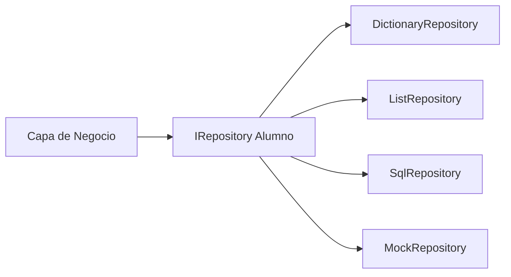

- [5. Proyecto Integrador: Simulación de CRUD con Arquitectura de Repositorio](#5-proyecto-integrador-simulación-de-crud-con-arquitectura-de-repositorio)
  - [5.1. ¿Qué es el Patrón CRUD?](#51-qué-es-el-patrón-crud)
  - [5.2. El Patrón Repository (Repositorio)](#52-el-patrón-repository-repositorio)
  - [5.3. Definición del Modelo: Entidad Alumno](#53-definición-del-modelo-entidad-alumno)
  - [5.4. El Contrato de Persistencia: Interfaz ICrudRepository\<TKey, TValue\>](#54-el-contrato-de-persistencia-interfaz-icrudrepositorytkey-tvalue)
  - [5.5. Implementación 1: ListRepository](#55-implementación-1-listrepository)
  - [5.6. Implementación 2: DictionaryRepository](#56-implementación-2-dictionaryrepository)
  - [5.7. Implementación 3: SetRepository (Sobrescribiendo Equals y GetHashCode)](#57-implementación-3-setrepository-sobrescribiendo-equals-y-gethashcode)
    - [5.7.1. ¿Por Qué Sobrescribir Equals y GetHashCode?](#571-por-qué-sobrescribir-equals-y-gethashcode)
  - [5.8. Manejo de Excepciones y Lógica de Control](#58-manejo-de-excepciones-y-lógica-de-control)
  - [5.9. Informes y Estadísticas con LINQ](#59-informes-y-estadísticas-con-linq)
  - [5.10. Comparativa de Repositorios: Dictionary vs List vs Sets](#510-comparativa-de-repositorios-dictionary-vs-list-vs-sets)

# 5. Proyecto Integrador: Simulación de CRUD con Arquitectura de Repositorio

## 5.1. ¿Qué es el Patrón CRUD?

CRUD representa las cuatro operaciones fundamentales de cualquier sistema de persistencia:

```csharp
// CRUD = Create, Read, Update, Delete

// CREATE - Crear/Nuevos registros
alumnoService.Crear(new Alumno("Ana", "García"));

// READ - Leer/Buscar registros
var alumno = alumnoService.Obtener(1);
var todos = alumnoService.ObtenerTodos();
var filtrados = alumnoService.Buscar(a => a.Nota > 7);

// UPDATE - Actualizar/Modificar registros
alumno.Nota = 8.5;
alumnoService.Actualizar(alumno);

// DELETE - Eliminar registros
alumnoService.Eliminar(alumno);
alumnoService.EliminarPorId(1);
```

**📝 Nota del Profesor:** CRUD es universal

CRUD existe desde los primeros sistemas de bases de datos (1970s) y sigue siendo la base de toda aplicación moderna. Da igual si usas SQL, MongoDB, REST APIs o sistemas de archivos: las operaciones son las mismas.

---

## 5.2. El Patrón Repository (Repositorio)

El **Patrón Repository** abstrae el acceso a datos, proporcionando una colección-like interface:



**💡 Tip del Examinador:** Beneficios del Repository

| Beneficio                | Descripción                                  |
| ------------------------ | -------------------------------------------- |
| **Abstracción**          | La lógica de negocio no sabe dónde se guarda |
| **Testabilidad**         | Puedes testear sin base de datos real        |
| **Flexibilidad**         | Cambiar almacenamiento sin tocar lógica      |
| **Centralización**       | Una sola lógica de acceso a datos            |
| **Inversión de control** | Dependes de abstracción, no implementación   |

---

## 5.3. Definición del Modelo: Entidad Alumno

```csharp
public record Alumno(
    int Id,
    string Nombre,
    string Apellidos,
    string DNI,
    double Nota,
    string Curso
)
{
    public bool EstaAprobado => Nota >= 5.0;
    public string Calificacion => Nota switch
    {
        < 5 => "Suspenso",
        < 7 => "Aprobado",
        < 9 => "Notable",
        _ => "Sobresaliente"
    };
}

// Builder pattern para creación
public record AlumnoBuilder
{
    private int _id;
    private string _nombre = "";
    private string _apellidos = "";
    private string _dni = "";
    private double _nota;
    private string _curso = "";

    public AlumnoBuilder ConId(int id) { _id = id; return this; }
    public AlumnoBuilder ConNombre(string nombre) { _nombre = nombre; return this; }
    public AlumnoBuilder ConApellidos(string apellidos) { _apellidos = apellidos; return this; }
    public AlumnoBuilder ConDNI(string dni) { _dni = dni; return this; }
    public AlumnoBuilder ConNota(double nota) { _nota = nota; return this; }
    public AlumnoBuilder ConCurso(string curso) { _curso = curso; return this; }

    public Alumno Build() => new(_id, _nombre, _apellidos, _dni, _nota, _curso);
}

// Uso
var alumno = new AlumnoBuilder()
    .ConId(1)
    .ConNombre("Ana")
    .ConApellidos("García López")
    .ConDNI("12345678A")
    .ConNota(8.5)
    .ConCurso("DAM")
    .Build();
```

---

## 5.4. El Contrato de Persistencia: Interfaz ICrudRepository<TKey, TValue>

```csharp
public interface ICrudRepository<TKey, TValue>
{
    // CREATE
    void Add(TValue entity);
    void AddRange(IEnumerable<TValue> entities);

    // READ
    TValue? GetById(TKey id);
    IEnumerable<TValue> GetAll();
    IEnumerable<TValue> Find(Func<TValue, bool> predicate);
    
    // UPDATE
    void Update(TValue entity);
    
    // DELETE
    void Delete(TKey id);
    void Delete(TValue entity);
    void DeleteRange(IEnumerable<TValue> entities);
    void Clear();

    // AGGREGATES
    int Count();
    int Count(Func<TValue, bool> predicate);
    bool Exists(TKey id);
    bool Exists(Func<TValue, bool> predicate);
}
```

**📝 Nota del Profesor:** Genéricos en Repository

Los genéricos permiten:
- **Reutilización**: Una sola interfaz para todas las entidades
- **Tipado seguro**: Errores en compilación
- **Flexibilidad**: Cambiar tipos sin reescribir

---

## 5.5. Implementación 1: ListRepository

```csharp
public class ListRepository<TKey, TValue> : ICrudRepository<TKey, TValue> 
    where TKey : notnull
{
    private readonly Dictionary<TKey, TValue> _storage;
    private readonly Func<TValue, TKey> _keySelector;
    private readonly ILogger<ListRepository<TKey, TValue>>? _logger;

    public ListRepository(Func<TValue, TKey> keySelector, ILogger<ListRepository<TKey, TValue>>? logger = null)
    {
        _storage = new Dictionary<TKey, TValue>();
        _keySelector = keySelector;
        _logger = logger;
    }

    public void Add(TValue entity)
    {
        var key = _keySelector(entity);
        if (_storage.ContainsKey(key))
        {
            throw new ArgumentException($"Ya existe un elemento con clave {key}");
        }
        _storage.Add(key, entity);
        _logger?.LogInformation("Añadido {Key}", key);
    }

    public void AddRange(IEnumerable<TValue> entities)
    {
        foreach (var entity in entities)
        {
            Add(entity);
        }
    }

    public TValue? GetById(TKey id)
    {
        _storage.TryGetValue(id, out var entity);
        return entity;
    }

    public IEnumerable<TValue> GetAll() => _storage.Values;

    public IEnumerable<TValue> Find(Func<TValue, bool> predicate)
    {
        return _storage.Values.Where(predicate);
    }

    public void Update(TValue entity)
    {
        var key = _keySelector(entity);
        if (!_storage.ContainsKey(key))
        {
            throw new KeyNotFoundException($"No existe {key}");
        }
        _storage[key] = entity;
        _logger?.LogInformation("Actualizado {Key}", key);
    }

    public void Delete(TKey id)
    {
        if (!_storage.Remove(id, out var removed))
        {
            throw new KeyNotFoundException($"No existe {id}");
        }
        _logger?.LogInformation("Eliminado {Key}", id);
    }

    public void Delete(TValue entity)
    {
        Delete(_keySelector(entity));
    }

    public void DeleteRange(IEnumerable<TValue> entities)
    {
        foreach (var entity in entities)
        {
            Delete(entity);
        }
    }

    public void Clear()
    {
        _storage.Clear();
        _logger?.LogInformation("Repositorio limpiado");
    }

    public int Count() => _storage.Count;

    public int Count(Func<TValue, bool> predicate)
    {
        return _storage.Values.Count(predicate);
    }

    public bool Exists(TKey id) => _storage.ContainsKey(id);

    public bool Exists(Func<TValue, bool> predicate)
    {
        return _storage.Values.Any(predicate);
    }
}
```

---

## 5.6. Implementación 2: DictionaryRepository

```csharp
public class DictionaryRepository<TKey, TValue> : ICrudRepository<TKey, TValue>
    where TKey : notnull
{
    private readonly Dictionary<TKey, TValue> _dictionary;
    private readonly Func<TValue, TKey> _keySelector;

    public DictionaryRepository(Func<TValue, TKey> keySelector)
    {
        _keySelector = keySelector;
        _dictionary = new Dictionary<TKey, TValue>();
    }

    // CRUD operations with optimizations
    public void Add(TValue entity)
    {
        var key = _keySelector(entity);
        _dictionary[key] = entity; // Sobrescribe si existe
    }

    public void AddRange(IEnumerable<TValue> entities)
    {
        foreach (var entity in entities)
        {
            Add(entity);
        }
    }

    public TValue? GetById(TKey id)
    {
        return _dictionary.TryGetValue(id, out var value) ? value : default;
    }

    public IEnumerable<TValue> GetAll() => _dictionary.Values;

    public IEnumerable<TValue> Find(Func<TValue, bool> predicate)
    {
        return _dictionary.Values.Where(predicate);
    }

    public void Update(TValue entity)
    {
        var key = _keySelector(entity);
        _dictionary[key] = entity;
    }

    public void Delete(TKey id)
    {
        _dictionary.Remove(id);
    }

    public void Delete(TValue entity)
    {
        Delete(_keySelector(entity));
    }

    public void DeleteRange(IEnumerable<TValue> entities)
    {
        var keysToDelete = entities.Select(_keySelector);
        foreach (var key in keysToDelete)
        {
            _dictionary.Remove(key);
        }
    }

    public void Clear()
    {
        _dictionary.Clear();
    }

    public int Count() => _dictionary.Count;

    public int Count(Func<TValue, bool> predicate)
    {
        return _dictionary.Values.Count(predicate);
    }

    public bool Exists(TKey id) => _dictionary.ContainsKey(id);

    public bool Exists(Func<TValue, bool> predicate)
    {
        return _dictionary.Values.Any(predicate);
    }
}
```

**💡 Tip del Examinador:** Dictionary vs List en Repository

| Aspecto         | Dictionary         | List          |
| --------------- | ------------------ | ------------- |
| Búsqueda por ID | O(1)               | O(n)          |
| Iteración       | O(n)               | O(n)          |
| Inserción       | O(1) amortizado    | O(1) al final |
| Memoria         | Mayor (tabla hash) | Menor         |
| Orden           | No garantizado     | Mantenido     |

---

## 5.7. Implementación 3: SetRepository (Sobrescribiendo Equals y GetHashCode)

```csharp
// PARA USAR HashSet<T>, los objetos deben ser comparable por valor

public record AlumnoSet(
    int Id,
    string Nombre,
    string Apellidos,
    string DNI,
    double Nota,
    string Curso
)
{
    // Records ya implementan Equals/GetHashCode por valor
    // Pero solo con las propiedades del constructor primary
}

public class SetRepository<T> : ICrudRepository<string, T>
    where T : notnull
{
    private readonly HashSet<T> _set;
    private readonly Func<T, string> _keySelector;

    public SetRepository(Func<T, string> keySelector)
    {
        _keySelector = keySelector;
        _set = new HashSet<T>();
    }

    public void Add(T entity)
    {
        if (!_set.Add(entity))
        {
            var key = _keySelector(entity);
            throw new ArgumentException($"Ya existe {key}");
        }
    }

    public void AddRange(IEnumerable<T> entities)
    {
        foreach (var entity in entities)
        {
            Add(entity);
        }
    }

    public T? GetById(string id)
    {
        return _set.FirstOrDefault(e => _keySelector(e) == id);
    }

    public IEnumerable<T> GetAll() => _set;

    public IEnumerable<T> Find(Func<T, bool> predicate)
    {
        return _set.Where(predicate);
    }

    // Update requiere Remove + Add en HashSet
    public void Update(T entity)
    {
        var key = _keySelector(entity);
        var existente = GetById(key);
        if (existente != null)
        {
            _set.Remove(existente);
        }
        _set.Add(entity);
    }

    public void Delete(string id)
    {
        var entity = GetById(id);
        if (entity != null)
        {
            _set.Remove(entity);
        }
    }

    public void Delete(T entity)
    {
        _set.Remove(entity);
    }

    public void DeleteRange(IEnumerable<T> entities)
    {
        foreach (var entity in entities)
        {
            _set.Remove(entity);
        }
    }

    public void Clear()
    {
        _set.Clear();
    }

    public int Count() => _set.Count;

    public int Count(Func<T, bool> predicate)
    {
        return _set.Count(predicate);
    }

    public bool Exists(string id)
    {
        return _set.Any(e => _keySelector(e) == id);
    }

    public bool Exists(Func<T, bool> predicate)
    {
        return _set.Any(predicate);
    }
}
```

---

### 5.7.1. ¿Por Qué Sobrescribir Equals y GetHashCode?

```csharp
// Sin sobrescribir Equals/GetHashCode
public class Alumno
{
    public int Id { get; set; }
    public string Nombre { get; set; } = "";
}

// Las clases comparan por REFERENCIA por defecto
var a1 = new Alumno { Id = 1, Nombre = "Ana" };
var a2 = new Alumno { Id = 1, Nombre = "Ana" };

Console.WriteLine(a1 == a2); // false (diferentes referencias)
Console.WriteLine(a1.Equals(a2)); // false

// En HashSet
var set = new HashSet<Alumno>();
set.Add(a1);
set.Add(a2);
Console.WriteLine(set.Count); // 2 (aunque son "iguales" por valor)
```

**📝 Nota del Profesor:** Equals/GetHashCode en práctica

```csharp
// SOLUCIÓN 1: Sobrescribir en la clase
public class Alumno : IEquatable<Alumno>
{
    public int Id { get; set; }
    public string Nombre { get; set; } = "";

    public override bool Equals(object? obj)
    {
        return obj is Alumno other && Equals(other);
    }

    public bool Equals(Alumno? other)
    {
        return other != null && Id == other.Id;
    }

    public override int GetHashCode()
    {
        return Id.GetHashCode();
    }
}

// SOLUCIÓN 2: Usar record (C# 9+)
public record Alumno(int Id, string Nombre);
// Equals/GetHashCode automáticamente por valor
```

---

## 5.8. Manejo de Excepciones y Lógica de Control

```csharp
// Excepciones personalizadas
public class RepositoryException : Exception
{
    public RepositoryException(string message) : base(message) { }
    public RepositoryException(string message, Exception inner) : base(message, inner) { }
}

public class EntityNotFoundException : RepositoryException
{
    public EntityNotFoundException(string key) 
        : base($"No se encontró la entidad con clave: {key}") { }
}

public class DuplicateEntityException : RepositoryException
{
    public DuplicateEntityException(string key) 
        : base($"Ya existe una entidad con clave: {key}") { }
}

// Repository con manejo de excepciones
public class SafeRepository<TKey, TValue> : ICrudRepository<TKey, TValue>
    where TKey : notnull
{
    private readonly ICrudRepository<TKey, TValue> _inner;
    private readonly ILogger _logger;

    public SafeRepository(ICrudRepository<TKey, TValue> inner, ILogger logger)
    {
        _inner = inner;
        _logger = logger;
    }

    public void Add(TValue entity)
    {
        try
        {
            _inner.Add(entity);
        }
        catch (ArgumentException ex)
        {
            _logger.LogWarning(ex, "Intento de duplicado");
            throw new DuplicateEntityException($"Error añadiendo: {ex.Message}");
        }
    }

    public TValue? GetById(TKey id)
    {
        try
        {
            var result = _inner.GetById(id);
            if (result == null)
            {
                throw new EntityNotFoundException(id?.ToString() ?? "null");
            }
            return result;
        }
        catch (Exception ex)
        {
            _logger.LogError(ex, "Error buscando {Id}", id);
            throw;
        }
    }

    // Delegar el resto...
}
```

---

## 5.9. Informes y Estadísticas con LINQ

```csharp
// Dataset de ejemplo
var alumnos = new List<Alumno>
{
    new(1, "Juan", "Pérez", "11111111A", 7.5, "DAM"),
    new(2, "María", "García", "22222222B", 8.5, "DAM"),
    new(3, "Ana", "López", "33333333C", 9.5, "DAW"),
    new(4, "Pedro", "Sánchez", "44444444D", 6.0, "DAM"),
    new(5, "Laura", "Martínez", "55555555E", 5.5, "DAW"),
    new(6, "Carlos", "Rodríguez", "66666666F", 8.0, "DAW"),
    new(7, "Elena", "Fernández", "77777777G", 4.5, "DAM"),
    new(8, "Miguel", "Torres", "88888888H", 7.0, "DAW")
};

// ============ ESTADÍSTICAS BÁSICAS ============
var estadisticas = new
{
    TotalAlumnos = alumnos.Count,
    NotaMedia = alumnos.Average(a => a.Nota),
    NotaMaxima = alumnos.Max(a => a.Nota),
    NotaMinima = alumnos.Min(a => a.Nota),
    SumaNotas = alumnos.Sum(a => a.Nota)
};

Console.WriteLine($"Total: {estadisticas.TotalAlumnos}");
Console.WriteLine($"Media: {estadisticas.NotaMedia:F2}");

// ============ ALUMNOS CON NOTA MÁXIMA/MÍNIMA ============
var notaMax = alumnos.Max(a => a.Nota);
var notaMin = alumnos.Min(a => a.Nota);

var mejores = alumnos.Where(a => a.Nota == notaMax);
var peores = alumnos.Where(a => a.Nota == notaMin);

// ============ APROBADOS VS SUSPENSOS ============
var aprobados = alumnos.Count(a => a.EstaAprobado);
var suspensos = alumnos.Count(a => !a.EstaAprobado);
var porcentajeAprobados = (double)aprobados / alumnos.Count * 100;

// ============ DISTRIBUCIÓN POR CALIFICACIÓN ============
var porCalificacion = alumnos
    .GroupBy(a => a.Calificacion)
    .OrderBy(g => g.Key)
    .ToDictionary(g => g.Key, g => g.Count());

// ============ TOP N ALUMNOS ============
var top3 = alumnos
    .OrderByDescending(a => a.Nota)
    .Take(3);

// ============ AGRUPACIÓN POR CURSO ============
var porCurso = alumnos
    .GroupBy(a => a.Curso)
    .ToDictionary(
        g => g.Key,
        g => new
        {
            Cantidad = g.Count(),
            NotaMedia = g.Average(a => a.Nota),
            MejorNota = g.Max(a => a.Nota)
        }
    )
    .OrderByDescending(x => x.Value.NotaMedia);

// ============ ANÁLISIS POR RANGOS DE NOTA ============
var rangos = alumnos
    .Select(a => a.Nota switch
    {
        < 5 => "0-4.99 (Suspenso)",
        < 7 => "5-6.99 (Aprobado)",
        < 9 => "7-8.99 (Notable)",
        _ => "9-10 (Sobresaliente)"
    })
    .GroupBy(r => r)
    .ToDictionary(g => g.Key, g => g.Count());
```

**📝 Nota del Profesor:** LINQ para informes

LINQ es ideal para:
- **Dashboards** en tiempo real
- **Reportes** ad-hoc
- **Analytics** sobre datos en memoria
- **Estadísticas** rápidas

Para grandes volúmenes, considera pre-calcular o usar bases de datos.

---

## 5.10. Comparativa de Repositorios: Dictionary vs List vs Sets

```csharp
// ============ BENCHMARK SIMPLE ============

// Preparar datos
var lista = new List<Alumno>(10000);
var dict = new Dictionary<int, Alumno>();
var set = new HashSet<Alumno>(new AlumnoComparer());

// Insertar 10000 elementos
var sw = Stopwatch.StartNew();
foreach (var a in datos)
{
    lista.Add(a);
    dict[a.Id] = a;  // Dictionary: O(1) promedio
    set.Add(a);       // HashSet: O(1) promedio
}
sw.Stop();

// Buscar por ID
var buscarSw = Stopwatch.StartNew();
var foundList = lista.FirstOrDefault(a => a.Id == 9999); // O(n)
var foundDict = dict.TryGetValue(9999, out var d) ? d : null; // O(1)
var foundSet = datos.FirstOrDefault(a => a.Id == 9999); // O(n)
buscarSw.Stop();

// ============ RESULTADOS ESPERADOS ============

// Inserción: Dictionary y HashSet más rápidos por hashing
// Búsqueda por ID: Dictionary O(1) vs List O(n)

// Dictionary<K,V>: Ideal para búsquedas por clave única
// List<T>: Ideal para iteración secuencial, orden preservado
// HashSet<T>: Ideal para eliminar duplicados, membership testing
```

**💡 Tip del Examinador:** Matriz de decisión

| Requisito           | Dictionary | List   | HashSet |
| ------------------- | ---------- | ------ | ------- |
| Búsqueda por ID     | ✓✓✓ O(1)   | ✓ O(n) | ✗       |
| Búsqueda por valor  | ✗          | ✓      | ✓ O(1)  |
| Mantener orden      | ✗          | ✓✓✓    | ✗       |
| Eliminar duplicados | ✗          | ✗      | ✓✓✓     |
| Iteración completa  | ✓          | ✓✓✓    | ✓       |
| Memoria mínima      | ✗          | ✓✓     | ✓       |
| Inserción rápida    | ✓✓         | ✓      | ✓✓      |

---
