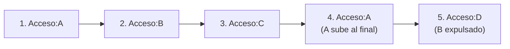
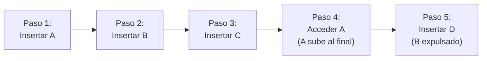

- [6. Caso Práctico Avanzado: Implementación de Sistemas de Caché](#6-caso-práctico-avanzado-implementación-de-sistemas-de-caché)
  - [6.1. ¿Qué es una Caché y Por Qué es Importante?](#61-qué-es-una-caché-y-por-qué-es-importante)
    - [6.2. Concepto de Caché y Capacidad Máxima](#62-concepto-de-caché-y-capacidad-máxima)
  - [6.3. Estrategia FIFO (First In, First Out)](#63-estrategia-fifo-first-in-first-out)
    - [6.3.1. Concepto de FIFO](#631-concepto-de-fifo)
    - [6.3.2. Ejemplo de Uso FIFO](#632-ejemplo-de-uso-fifo)
  - [6.4. Estrategia LRU (Least Recently Used)](#64-estrategia-lru-least-recently-used)
    - [6.4.1. Concepto de LRU](#641-concepto-de-lru)
    - [6.4.2. Implementación de LruCache](#642-implementación-de-lrucache)
    - [6.4.3. Ejemplo de Uso LRU](#643-ejemplo-de-uso-lru)
  - [6.5. Comparación FIFO vs LRU](#65-comparación-fifo-vs-lru)
    - [6.5.1. Diferencias Clave](#651-diferencias-clave)
    - [6.5.2. Tabla Comparativa Completa](#652-tabla-comparativa-completa)
  - [6.6. Caso Práctico: AlumnoService con Caché](#66-caso-práctico-alumnoservice-con-caché)
    - [6.6.1. ¿Qué es un Servicio con Caché?](#661-qué-es-un-servicio-con-caché)
    - [6.6.2. Demostración Completa del AlumnoService](#662-demostración-completa-del-alumnoservice)

# 6. Caso Práctico Avanzado: Implementación de Sistemas de Caché

## 6.1. ¿Qué es una Caché y Por Qué es Importante?

Una **caché** es un almacenamiento temporal de alta velocidad que guarda copias de datos frecuentemente accedidos para reducir la latencia y mejorar el rendimiento:

```csharp
// SIN CACHÉ: Acceso directo (lento)
var datos = baseDatos.ObtenerAlumno(id); // 100-500ms

// CON CACHÉ: Acceso rápido (nanosegundos)
var datos = cache.Obtener(id);
if (datos == null)
{
    datos = baseDatos.ObtenerAlumno(id); // Solo si no está en caché
    cache.Guardar(id, datos); // Guardar para próxima vez
}
```

**📝 Nota del Profesor:** El principio de localidad

Los sistemas informáticos aprovechan dos tipos de localidad:
- **Localidad temporal**: Si usaste un dato recientemente, probablemente lo volverás a usar pronto
- **Localidad espacial**: Si usaste un dato, probablemente usarás datos cercanos

La caché aprovecha estas propiedades para almacenar lo más probable que se necesite.

---

### 6.2. Concepto de Caché y Capacidad Máxima

```csharp
public interface ICache<TKey, TValue>
{
    TValue? Obtener(TKey clave);
    void Guardar(TKey clave, TValue valor);
    bool Eliminar(TKey clave);
    void Limpiar();
    int Count();
    TValue? this[TKey clave] { get; set; }
}

// Caché con capacidad limitada
public class CacheLimitada<TKey, TValue> : ICache<TKey, TValue>
    where TKey : notnull
{
    private readonly int _capacidadMaxima;
    private readonly Dictionary<TKey, TValue> _almacen;
    private readonly ILogger<CacheLimitada<TKey, TValue>>? _logger;

    public CacheLimitada(int capacidadMaxima, ILogger<CacheLimitada<TKey, TValue>>? logger = null)
    {
        _capacidadMaxima = capacidadMaxima;
        _almacen = new Dictionary<TKey, TValue>();
        _logger = logger;
    }

    public TValue? Obtener(TKey clave)
    {
        if (_almacen.TryGetValue(clave, out var valor))
        {
            _logger?.LogDebug("Caché HIT: {Clave}", clave);
            return valor;
        }
        _logger?.LogDebug("Caché MISS: {Clave}", clave);
        return default;
    }

    public void Guardar(TKey clave, TValue valor)
    {
        if (_almacen.Count >= _capacidadMaxima)
        {
            _logger?.LogWarning("Caché llena, expulsando elemento");
            throw new CacheLlenaException("Caché ha alcanzado su capacidad máxima");
        }
        _almacen[clave] = valor;
    }

    public bool Eliminar(TKey clave) => _almacen.Remove(clave);
    public void Limpiar() => _almacen.Clear();
    public int Count() => _almacen.Count;

    public TValue? this[TKey clave]
    {
        get => Obtener(clave);
        set
        {
            if (value != null)
                Guardar(clave, value);
            else
                Eliminar(clave);
        }
    }
}
```

---

## 6.3. Estrategia FIFO (First In, First Out)

### 6.3.1. Concepto de FIFO

FIFO es la estrategia más simple: el **primer elemento en entrar es el primero en salir** cuando la caché está llena:



```csharp
// IMPLEMENTACIÓN FIFO
public class FifoCache<TKey, TValue> : ICache<TKey, TValue>
    where TKey : notnull
{
    private readonly int _capacidadMaxima;
    private readonly Dictionary<TKey, TValue> _datos;
    private readonly Queue<TKey> _ordenInsercion;
    private readonly ILogger<FifoCache<TKey, TValue>>? _logger;

    public FifoCache(int capacidadMaxima, ILogger<FifoCache<TKey, TValue>>? logger = null)
    {
        _capacidadMaxima = capacidadMaxima;
        _datos = new Dictionary<TKey, TValue>();
        _ordenInsercion = new Queue<TKey>();
        _logger = logger;
    }

    public TValue? Obtener(TKey clave)
    {
        if (_datos.TryGetValue(clave, out var valor))
        {
            _logger?.LogDebug("FIFO HIT: {Clave}", clave);
            return valor;
        }
        _logger?.LogDebug("FIFO MISS: {Clave}", clave);
        return default;
    }

    public void Guardar(TKey clave, TValue valor)
    {
        // Si ya existe, actualizar
        if (_datos.ContainsKey(clave))
        {
            _datos[clave] = valor;
            return;
        }

        // Si está llena, expulsar el más antiguo
        if (_datos.Count >= _capacidadMaxima)
        {
            var claveExpulsada = _ordenInsercion.Dequeue();
            _datos.Remove(claveExpulsada);
            _logger?.LogInformation("FIFO expulsó: {Clave}", claveExpulsada);
        }

        // Insertar nuevo
        _datos[clave] = valor;
        _ordenInsercion.Enqueue(clave);
    }

    public bool Eliminar(TKey clave)
    {
        if (_datos.Remove(clave, out var removed))
        {
            // No podemos eliminar del Queue eficientemente, así que lo marcamos
            _logger?.LogDebug("Eliminado: {Clave}", clave);
            return true;
        }
        return false;
    }

    public void Limpiar()
    {
        _datos.Clear();
        _ordenInsercion.Clear();
    }

    public int Count() => _datos.Count;

    public TValue? this[TKey clave]
    {
        get => Obtener(clave);
        set
        {
            if (value != null) Guardar(clave, value);
            else Eliminar(clave);
        }
    }
}
```

**💡 Tip del Examinador:** FIFO es simple pero no inteligente

FIFO es fácil de implementar pero ignora patrones de acceso. Si el elemento más antiguo es el más usado, será expulsado mientras datos nuevos y no usados ocupan su lugar.

---

### 6.3.2. Ejemplo de Uso FIFO

```csharp
var fifo = new FifoCache<string, Alumno>(3);

// Insertar: A, B, C
fifo.Guardar("A", new Alumno(1, "Ana"));
fifo.Guardar("B", new Alumno(2, "Juan"));
fifo.Guardar("C", new Alumno 3, "María"));

// Estado: {A, B, C} - Orden: A, B, C

// Acceder a A (no cambia el orden en FIFO)
var a = fifo.Obtener("A"); // HIT

// Insertar D (A se mantiene, es el más antiguo pero no se mueve)
fifo.Guardar("D", new Alumno(4, "Pedro"));

// Expulsa A (el más antiguo)
// Estado: {B, C, D} - Orden: B, C, D
```

---

## 6.4. Estrategia LRU (Least Recently Used)

### 6.4.1. Concepto de LRU

LRU expulsa el elemento **menos recientemente usado** cuando la caché está llena:



**💡 Tip del Examinador:** LRU es más inteligente que FIFO

LRU asume que los datos usados recientemente probablemente se usarán de nuevo. Es ideal para patrones de acceso con **localidad temporal**.

---

### 6.4.2. Implementación de LruCache

```csharp
public class LruCache<TKey, TValue> : ICache<TKey, TValue>
    where TKey : notnull
{
    private readonly int _capacidadMaxima;
    private readonly Dictionary<TKey, LinkedListNode<(TKey, TValue)>> _mapa;
    private readonly LinkedList<(TKey, TValue)> _lista;
    private readonly ILogger<LruCache<TKey, TValue>>? _logger;

    public LruCache(int capacidadMaxima, ILogger<LruCache<TKey, TValue>>? logger = null)
    {
        _capacidadMaxima = capacidadMaxima;
        _mapa = new Dictionary<TKey, LinkedListNode<(TKey, TValue)>>();
        _lista = new LinkedList<(TKey, TValue)>();
        _logger = logger;
    }

    public TValue? Obtener(TKey clave)
    {
        if (!_mapa.TryGetValue(clave, out var nodo))
        {
            _logger?.LogDebug("LRU MISS: {Clave}", clave);
            return default;
        }

        // Mover al frente (más recientemente usado)
        _lista.Remove(nodo);
        _lista.AddFirst(nodo);
        
        _logger?.LogDebug("LRU HIT: {Clave}", clave);
        return nodo.Value.Item2;
    }

    public void Guardar(TKey clave, TValue valor)
    {
        // Si existe, actualizar y mover al frente
        if (_mapa.TryGetValue(clave, out var nodoExistente))
        {
            _lista.Remove(nodoExistente);
            _lista.AddFirst(nodoExistente);
            nodoExistente.Value = (clave, valor);
            return;
        }

        // Si está llena, expulsar el menos reciente
        if (_mapa.Count >= _capacidadMaxima)
        {
            var nodoExpulsado = _lista.RemoveLast();
            _mapa.Remove(nodoExpulsado.Item1);
            _logger?.LogInformation("LRU expulsó: {Clave}", nodoExpulsado.Item1);
        }

        // Insertar al frente (más reciente)
        var nuevoNodo = new LinkedListNode<(TKey, TValue)>((clave, valor));
        _lista.AddFirst(nuevoNodo);
        _mapa[clave] = nuevoNodo;
    }

    public bool Eliminar(TKey clave)
    {
        if (!_mapa.TryGetValue(clave, out var nodo))
            return false;

        _lista.Remove(nodo);
        _mapa.Remove(clave);
        return true;
    }

    public void Limpiar()
    {
        _mapa.Clear();
        _lista.Clear();
    }

    public int Count() => _mapa.Count;

    public TValue? this[TKey clave]
    {
        get => Obtener(clave);
        set
        {
            if (value != null) Guardar(clave, value);
            else Eliminar(clave);
        }
    }
}
```

---

### 6.4.3. Ejemplo de Uso LRU

```csharp
var lru = new LruCache<string, Alumno>(3);

// Insertar: A, B, C
lru.Guardar("A", new Alumno(1, "Ana"));  // A→[A]
lru.Guardar("B", new Alumno(2, "Juan")); // B→[B, A]
lru.Guardar("C", new Alumno(3, "María")); // C→[C, B, A]

// Estado: A←B←C (C es el más reciente)

// Acceder a A (A sube al frente)
lru.Obtener("A"); // A→[A, C, B]

// Insertar D (B es el menos reciente, se expulsa)
lru.Guardar("D", new Alumno(4, "Pedro")); // D→[D, A, C]

// Acceder a C (no cambia posición, ya está al frente)
lru.Obtener("C"); // C→[C, D, A]

// Estado final: {D, A, C} - Orden: C (MRU), D, A (LRU)
```

---

## 6.5. Comparación FIFO vs LRU

### 6.5.1. Diferencias Clave

```csharp
// ============ SIMULACIÓN COMPARATIVA ============

var fifo = new FifoCache<string, string>(3);
var lru = new LruCache<string, string>(3);

// Secuencia de acceso: A, B, C, A, D

// ---- FIFO ----
fifo.Guardar("A", "1"); // [A]
fifo.Guardar("B", "2"); // [A, B]
fifo.Guardar("C", "3"); // [A, B, C]
fifo.Obtener("A");       // [A, B, C] - Sin cambio
fifo.Guardar("D", "4");  // Expulsa A → [B, C, D]

// ---- LRU ----
lru.Guardar("A", "1");  // [A]
lru.Guardar("B", "2");  // [B, A]
lru.Guardar("C", "3");  // [C, B, A]
lru.Obtener("A");        // [A, C, B] - A sube al frente
lru.Guardar("D", "4");  // Expulsa B → [D, A, C]

// RESULTADO:
// FIFO expulsó: A (el más antiguo)
// LRU expulsó: B (el menos reciente, A fue usado recientemente)
```

**📝 Nota del Profesor:** ¿Cuándo usar cada uno?

| Escenario                        | FIFO | LRU |
| -------------------------------- | ---- | --- |
| Patrones de acceso con localidad | ✗    | ✓   |
| Datos con expiración natural     | ✓    | ✗   |
| Acceso secuencial (stream)       | ✓    | ✗   |
| Memoria limitada estricta        | ✓    | ✓   |
| Cache de base de datos           | ✗    | ✓   |
| Buffer de streaming              | ✓    | ✗   |

---

### 6.5.2. Tabla Comparativa Completa

| Aspecto             | FIFO               | LRU                    |
| ------------------- | ------------------ | ---------------------- |
| **Complejidad**     | O(1)               | O(1)                   |
| **Memoria extra**   | Queue + Dict       | LinkedList + Dict      |
| **Simplicidad**     | Muy simple         | Media                  |
| **Hit rate típico** | Bajo               | Alto                   |
| **Mejor para**      | Expiración natural | Reutilización temporal |
| **Peor para**       | Patrones cíclicos  | Acceso aleatorio       |
| **Implementación**  | Cola simple        | Lista enlazada         |

---

## 6.6. Caso Práctico: AlumnoService con Caché

### 6.6.1. ¿Qué es un Servicio con Caché?

```csharp
// Servicio que combina caché con acceso a datos
public interface IAlumnoService
{
    Alumno? ObtenerPorId(int id);
    IEnumerable<Alumno> ObtenerTodos();
    IEnumerable<Alumno> ObtenerPorCurso(string curso);
    void Guardar(Alumno alumno);
    void Eliminar(int id);
}

// Implementación con caché LRU
public class AlumnoService : IAlumnoService
{
    private readonly ICache<int, Alumno> _cache;
    private readonly ICrudRepository<int, Alumno> _repositorio;
    private readonly ILogger<AlumnoService> _logger;

    public AlumnoService(
        ICache<int, Alumno> cache,
        ICrudRepository<int, Alumno> repositorio,
        ILogger<AlumnoService> logger)
    {
        _cache = cache;
        _repositorio = repositorio;
        _logger = logger;
    }

    public Alumno? ObtenerPorId(int id)
    {
        // 1. Primero buscar en caché
        var desdeCache = _cache.Obtener(id);
        if (desdeCache != null)
        {
            _logger.LogDebug("Alumno {Id} obtenido de caché", id);
            return desdeCache;
        }

        // 2. Si no está, buscar en repositorio
        var desdeRepo = _repositorio.GetById(id);
        if (desdeRepo != null)
        {
            // 3. Guardar en caché para próxima vez
            _cache.Guardar(id, desdeRepo);
            _logger.LogDebug("Alumno {Id} cargado desde BD y guardado en caché", id);
        }

        return desdeRepo;
    }

    public IEnumerable<Alumno> ObtenerTodos()
    {
        return _repositorio.GetAll();
    }

    public void Guardar(Alumno alumno)
    {
        // Guardar en repositorio
        _repositorio.Add(alumno);
        
        // Invalidar/actualizar caché
        _cache[alumno.Id] = alumno;
        _logger.LogInformation("Alumno {Id} guardado", alumno.Id);
    }

    public void Eliminar(int id)
    {
        _repositorio.Delete(id);
        _cache.Eliminar(id);
        _logger.LogInformation("Alumno {Id} eliminado", id);
    }
}
```

---

### 6.6.2. Demostración Completa del AlumnoService

```csharp
// Configuración
var logger = LoggerFactory.Create(b => b.AddConsole()).CreateLogger<AlumnoService>();
var cache = new LruCache<int, Alumno>(5); // Caché de 5 elementos
var repositorio = new ListRepository<int, Alumno>(a => a.Id);
var service = new AlumnoService(cache, repositorio, logger);

// Insertar datos de prueba
Console.WriteLine("=== INSERTANDO DATOS ===");
foreach (var a in datosPrueba)
{
    service.Guardar(a);
}

// ============ DEMOSTRACIÓN DE CACHÉ ============

Console.WriteLine("\n=== ACCESOS SECUENCIALES ===");

// Acceso secuencial (muchos hits de caché)
for (int i = 1; i <= 5; i++)
{
    var start = DateTime.Now;
    var alumno = service.ObtenerPorId(i);
    var elapsed = (DateTime.Now - start).TotalMilliseconds;
    Console.WriteLine($"#{i}: {alumno?.Nombre} ({(elapsed < 1ms ? "CACHÉ" : "BD")})");
}

// Acceso a nuevo elemento (MISS, luego HIT)
Console.WriteLine("\n=== ACCESO A NUEVO ELEMENTO ===");
var nuevo = new Alumno(6, "Nuevo", "Estudiante", "X", 10, "DAW");
service.Guardar(nuevo);

Console.WriteLine($"1° acceso (MISS): {service.ObtenerPorId(6)?.Nombre}");
Console.WriteLine($"2° acceso (HIT):  {service.ObtenerPorId(6)?.Nombre}");

// ============ DEMOSTRACIÓN DE EVICCIÓN ============

Console.WriteLine("\n=== LLENANDO CACHÉ (5 elementos) ===");
for (int i = 7; i <= 12; i++)
{
    service.Guardar(new Alumno(i, $"Estudiante{i}", "Apellido", $"{i}", 5, "DAW"));
    Console.WriteLine($"Insertado #{i}");
}

Console.WriteLine("\n=== ACCEDIENDO A ELEMENTOS ANTIGUOS ===");
// Los elementos 1-5 deberían estar en caché
for (int i = 1; i <= 5; i++)
{
    var alumno = service.ObtenerPorId(i);
    Console.WriteLine($"#{i}: {(alumno != null ? "HIT" : "MISS")} - {alumno?.Nombre}");
}
```

**📝 Nota del Profesor:** Estrategias de caché

| Estrategia        | Descripción                        | Caso de uso       |
| ----------------- | ---------------------------------- | ----------------- |
| **Cache-Aside**   | Leer: caché→BD, Escribir: BD+caché | Más común         |
| **Write-Through** | Escribir en ambos simultáneamente  | Consistencia alta |
| **Write-Behind**  | Escribir en caché, sync async a BD | Alto rendimiento  |
| **Refresh-Ahead** | Refrescar antes de expiración      | Datos predecibles |

---
