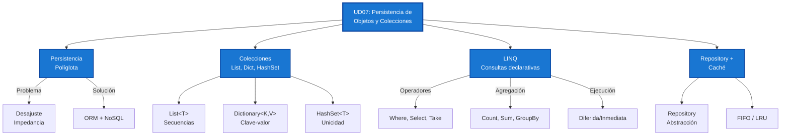

- [7. Resumen y Conclusiones](#7-resumen-y-conclusiones)
  - [7.1. Mapa Conceptual de la Unidad](#71-mapa-conceptual-de-la-unidad)
  - [7.2. Conceptos Clave Detallados](#72-conceptos-clave-detallados)
    - [7.2.1. Persistencia de Objetos](#721-persistencia-de-objetos)
    - [7.2.2. Colecciones en C#](#722-colecciones-en-c)
    - [7.2.3. LINQ: Consultas Declarativas](#723-linq-consultas-declarativas)
    - [7.2.4. Patrón Repository y Caché](#724-patrón-repository-y-caché)
  - [7.3. Resumen de Operaciones LINQ](#73-resumen-de-operaciones-linq)
    - [Operadores de Filtrado](#operadores-de-filtrado)
    - [Operadores de Transformación](#operadores-de-transformación)
    - [Operadores de Ordenación](#operadores-de-ordenación)
    - [Operadores de Agregación](#operadores-de-agregación)
    - [Operadores de Particionado](#operadores-de-particionado)
  - [7.4. Checklist de Supervivencia](#74-checklist-de-supervivencia)
    - [Persistencia y Colecciones](#persistencia-y-colecciones)
    - [LINQ](#linq)
    - [Repository y Caché](#repository-y-caché)

# 7. Resumen y Conclusiones

## 7.1. Mapa Conceptual de la Unidad



---

## 7.2. Conceptos Clave Detallados

### 7.2.1. Persistencia de Objetos

**El Desajuste de Impedancia:**

| Aspecto      | Objetos (POO)         | Tablas (SQL)     |
| ------------ | --------------------- | ---------------- |
| Estructura   | Clases con herencia   | Tablas planas    |
| Navegación   | Referencias directas  | JOINs            |
| Identidad    | Referencia == iguales | Primary Key      |
| Granularidad | Tipos complejos       | Columnas simples |

**Persistencia Políglota:** Usar diferentes tecnologías según el caso.

```csharp
// Memoria: acceso rápido, temporal
var clientes = new List<Cliente>();

// BD: persistente, transaccional
using var db = new DbContext();
db.Clientes.Where(c => c.Activo);

// NoSQL: flexible, escalable
var documento = mongoDb.GetCollection("pedidos");
```

**🧠 Analogía:** El desajuste de impedancia es como hablar español con alguien que solo entiende inglés. El ORM es el traductor que permite la comunicación sin que ninguno aprenda el idioma del otro.

---

### 7.2.2. Colecciones en C#

| Colección         | Uso Principal        | Búsqueda | Duplicados |
| ----------------- | -------------------- | -------- | ---------- |
| `List<T>`         | Secuencias generales | O(n)     | Sí         |
| `Dictionary<K,V>` | Clave-valor          | O(1)     | Claves no  |
| `HashSet<T>`      | Unicidad             | O(1)     | No         |
| `Queue<T>`        | FIFO                 | O(n)     | Sí         |
| `Stack<T>`        | LIFO                 | O(n)     | Sí         |

```csharp
// Dictionary: búsqueda O(1)
var productos = new Dictionary<int, Producto>();
productos[1] = new Producto();
var p = productos[1]; // Instantáneo

// HashSet: unicidad garantizada
var unicos = new HashSet<int> { 1, 2, 2, 3 }; // {1, 2, 3}
```

**🧠 Analogía:**
- `List<T>` = Estantes ordenados (acceso por posición)
- `Dictionary<K,V>` = Catálogo (buscas por código, obtienes libro)
- `HashSet<T>` = Lista de socios (cada uno es único)

---

### 7.2.3. LINQ: Consultas Declarativas

**Programación Imperativa vs Declarativa:**

```csharp
// IMPERATIVO: cómo hacerlo
var resultados = new List<int>();
foreach (var n in numeros)
{
    if (n > 5) resultados.Add(n * 2);
}

// DECLARATIVO: qué quieres
var resultados = numeros
    .Where(n => n > 5)
    .Select(n => n * 2);
```

**Ejecución Diferida vs Inmediata:**

| Operador                     | Tipo      | Ejecuta cuando |
| ---------------------------- | --------- | -------------- |
| `Where`, `Select`, `OrderBy` | Diferido  | Se itera       |
| `ToList`, `Count`, `First`   | Inmediato | Inmediatamente |

```csharp
var query = numeros.Where(n => n > 5); // No ejecuta
var lista = query.ToList(); // AHORA ejecuta
```

---

### 7.2.4. Patrón Repository y Caché

**Repository:** Abstrae el acceso a datos.

```csharp
public interface ICrudRepository<TKey, TEntity>
{
    TEntity? GetById(TKey id);
    IEnumerable<TEntity> GetAll();
    void Add(TEntity entity);
    void Update(TEntity entity);
    void Delete(TKey id);
}
```

**Caché: FIFO vs LRU**

| Estrategia | Expulsa        | Mejor para         |
| ---------- | -------------- | ------------------ |
| **FIFO**   | El más antiguo | Expiración natural |
| **LRU**    | El menos usado | Localidad temporal |

```csharp
// FIFO: primero en entrar, primero en salir
// LRU: el menos reciente se expulsa
var cache = new LruCache<string, Alumno>(100);
```

**📝 Nota del Profesor:** La caché mejora el rendimiento cuando:
- Los datos se leen más veces de los que se escriben
- Los patrones de acceso tienen localidad temporal
- Puedes permitir datos ligeramente desactualizados

---

## 7.3. Resumen de Operaciones LINQ

### Operadores de Filtrado

| Operador         | Descripción       | Ejemplo                    |
| ---------------- | ----------------- | -------------------------- |
| `Where`          | Filtra elementos  | `.Where(x => x.Activo)`    |
| `First`          | Primer elemento   | `.First()`                 |
| `FirstOrDefault` | Primero o default | `.FirstOrDefault()`        |
| `Single`         | Elemento único    | `.Single(x => x.Id == id)` |
| `Any`            | ¿Hay elementos?   | `.Any()`                   |
| `All`            | ¿Todos cumplen?   | `.All(x => x.Valido)`      |

### Operadores de Transformación

| Operador     | Descripción    | Ejemplo                     |
| ------------ | -------------- | --------------------------- |
| `Select`     | Proyección     | `.Select(x => x.Nombre)`    |
| `SelectMany` | Aplanar listas | `.SelectMany(x => x.Items)` |
| `Zip`        | Combinar pares | `.Zip(otro)`                |

### Operadores de Ordenación

| Operador            | Descripción         |
| ------------------- | ------------------- |
| `OrderBy`           | Ascendente          |
| `OrderByDescending` | Descendente         |
| `ThenBy`            | Criterio secundario |
| `Reverse`           | Invertir            |

### Operadores de Agregación

| Operador      | Descripción   |
| ------------- | ------------- |
| `Count`       | Contar        |
| `Sum`         | Sumar         |
| `Average`     | Promedio      |
| `Max` / `Min` | Extremos      |
| `Aggregate`   | Personalizado |
| `GroupBy`     | Agrupar       |

### Operadores de Particionado

| Operador    | Descripción        |
| ----------- | ------------------ |
| `Take`      | Primeros N         |
| `Skip`      | Saltar N           |
| `Chunk`     | Dividir en lotes   |
| `TakeWhile` | Mientras condición |

---

## 7.4. Checklist de Supervivencia

Antes de dar por cerrado el tema, asegúrate de poder responder **SÍ** a estas preguntas:

### Persistencia y Colecciones
- [ ] ¿Entiendo qué es el desajuste de impedancia?
- [ ] ¿Sé cuándo usar List, dictionary o HashSet?
- [ ] ¿Conozco la complejidad de búsqueda de cada colección?

### LINQ
- [ ] ¿Puedo escribir consultas con Method Syntax y Query Syntax?
- [ ] ¿Entiendo la diferencia entre ejecución diferida e inmediata?
- [ ] ¿Sé usar Where, Select, GroupBy, OrderBy?

### Repository y Caché
- [ ] ¿Puedo definir una interfaz ICrudRepository?
- [ ] ¿Entiendo la diferencia entre FIFO y LRU?
- [ ] ¿Sé cuándo es apropiado usar caché?

**💡 Tip del Examinador:** Preguntas Típicas de Examen

1. "¿Cuál es la diferencia entre IEnumerable e IQueryable?"
2. "¿Cuándo usarías Dictionary<K,V> en lugar de List<T>?"
3. "Explica qué es la ejecución diferida en LINQ con un ejemplo."
4. "¿Qué estrategia de caché (FIFO o LRU) es mejor para datos con localidad temporal?"
5. "¿Cómo implementarías un LEFT JOIN usando LINQ?"

---
